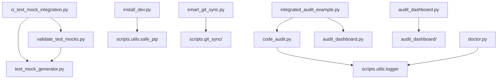

# P26 - Refatoração de Scripts: Fase 01 - Auditoria e Planejamento

**Data**: 30 de Novembro de 2025
**Objetivo**: Mapear dependências e planejar migração de scripts soltos para estrutura de pacote organizada
**Status**: ✅ Auditoria Completa

---

## 🎯 Escopo da Auditoria

Esta auditoria tem como objetivo:

1. **Mapear o Grafo de Dependências** entre todos os scripts em `scripts/*.py`
2. **Identificar Pontos de Entrada (CLI)** onde os Banners de Inicialização serão injetados
3. **Propor Arquitetura Target** com estrutura de pacote organizada
4. **Analisar Caso Especial** do `install_dev.py` (script de bootstrap)
5. **Criar Estratégia de Migração** sem quebrar imports existentes

---

## 📊 1. Inventário de Scripts (Raiz)

### Scripts Executáveis (10 arquivos)

Todos os scripts abaixo possuem `if __name__ == "__main__":` e são executáveis diretamente.

| Script | Linhas | Tipo | Descrição |
|--------|--------|------|-----------|
| `audit_dashboard.py` | 51 | **Wrapper CLI** | Wrapper de compatibilidade para `audit_dashboard/` |
| `code_audit.py` | 369 | **CLI Principal** | Auditoria de segurança e qualidade de código |
| `doctor.py` | 388 | **CLI Principal** | Diagnóstico preventivo de ambiente |
| `install_dev.py` | 244 | **Bootstrap Script** | ⚠️ Script de instalação (pré-venv) |
| `smart_git_sync.py` | 112 | **CLI Wrapper** | Interface para `git_sync/` |
| `maintain_versions.py` | 327 | **CLI Principal** | Automação de versões Python (pyenv) |
| `ci_test_mock_integration.py` | 552 | **CLI Principal** | Integração de mocks no CI/CD |
| `integrated_audit_example.py` | 212 | **Exemplo/Demo** | Demonstração de integração |
| `test_mock_generator.py` | 772 | **CLI Principal** | Gerador de mocks para testes |
| `validate_test_mocks.py` | 524 | **CLI Principal** | Validador de mocks gerados |

---

## 🔗 2. Grafo de Dependências

### 2.1 Dependências Externas (Pacotes do Projeto)

```
scripts/
├── audit_dashboard.py
│   └── → audit_dashboard/ (pacote já refatorado)
│       ├── audit_dashboard.AuditDashboard
│       ├── audit_dashboard.AuditMetricsError
│       └── audit_dashboard.cli.main
│
├── code_audit.py
│   ├── → audit/ (pacote existente)
│   │   ├── audit.analyzer.CodeAnalyzer
│   │   ├── audit.config.load_config
│   │   ├── audit.models.{AuditResult, SecurityPattern}
│   │   ├── audit.plugins.{check_mock_coverage, simulate_ci}
│   │   ├── audit.reporter.AuditReporter
│   │   └── audit.scanner.scan_workspace
│   └── → scripts.utils.logger.setup_logging
│
├── doctor.py
│   └── → scripts.utils.logger.get_colors
│
├── install_dev.py
│   └── → scripts.utils.safe_pip.safe_pip_compile
│
├── smart_git_sync.py
│   ├── → scripts.git_sync.{SyncOrchestrator, load_config}
│   └── → scripts.git_sync.exceptions.SyncError
│
├── maintain_versions.py
│   └── [Sem dependências internas - stdlib apenas]
│
├── ci_test_mock_integration.py
│   ├── → scripts.test_mock_generator.TestMockGenerator
│   └── → scripts.validate_test_mocks.TestMockValidator
│
├── integrated_audit_example.py
│   ├── → audit_dashboard.{AuditDashboard, AuditMetricsError}
│   └── → code_audit.{CodeAuditor, print_summary, save_report}
│
├── test_mock_generator.py
│   └── [Sem dependências internas - standalone]
│
└── validate_test_mocks.py
    └── → scripts.test_mock_generator.TestMockGenerator
```

### 2.2 Dependências Internas (Entre Scripts)



**Nós Centrais (Alta Conectividade)**:

- `test_mock_generator.py` → importado por 2 scripts
- `scripts.utils.logger` → importado por 2 scripts
- `audit_dashboard.py` → importado por 1 script (exemplo)

---

## 🏗️ 3. Classificação Funcional

### 3.1 **CLI Tools** (Ferramentas Executáveis)

Devem ir para `scripts/cli/`:

| Script | Justificativa | Banner Necessário |
|--------|---------------|-------------------|
| `doctor.py` | Ferramenta de diagnóstico ativa | ✅ Sim |
| `code_audit.py` | Ferramenta de auditoria ativa | ✅ Sim |
| `smart_git_sync.py` | Wrapper CLI para git sync | ✅ Sim |
| `maintain_versions.py` | Gerenciador de versões Python | ✅ Sim |
| `ci_test_mock_integration.py` | Integração de CI/CD | ✅ Sim |

### 3.2 **Core Libraries** (Lógica de Negócio)

Devem ir para `scripts/core/`:

| Script | Justificativa | Banner Necessário |
|--------|---------------|-------------------|
| `test_mock_generator.py` | Motor de geração de mocks | ✅ Sim (quando CLI) |
| `validate_test_mocks.py` | Motor de validação de mocks | ✅ Sim (quando CLI) |

### 3.3 **Wrappers de Compatibilidade**

Mantêm localização atual (temporário):

| Script | Justificativa | Ação |
|--------|---------------|------|
| `audit_dashboard.py` | Wrapper para `audit_dashboard/` | Manter 1 ciclo de release |
| `smart_git_sync.py` | Wrapper fino para `git_sync/` | Pode migrar para CLI |

### 3.4 **Exemplos e Demos**

Devem ir para `examples/` ou ser removidos:

| Script | Justificativa | Ação |
|--------|---------------|------|
| `integrated_audit_example.py` | Demonstração de integração | Mover para `examples/` |

### 3.5 **Bootstrap Scripts** (⚠️ Caso Especial)

Devem permanecer na raiz:

| Script | Justificativa | Ação |
|--------|---------------|------|
| `install_dev.py` | Executado **antes** do venv existir | **MANTER NA RAIZ** |

---

## 🔍 4. Análise de Caso Especial: `install_dev.py`

### 4.1 Uso no Makefile

```makefile
install-dev:
 @if [ ! -f "$(VENV)/.install_complete" ]; then \
  $(SYSTEM_PYTHON) -m venv $(VENV); \
  $(VENV)/bin/python $(SCRIPTS_DIR)/install_dev.py && \
  touch $(VENV)/.install_complete; \
 fi
```

**Problema**: O script é executado com `$(VENV)/bin/python`, que é o Python **recém-criado no venv**, mas **antes** de qualquer pacote ser instalado.

### 4.2 Dependências do Script

```python
from scripts.utils.safe_pip import safe_pip_compile
```

**Risco**: Se movermos `install_dev.py` para `scripts/cli/`, o import quebrará porque:

1. O pacote `scripts` ainda não está instalado no venv novo
2. O `sys.path` não inclui a raiz do projeto automaticamente

### 4.3 Solução de Mitigação

O script **já implementa** um workaround:

```python
PROJECT_ROOT = Path(__file__).resolve().parent.parent
if str(PROJECT_ROOT) not in sys.path:
    sys.path.insert(0, str(PROJECT_ROOT))
```

### 4.4 Decisão de Arquitetura

✅ **Decisão**: `install_dev.py` pode ser movido para `scripts/cli/install_dev.py`

**Justificativa**:

- O script já manipula `sys.path` para resolver imports
- A movimentação para `scripts/cli/` não afeta a lógica de bootstrap
- O Makefile será atualizado para refletir o novo caminho

**Atualização Necessária no Makefile**:

```makefile
$(VENV)/bin/python $(SCRIPTS_DIR)/cli/install_dev.py
```

---

## 🎯 5. Arquitetura Target (Proposta)

### 5.1 Estrutura de Diretórios Proposta

```
scripts/
├── __init__.py                    # Torna scripts/ um pacote Python
├── cli/                           # 🆕 CLI Tools (Executáveis)
│   ├── __init__.py
│   ├── audit.py                   # ← code_audit.py (renomeado)
│   ├── doctor.py                  # ← doctor.py
│   ├── git_sync.py                # ← smart_git_sync.py (renomeado)
│   ├── install_dev.py             # ← install_dev.py
│   ├── mock_ci.py                 # ← ci_test_mock_integration.py
│   ├── mock_generate.py           # ← test_mock_generator.py (quando CLI)
│   ├── mock_validate.py           # ← validate_test_mocks.py (quando CLI)
│   └── upgrade_python.py          # ← maintain_versions.py
│
├── core/                          # 🆕 Lógica de Negócio (Bibliotecas)
│   ├── __init__.py
│   ├── mock_generator.py          # ← test_mock_generator.py (classes)
│   └── mock_validator.py          # ← validate_test_mocks.py (classes)
│
├── utils/                         # ✅ Já existe - manter
│   ├── __init__.py
│   ├── atomic.py
│   ├── logger.py
│   └── safe_pip.py
│
├── audit/                         # ✅ Já existe - manter
│   └── ...
│
├── audit_dashboard/               # ✅ Já existe - manter
│   └── ...
│
├── ci_recovery/                   # ✅ Já existe - manter
│   └── ...
│
└── git_sync/                      # ✅ Já existe - manter
    └── ...
```

### 5.2 Wrappers Temporários (Backward Compatibility)

Para evitar quebrar scripts existentes, criar wrappers na raiz:

```
scripts/
├── audit_dashboard.py             # Wrapper existente (manter)
├── code_audit.py                  # 🆕 Wrapper → cli.audit
├── doctor.py                      # 🆕 Wrapper → cli.doctor
├── smart_git_sync.py              # 🆕 Wrapper → cli.git_sync
├── maintain_versions.py           # 🆕 Wrapper → cli.upgrade_python
└── ... (outros wrappers)
```

**Exemplo de Wrapper**:

```python
#!/usr/bin/env python3
"""[DEPRECATED] Wrapper for backward compatibility.
Use: python -m scripts.cli.doctor
"""
import sys
from scripts.cli.doctor import main

if __name__ == "__main__":
    sys.exit(main())
```

### 5.3 Pontos de Entrada no `pyproject.toml`

Adicionar console scripts para facilitar execução:

```toml
[project.scripts]
dev-doctor = "scripts.cli.doctor:main"
dev-audit = "scripts.cli.audit:main"
dev-git-sync = "scripts.cli.git_sync:main"
dev-upgrade-python = "scripts.cli.upgrade_python:main"
mock-generate = "scripts.cli.mock_generate:main"
mock-validate = "scripts.cli.mock_validate:main"
```

---

## 🚀 6. Estratégia de Migração (Fase 02)

### 6.1 Princípios de Migração

1. **Idempotência**: Código pode existir em ambos os lugares durante a transição
2. **Backward Compatibility**: Wrappers garantem que scripts antigos funcionem
3. **Incremental**: Migrar um script por vez, testar, e continuar
4. **Deprecation Notice**: Avisos claros nos wrappers sobre a mudança

### 6.2 Fases de Execução

#### **Fase 02.1**: Preparação

- [ ] Criar estrutura de diretórios (`scripts/cli/`, `scripts/core/`)
- [ ] Adicionar `__init__.py` em cada pasta
- [ ] Implementar Banner de Inicialização reutilizável

#### **Fase 02.2**: Migração de Utilitários

- [ ] Mover `test_mock_generator.py` (classes) → `scripts/core/mock_generator.py`
- [ ] Mover `validate_test_mocks.py` (classes) → `scripts/core/mock_validator.py`
- [ ] Criar CLIs finos em `scripts/cli/mock_*.py` que importam do core

#### **Fase 02.3**: Migração de CLI Tools

- [ ] Mover `doctor.py` → `scripts/cli/doctor.py` + injetar banner
- [ ] Mover `code_audit.py` → `scripts/cli/audit.py` + injetar banner
- [ ] Mover `smart_git_sync.py` → `scripts/cli/git_sync.py` + injetar banner
- [ ] Mover `maintain_versions.py` → `scripts/cli/upgrade_python.py` + injetar banner
- [ ] Mover `ci_test_mock_integration.py` → `scripts/cli/mock_ci.py` + injetar banner

#### **Fase 02.4**: Bootstrap Script

- [ ] Mover `install_dev.py` → `scripts/cli/install_dev.py`
- [ ] Atualizar Makefile para apontar para novo caminho
- [ ] Testar instalação completa do zero

#### **Fase 02.5**: Wrappers e Deprecation

- [ ] Criar wrappers de compatibilidade na raiz de `scripts/`
- [ ] Adicionar deprecation notices nos wrappers
- [ ] Atualizar documentação (README, CONTRIBUTING, etc.)

#### **Fase 02.6**: Console Scripts

- [ ] Adicionar `[project.scripts]` no `pyproject.toml`
- [ ] Testar executáveis globais após instalação
- [ ] Atualizar CI/CD para usar novos comandos

#### **Fase 02.7**: Cleanup (Após 1 Release)

- [ ] Remover wrappers da raiz
- [ ] Atualizar todos os imports no codebase
- [ ] Remover deprecation notices

### 6.3 Testes de Aceitação

Para cada script migrado:

1. ✅ Script executa com sucesso na nova localização
2. ✅ Wrapper de compatibilidade funciona
3. ✅ Banner de inicialização é exibido
4. ✅ Imports não quebram
5. ✅ Testes automatizados passam
6. ✅ Makefile continua funcionando
7. ✅ CI/CD não quebra

---

## 📍 7. Banner de Inicialização (Anti-Cegueira)

### 7.1 Implementação Reutilizável

Criar utilitário em `scripts/utils/banner.py`:

```python
"""Banner de inicialização para combater Cegueira de Ferramenta."""
from pathlib import Path
from datetime import datetime

def print_startup_banner(
    tool_name: str,
    version: str,
    description: str,
    script_path: Path,
    width: int = 70
) -> None:
    """Imprime banner de inicialização da ferramenta.

    Args:
        tool_name: Nome da ferramenta (ex: "Dev Doctor")
        version: Versão da ferramenta
        description: Descrição curta da ferramenta
        script_path: Path(__file__) do script
        width: Largura do banner
    """
    border = "=" * width
    timestamp = datetime.now().strftime("%Y-%m-%d %H:%M:%S")

    print(f"\n{border}")
    print(f"  {tool_name} v{version}")
    print(f"  {description}")
    print(f"{border}")
    print(f"  Timestamp: {timestamp}")
    print(f"  Script:    {script_path.relative_to(Path.cwd())}")
    print(f"{border}\n")
```

### 7.2 Pontos de Injeção

Cada script CLI terá o banner injetado no `if __name__ == "__main__":`:

```python
if __name__ == "__main__":
    from scripts.utils.banner import print_startup_banner

    print_startup_banner(
        tool_name="Dev Doctor",
        version="2.0.0",
        description="Diagnóstico Preventivo de Ambiente",
        script_path=Path(__file__)
    )

    sys.exit(main())
```

### 7.3 Scripts que Receberão Banners

✅ **Ferramentas CLI** (7 scripts):

- `doctor.py`
- `code_audit.py` (audit.py)
- `smart_git_sync.py` (git_sync.py)
- `maintain_versions.py` (upgrade_python.py)
- `ci_test_mock_integration.py` (mock_ci.py)
- `test_mock_generator.py` (quando executado como CLI)
- `validate_test_mocks.py` (quando executado como CLI)

❌ **Não Receberão Banners**:

- `install_dev.py` (bootstrap silencioso)
- `integrated_audit_example.py` (exemplo/demo)
- `audit_dashboard.py` (wrapper temporário)

---

## 📊 8. Matriz de Risco

| Risco | Severidade | Mitigação |
|-------|-----------|-----------|
| Quebrar imports durante migração | 🔴 Alta | Manter wrappers de compatibilidade |
| CI/CD falhar após mudanças | 🔴 Alta | Testar em branch separada antes de merge |
| Makefile parar de funcionar | 🟡 Média | Atualizar paths no Makefile na Fase 02.4 |
| Desenvolvedores usarem scripts antigos | 🟡 Média | Deprecation notices + documentação |
| `install_dev.py` falhar no bootstrap | 🔴 Alta | Testar instalação do zero antes de commit |
| Perder rastreabilidade de git blame | 🟢 Baixa | Git detecta renames automaticamente |

---

## ✅ 9. Checklist de Prontidão (Fase 02)

Antes de iniciar a Fase 02 (implementação), garantir:

- [x] Auditoria completa de dependências realizada
- [x] Grafo de dependências documentado
- [x] Arquitetura target definida e aprovada
- [x] Estratégia de migração documentada
- [x] Caso especial `install_dev.py` analisado
- [x] Pontos de injeção de banner identificados
- [x] Matriz de risco documentada
- [ ] Branch de feature criada (`feature/P26-scripts-refactoring`)
- [ ] Backup do workspace realizado

---

## 📝 10. Conclusões

### 10.1 Descobertas Principais

1. **Estrutura Atual**: Scripts soltos na raiz sem organização clara
2. **Dependências**: Maioria dos scripts é independente, facilitando migração
3. **Caso Especial**: `install_dev.py` pode ser movido com ajuste no Makefile
4. **Oportunidade**: Injetar banners para combater Cegueira de Ferramenta
5. **Compatibilidade**: Wrappers garantem transição suave

### 10.2 Recomendações

✅ **Prosseguir com Fase 02**: A auditoria confirma viabilidade da refatoração.

**Prioridades**:

1. Criar estrutura de pastas (`cli/`, `core/`)
2. Implementar banner reutilizável
3. Migrar scripts um por vez
4. Manter wrappers por 1 ciclo de release
5. Atualizar documentação e CI/CD

### 10.3 Próximos Passos

1. **Criar Issue/PR**: Documentar Fase 02 como tarefa rastreável
2. **Implementar Banner**: Criar `scripts/utils/banner.py`
3. **Iniciar Migração**: Seguir ordem da Fase 02 (seção 6.2)
4. **Testar Continuamente**: Executar `make all` após cada mudança
5. **Documentar Mudanças**: Atualizar CHANGELOG.md

---

## 📚 Referências

- **Código Fonte**: `scripts/*.py`
- **Makefile**: Verificação de uso de `install_dev.py`
- **Pacotes Existentes**: `audit/`, `audit_dashboard/`, `git_sync/`, `ci_recovery/`
- **Padrões de DevOps**: Idempotência, Backward Compatibility, Deprecation Notices

---

**Auditoria Realizada Por**: GitHub Copilot (Claude Sonnet 4.5)
**Data de Conclusão**: 30 de Novembro de 2025
**Status Final**: ✅ Aprovado para Fase 02
