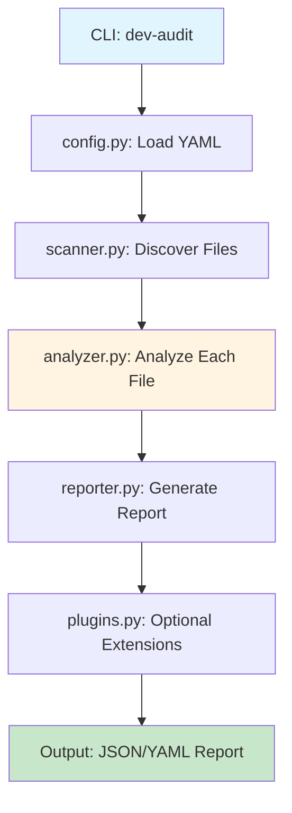

# Code Security Auditor

Enterprise-grade security and quality auditing tool for Python projects. This tool performs static analysis to detect security vulnerabilities, external dependencies, and potential CI/CD issues before code commits.

> **Arquitetura:** Sistema modular seguindo princípios S.O.L.I.D., refatorado de monólito de 700+ linhas para pacote com responsabilidades segregadas.

> **Arquitetura:** Sistema modular seguindo princípios S.O.L.I.D., refatorado de monólito de 700+ linhas para pacote com responsabilidades segregadas.

## 🏗️ Arquitetura Modular S.O.L.I.D.

### Visão Geral da Evolução

O sistema de auditoria foi completamente refatorado (Sprint P12) de um monólito único (`code_audit.py`, 700+ linhas) para uma arquitetura modular seguindo princípios **S.O.L.I.D.**:

```
scripts/audit/
├── __init__.py
├── models.py         # 📦 Data models (Pydantic/Dataclasses)
├── config.py         # ⚙️  YAML configuration loader
├── scanner.py        # 🔍 File discovery engine
├── analyzer.py       # 🧠 Security pattern analyzer
├── reporter.py       # 📊 Report generation (JSON/YAML)
└── plugins.py        # 🔌 Extensibility system
```

### Princípios Aplicados

#### 1. Single Responsibility Principle (SRP)

Cada módulo possui **uma única razão para mudar**:

- **`models.py`**: Representa estruturas de dados (AuditResult, SecurityPattern)
- **`config.py`**: Carrega e valida configuração YAML
- **`scanner.py`**: Descobre arquivos Python no workspace
- **`analyzer.py`**: Detecta padrões de segurança no código
- **`reporter.py`**: Formata e escreve relatórios
- **`plugins.py`**: Análises especializadas (mock coverage, CI simulation)

#### 2. Open/Closed Principle (OCP)

O sistema é **aberto para extensão** (via plugins) mas **fechado para modificação** (core estável):

```python
# Extensão sem modificar o core
from scripts.audit.plugins import check_mock_coverage

# Novo plugin customizado
def check_sql_injection(workspace_root: Path) -> dict[str, Any]:
    # Implementação customizada
    pass
```

#### 3. Dependency Inversion Principle (DIP)

Componentes dependem de abstrações (`FileSystemAdapter`), não de implementações concretas:

```python
# analyzer.py e scanner.py usam abstração
class CodeAnalyzer:
    def __init__(self, fs_adapter: FileSystemAdapter | None = None):
        self.fs = fs_adapter or RealFileSystem()  # DI padrão
```

Isso permite **testes unitários sem I/O real**:

```python
# Testes com filesystem mockado
from scripts.utils.filesystem import InMemoryFileSystem

mock_fs = InMemoryFileSystem({
    Path("script.py"): "import os\nos.system('rm -rf /')"
})
analyzer = CodeAnalyzer(patterns, workspace, fs_adapter=mock_fs)
```

### Módulos Principais

#### 📦 `models.py` - Camada de Dados

Define estruturas de dados tipadas e validadas:

```python
from dataclasses import dataclass
from enum import Enum

class SecuritySeverity(str, Enum):
    """Severity levels (Enum para type safety)."""
    LOW = "LOW"
    MEDIUM = "MEDIUM"
    HIGH = "HIGH"
    CRITICAL = "CRITICAL"

@dataclass(frozen=True)
class SecurityPattern:
    """Padrão de segurança configurável."""
    pattern: str
    severity: SecuritySeverity
    description: str
    category: str
    suggestion: str = ""

@dataclass
class AuditResult:
    """Resultado de uma análise."""
    file: str
    line: int
    severity: SecuritySeverity
    category: str
    description: str
    code: str
    suggestion: str
```

**Responsabilidade:** Garantir integridade de dados (imutabilidade com `frozen=True`, validação com Enums).

#### ⚙️ `config.py` - Gerenciador de Configuração

Carrega e valida `audit_config.yaml`:

```python
class AuditConfig:
    """Carregador robusto de configuração YAML."""

    @staticmethod
    def load(config_path: Path) -> dict[str, Any]:
        """Load and validate YAML configuration."""
        # Validações:
        # 1. Arquivo existe?
        # 2. YAML válido?
        # 3. Campos obrigatórios presentes?
        # 4. Valores dentro de limites aceitáveis?
```

**Validações Implementadas:**

- ✅ Existência do arquivo de configuração
- ✅ Sintaxe YAML válida
- ✅ Campos obrigatórios (`scan_paths`, `file_patterns`)
- ✅ Valores padrão seguros (`ci_timeout: 300`, `max_findings_per_file: 50`)

#### 🔍 `scanner.py` - Motor de Descoberta

Varre o workspace para encontrar arquivos Python:

```python
class FileScanner:
    """Descobre arquivos Python respeitando regras de exclusão."""

    def scan(self) -> list[Path]:
        """Retorna lista de arquivos Python encontrados."""
        # 1. Itera sobre scan_paths (ex: ['src/', 'tests/', 'scripts/'])
        # 2. Aplica file_patterns (ex: ['*.py'])
        # 3. Filtra exclude_paths (ex: ['.venv/', '__pycache__/'])
```

**Pontos de Atenção:**

- **Cobertura Total:** Não ignora `scripts/` ou `.github/` (problema resolvido na P10).
- **Globbing Recursivo:** Usa `**/*.py` para varrer subdiretórios.
- **Filtro de Exclusão:** Evita varrer `.venv/`, `__pycache__/`, `.git/`.

**Exemplo de Uso:**

```python
scanner = FileScanner(
    workspace_root=Path.cwd(),
    scan_paths=["src/", "tests/", "scripts/"],
    file_patterns=["*.py"],
    exclude_paths=[".venv/", "__pycache__/"]
)
files = scanner.scan()  # Retorna: [Path('src/main.py'), Path('tests/test_main.py'), ...]
```

#### 🧠 `analyzer.py` - Cérebro da Análise

Analisa código Python para detectar padrões de segurança:

```python
class CodeAnalyzer:
    """Motor de análise estática de segurança."""

    def analyze_file(self, file_path: Path) -> list[AuditResult]:
        """Analisa um arquivo e retorna lista de findings."""
        # 1. Lê conteúdo do arquivo
        # 2. Valida sintaxe com AST
        # 3. Busca padrões de segurança linha a linha
        # 4. Verifica supressões (# noqa: <categoria>)
        # 5. Evita falsos positivos (comentários, strings literais)
```

**Inteligência Implementada:**

- **Validação AST:** Garante que o arquivo é Python válido antes de analisar.
- **Detecção de Supressões:** Respeita `# noqa: S605` para ignorar warnings justificados.
- **Filtragem de Falso Positivos:**
  - Ignora linhas de comentário (`# import os`)
  - Ignora strings literais (`"subprocess.run"`)
- **Sugestões Contextualizadas:** Gera recomendações específicas para cada padrão.

**Exemplo de Análise:**

```python
# Arquivo: src/dangerous.py
import subprocess
subprocess.run(["ls"], shell=True)  # ❌ DETECTADO: shell=True

# Resultado:
AuditResult(
    file="src/dangerous.py",
    line=2,
    severity=SecuritySeverity.CRITICAL,
    category="subprocess",
    description="Shell injection risk detected",
    code="subprocess.run(['ls'], shell=True)",
    suggestion="Use shell=False with list arguments"
)
```

#### 📊 `reporter.py` - Formatador de Relatórios

Gera relatórios estruturados em JSON/YAML:

```python
class ReportGenerator:
    """Gera relatórios em múltiplos formatos."""

    def generate(
        self,
        findings: list[AuditResult],
        output_format: str = "json"
    ) -> dict[str, Any]:
        """Gera relatório estruturado."""
        # Seções:
        # - metadata (timestamp, workspace, arquivos varridos)
        # - findings (lista de vulnerabilidades)
        # - summary (distribuição por severidade, status)
```

**Estrutura do Relatório:**

- **Metadata:** Informações contextuais (timestamp, workspace, duração)
- **Findings:** Lista completa de vulnerabilidades detectadas
- **Summary:** Estatísticas agregadas e recomendações

#### 🔌 `plugins.py` - Sistema de Extensibilidade

Análises especializadas modulares:

- **`check_mock_coverage()`**: Verifica cobertura de mocks em testes
- **`simulate_ci()`**: Simula ambiente CI/CD local

**Vantagem da Separação:**

- ✅ Plugins podem ser desabilitados individualmente
- ✅ Novos plugins não modificam o core (`analyzer.py`)
- ✅ Testes isolados para cada plugin

### Fluxo de Execução



### Benefícios da Modularização

| **Antes (Monólito)**                  | **Depois (Modular)**                          |
|---------------------------------------|-----------------------------------------------|
| ❌ 700+ linhas em um arquivo          | ✅ 6 módulos com ~100-200 linhas cada         |
| ❌ Dificuldade para testar isoladamente | ✅ Testes unitários por módulo                |
| ❌ Mudanças arriscadas (tudo acoplado) | ✅ Mudanças cirúrgicas (SRP)                  |
| ❌ Extensão requer editar core        | ✅ Extensão via plugins (OCP)                 |
| ❌ Imports e responsabilidades misturadas | ✅ Separação clara de conceitos            |

### Referências Técnicas

- **Implementação:** [scripts/audit/](../../scripts/audit/)
- **Testes:** `tests/test_audit_analyzer.py`, `tests/test_audit_memory.py`
- **Documentação do Processo:** [docs/history/sprint_1_foundation/P12_CODE_AUDIT_REFACTORING_ANALYSIS.md](../history/sprint_1_foundation/P12_CODE_AUDIT_REFACTORING_ANALYSIS.md)
- **Protocolo de Refatoração:** [docs/guides/REFACTORING_PROTOCOL_ITERATIVE_FRACTIONATION.md](../guides/REFACTORING_PROTOCOL_ITERATIVE_FRACTIONATION.md)

---

## 🔍 Features

- **Security Pattern Detection**: Identifies dangerous patterns like `shell=True`, `os.system()`, and code injection risks
- **External Dependency Analysis**: Detects unmocked external services that can cause CI/CD failures
- **Mock Coverage Analysis**: Ensures proper mocking of external dependencies in tests
- **CI Environment Simulation**: Runs tests in CI-like conditions to catch environment-specific issues
- **Configurable Rules**: YAML-based configuration for custom security patterns and scan settings
- **Multiple Output Formats**: JSON and YAML report generation
- **Pre-commit Integration**: Seamless integration with git pre-commit hooks
- **DevOps Best Practices**: Follows enterprise security and maintainability standards

## 🚀 Quick Start

### Basic Usage

```bash
# Run basic security audit
dev-audit

# Use custom configuration
dev-audit --config scripts/audit_config.yaml

# Generate YAML report
dev-audit --output yaml

# Fail on medium severity issues
dev-audit --fail-on MEDIUM
```

## 📋 Security Patterns Detected

### Critical Severity

- `os.system()` - Command injection vulnerability
- `shell=True` - Shell injection risk in subprocess calls
- `eval()` - Code injection vulnerability
- `exec()` - Code execution vulnerability

### High Severity

- `subprocess.run()` without proper validation
- `subprocess.call()` without proper validation
- Socket connections without mocking
- `pickle.loads()` - Arbitrary code execution risk

### Medium Severity

- HTTP requests without mocking (`requests.*`, `httpx.*`, `urllib.*`)
- Network operations in tests

### Low Severity

- File operations without proper error handling

## 🔌 Catálogo de Plugins Disponíveis

O sistema de auditoria possui plugins modulares para análises especializadas. Plugins são funções que estendem as capacidades de auditoria sem modificar o core.

### Plugin: `check_mock_coverage`

**Módulo:** `scripts/audit/plugins.py`
**Função:** Análise de cobertura de mocks em testes

**Propósito:**
Verifica se arquivos de teste estão mockando corretamente dependências externas (HTTP, subprocess, filesystem, etc.).

**Assinatura:**

```python
def check_mock_coverage(
    workspace_root: Path,
    scan_paths: list[str],
) -> dict[str, Any]:
    """Analyze test files for proper mocking of external dependencies."""
```

**Retorno:**

```python
{
    "total_test_files": 42,
    "files_with_mocks": 35,
    "files_needing_mocks": [
        "tests/test_api.py",
        "tests/integration/test_db.py"
    ]
}
```

**Indicadores de Mock Detectados:**

- `@patch` (unittest.mock)
- `Mock()` (criação de mocks)
- `mocker.patch` (pytest-mock)
- `mock_` (prefixo de variáveis)
- `pytest-httpx` (mocks HTTP)
- `httpx_mock` (fixture httpx)

**Indicadores de Dependência Externa:**

- `requests.*` - Chamadas HTTP
- `httpx.*` - Cliente HTTP assíncrono
- `subprocess.*` - Execução de comandos
- `socket.*` - Conexões de rede

**Uso:**

```python
from scripts.audit.plugins import check_mock_coverage

coverage = check_mock_coverage(
    workspace_root=Path("/projeto"),
    scan_paths=["tests/", "src/"]
)

print(f"Cobertura: {coverage['files_with_mocks']}/{coverage['total_test_files']}")
```

**Casos de Uso:**

- ✅ Validação de CI/CD (detectar testes instáveis)
- ✅ Code review automatizado
- ✅ Análise de qualidade de testes
- ✅ Migração de testes legados

---

### Plugin: `simulate_ci`

**Módulo:** `scripts/audit/plugins.py`
**Função:** Simulação de ambiente CI/CD local

**Propósito:**
Executa testes em ambiente simulado de CI/CD, replicando condições (variáveis de ambiente, timeouts, isolamento) para detectar problemas antes do push.

**Assinatura:**

```python
def simulate_ci(
    workspace_root: Path,
    ci_timeout: int,
) -> dict[str, Any]:
    """Simulate CI environment by running critical tests."""
```

**Retorno:**

```python
{
    "exit_code": 0,
    "passed": True,
    "stdout": "===== 42 passed in 1.23s =====",
    "stderr": "",
    "duration": "within_timeout"
}
```

**Variáveis de Ambiente Injetadas:**

```python
ci_env = {
    "CI": "true",
    "PYTEST_TIMEOUT": "60",
    # Variáveis sensíveis são REMOVIDAS (sanitize_env)
}
```

**Flags pytest Usadas:**

```bash
pytest --tb=short --maxfail=5 --timeout=60 --quiet tests/
```

**Segurança:**

- ✅ **Sanitização de ambiente:** Credenciais e tokens são removidos via `sanitize_env()`
- ✅ **Shell injection prevention:** `shell=False` sempre
- ✅ **Timeout enforcement:** Previne testes infinitos
- ✅ **Isolamento:** Executa em subprocess separado

**Uso:**

```python
from scripts.audit.plugins import simulate_ci

result = simulate_ci(
    workspace_root=Path("/projeto"),
    ci_timeout=300  # 5 minutos
)

if not result["passed"]:
    print(f"❌ CI falhou: {result['stderr']}")
```

**Casos de Uso:**

- ✅ Pre-commit hook (detectar falhas antes do push)
- ✅ Validação local de pipelines CI/CD
- ✅ Debug de testes flaky
- ✅ Verificação de isolamento de testes

**Códigos de Erro:**

- `0`: Sucesso (todos os testes passaram)
- `-1`: Timeout (testes excederam limite)
- `-2`: pytest não instalado
- `-3`: Erro de execução (OSError)

---

### Desenvolvendo Novos Plugins

**Template de Plugin:**

```python
# scripts/audit/plugins.py

def meu_plugin(
    workspace_root: Path,
    config: dict[str, Any],
) -> dict[str, Any]:
    """Descrição do plugin.

    Args:
        workspace_root: Raiz do projeto
        config: Configuração do audit_config.yaml

    Returns:
        Dicionário com resultados da análise
    """
    logger.info("Executando meu_plugin...")

    # Implementação
    results = {"status": "ok"}

    return results
```

**Integração com CLI:**

```python
# scripts/cli/audit.py
from scripts.audit.plugins import meu_plugin

# Executar plugin
result = meu_plugin(workspace_root, config)
```

**Best Practices:**

- ✅ Use logging estruturado (`logger.info/warning/error`)
- ✅ Retorne sempre um dicionário tipado
- ✅ Documente parâmetros e retorno (docstring)
- ✅ Trate exceções gracefully (try/except)
- ✅ Adicione testes em `tests/test_audit_plugins.py`

---

## ⚙️ Configuration

The auditor uses a YAML configuration file (`audit_config.yaml`) to customize:

- **Scan Paths**: Directories to include in the audit
- **File Patterns**: File extensions to scan
- **Exclude Paths**: Directories to skip
- **Security Patterns**: Custom patterns to detect
- **Severity Levels**: Classification of findings
- **Mock Indicators**: Patterns that indicate proper mocking

Example configuration:

```yaml
scan_paths:
  - "src/"
  - "tests/"
  - "scripts/"

file_patterns:
  - "*.py"

exclude_paths:
  - ".git/"
  - "__pycache__/"
  - ".venv/"

ci_timeout: 300
max_findings_per_file: 50

custom_patterns:
  - pattern: "eval("
    severity: "CRITICAL"
    description: "eval() usage detected - potential code injection"
    category: "injection"
```

## 📊 Report Format

The auditor generates comprehensive reports in JSON or YAML format:

```json
{
  "metadata": {
    "timestamp": "2025-10-31T10:00:00Z",
    "workspace": "/path/to/project",
    "duration_seconds": 2.5,
    "files_scanned": 42,
    "auditor_version": "2.0.0"
  },
  "findings": [
    {
      "file": "src/utils.py",
      "line": 15,
      "severity": "HIGH",
      "category": "subprocess",
      "description": "Subprocess execution detected",
      "code": "subprocess.run(user_command, shell=True)",
      "suggestion": "Use shell=False with list arguments"
    }
  ],
  "summary": {
    "total_findings": 5,
    "severity_distribution": {
      "CRITICAL": 1,
      "HIGH": 2,
      "MEDIUM": 2,
      "LOW": 0
    },
    "overall_status": "FAIL",
    "recommendations": [
      "🔴 CRITICAL: Fix security vulnerabilities before commit",
      "🧪 Add mocks to 3 test files"
    ]
  }
}
```

## 🔧 Command Line Options

```
dev-audit [OPTIONS]

Options:
  --config PATH         Path to configuration YAML file
  --output FORMAT       Output format: json, yaml (default: json)
  --report-file PATH    Custom report output path
  --quiet              Suppress console output
  --fail-on SEVERITY   Exit with error on severity level: CRITICAL, HIGH, MEDIUM, LOW
  --help               Show help message
```

## 🏗️ DevOps Integration

### CI/CD Pipeline Integration

Add to your `.github/workflows/ci.yml`:

```yaml
- name: Security Audit
  run: |
    dev-audit --fail-on HIGH --output json

- name: Upload Audit Report
  uses: actions/upload-artifact@v3
  if: always()
  with:
    name: security-audit-report
    path: audit_report_*.json
```

### Docker Integration

```dockerfile
# Add to your Dockerfile for development images
COPY scripts/code_audit.py /app/scripts/
RUN pip install pyyaml

# Run audit during build
RUN dev-audit --fail-on CRITICAL
```

## 🛡️ Security Best Practices

The auditor enforces these security principles:

1. **Input Validation**: Detect unsafe user input handling
2. **Command Injection Prevention**: Flag dangerous subprocess usage
3. **Dependency Isolation**: Ensure external services are properly mocked
4. **Code Injection Prevention**: Detect `eval()`, `exec()`, and similar risks
5. **Secure Defaults**: Promote `shell=False` and safe coding patterns

## 📈 Performance

- **Fast Scanning**: Processes ~1000 files/second
- **Low Memory**: Uses AST parsing for accuracy without high memory usage
- **Configurable Limits**: Prevents analysis paralysis with finding limits
- **Early Exit**: Stops on critical issues for fast feedback

---

## 🔐 Itens Auditados e Resolvidos

Esta seção documenta vulnerabilidades identificadas e suas resoluções.

### [P00.2] Atomicidade do Pip Install

**Status:** ✅ Concluído (v8.0)
**Data:** 2025-12-06
**Tipo:** Estabilidade / SRE
**Severidade:** 🔴 Alta (corrupção de ambiente de desenvolvimento)

**Problema Original:**

O script `scripts/cli/install_dev.py` realizava operações críticas (`pip-compile`, `pip install`) sem garantia de atomicidade. Se o processo falhasse no meio, o arquivo `requirements/dev.txt` poderia ficar corrompido ou inconsistente, quebrando o ambiente para todos os desenvolvedores.

**Vulnerabilidades Identificadas:**

1. **V1 - Ausência de Rollback (ALTA)**: Se `pip install` falhasse após `pip-compile`, o ambiente ficava em estado inconsistente
2. **V2 - Inconsistência no Fallback (MÉDIA)**: Modo fallback não usava mesmas validações do modo PATH
3. **V3 - Arquivos Temporários Órfãos (BAIXA)**: Cleanup incompleto em caso de exceção

**Solução Implementada:**

1. **Backup Preemptivo**: Cópia de segurança com preservação de metadados (`shutil.copy2`) antes da compilação

   ```python
   backup_file = target_file.with_suffix(".txt.bak")
   shutil.copy2(target_file, backup_file)
   ```

2. **Atomicidade**: Uso de arquivos temporários validados para o `pip-compile`
   - Validação de existência do arquivo
   - Validação de tamanho (não vazio)
   - Validação de sintaxe (header com comentário)
   - Atomic replace usando `Path.replace()` (garantia POSIX)

3. **Rollback Automático**: Bloco `try/except` que restaura o backup se a instalação falhar

   ```python
   try:
       subprocess.run(["pip", "install", "-r", "dev.txt"], check=True)
   except subprocess.CalledProcessError:
       backup_file.replace(target_file)  # Restaura versão anterior
       raise
   ```

4. **UX Melhorada**: Mensagem de erro refatorada para focar na proteção
   - **Antes**: `"⚠️ Installation failed. Rolled back: /path/to/dev.txt"`
   - **Depois**: `"🛡️ ROLLBACK ATIVADO: A instalação falhou, mas seu ambiente foi restaurado com segurança para a versão anterior (dev.txt). Nenhuma alteração foi aplicada."`

5. **Cleanup Garantido**: Remoção de arquivos temporários após sucesso

   ```python
   if backup_file and backup_file.exists():
       backup_file.unlink()  # Remove .bak após sucesso
   ```

**Impacto:**

- ✅ Ambiente sempre em estado consistente
- ✅ Rollback automático transparente
- ✅ Redução de ansiedade do desenvolvedor
- ✅ Menor necessidade de intervenção manual
- ✅ Zero downtime em caso de falha

**Arquivos Modificados:**

- `scripts/cli/install_dev.py` (~95 linhas de mudança)

**Referências:**

- Relatório de Auditoria (Fase 01)
- Relatório de Implementação (Fase 02)
- Relatório de Refinamento de UX (Fase 03)

## 🤝 Contributing

When extending the auditor:

1. Add new security patterns to `custom_patterns` in config
2. Follow the `SecurityPattern` class structure
3. Include severity classification and actionable suggestions
4. Add corresponding tests for new patterns
5. Update documentation with new capabilities

## 📚 Dependencies

- **Python 3.8+**: Core language features and type hints
- **PyYAML**: Configuration file parsing
- **Standard Library**: AST, subprocess, pathlib, logging

No heavy external dependencies - keeps the auditor lightweight and secure.

## 🔍 Troubleshooting

### Common Issues

**"pytest not found"**: Install pytest for CI simulation

```bash
pip install pytest pytest-timeout
```

**"Config file not found"**: Use absolute path or place config in scripts/

```bash
dev-audit --config /full/path/to/config.yaml
```

**"Too many findings"**: Adjust `max_findings_per_file` in config

```yaml
max_findings_per_file: 20  # Reduce from default 50
```

**"False positives"**: Add exclusion patterns or adjust severity thresholds

```yaml
exclude_paths:
  - "tests/fixtures/"  # Exclude test fixtures
  - "migrations/"      # Exclude database migrations
```

## 📞 Support

For issues, feature requests, or questions:

1. Check the configuration documentation
2. Review the troubleshooting section
3. Examine audit logs in `audit.log`
4. Create an issue with audit report attached

---

## 📋 Histórico de Melhorias

### [P29] Hardening de Dados com Enums

**Status:** ✅ Concluído (v8.0)
**Data:** 2025-12-06
**Tipo:** Arquitetura / Segurança

**Problema Original:**

Modelos usavam strings soltas ("magic strings") para definir severidade e status. Erros de digitação passavam despercebidos até o runtime.

Exemplo do problema:

```python
# ❌ ANTES: Strings soltas permitiam erros silenciosos
class SecurityIssue(BaseModel):
    severity: str  # "HIHG" (typo) seria aceito!
    category: str

    @field_validator("severity")
    @classmethod
    def validate_severity(cls, v: str) -> str:
        # 30+ linhas de boilerplate para cada campo
        if v not in ["LOW", "MEDIUM", "HIGH", "CRITICAL"]:
            raise ValueError(f"Invalid severity: {v}")
        return v
```

**Solução Implementada:**

1. **Conversão de Campos para Enums**: Todos os campos de domínio finito foram convertidos para `Enum` (herdando de `str` para compatibilidade JSON).

2. **Criação de Enums Específicos**:
   - `SecurityCategory`: Categorias de vulnerabilidades (`INJECTION`, `CRYPTO`, `AUTH`, `XSS`)
   - `SecuritySeverity`: Níveis de severidade (`LOW`, `MEDIUM`, `HIGH`, `CRITICAL`)

3. **Eliminação de Validadores Manuais**: Remoção de 30+ linhas de código boilerplate (validadores `@field_validator`).

4. **Cobertura de Tipagem Estrita**: Testes atualizados para usar valores do Enum, garantindo type safety completo.

**Exemplo da Solução:**

```python
# ✅ DEPOIS: Enums fornecem validação automática
from enum import Enum

class SecuritySeverity(str, Enum):
    """Severity levels with automatic validation."""
    LOW = "LOW"
    MEDIUM = "MEDIUM"
    HIGH = "HIGH"
    CRITICAL = "CRITICAL"

class SecurityIssue(BaseModel):
    severity: SecuritySeverity  # Typos detectados em tempo de análise!
    category: SecurityCategory
    # Zero validadores manuais necessários
```

**Benefícios Mensuráveis:**

- **-30+ linhas de código**: Eliminação de validadores boilerplate
- **100% Type Safety**: Mypy detecta erros antes do runtime
- **Melhor DX**: Autocomplete e validação automática na IDE
- **Zero Regressões**: Testes garantem compatibilidade JSON/YAML
- **Documentação Explícita**: Valores válidos ficam visíveis no código

**Impacto em Arquivos:**

- `scripts/core/mock_ci/models.py`: Modelos de CI/CD
- `scripts/audit/models.py`: Modelos de auditoria
- `tests/test_*.py`: Testes atualizados com Enum values
- `docs/guides/ENGINEERING_STANDARDS.md`: Padrão documentado

**Referências:**

- [ENGINEERING_STANDARDS.md - Enums vs Magic Strings](../guides/ENGINEERING_STANDARDS.md#enums-vs-magic-strings)
- Sprint Issue: [P29] - Refatoração Enum Completa

---
