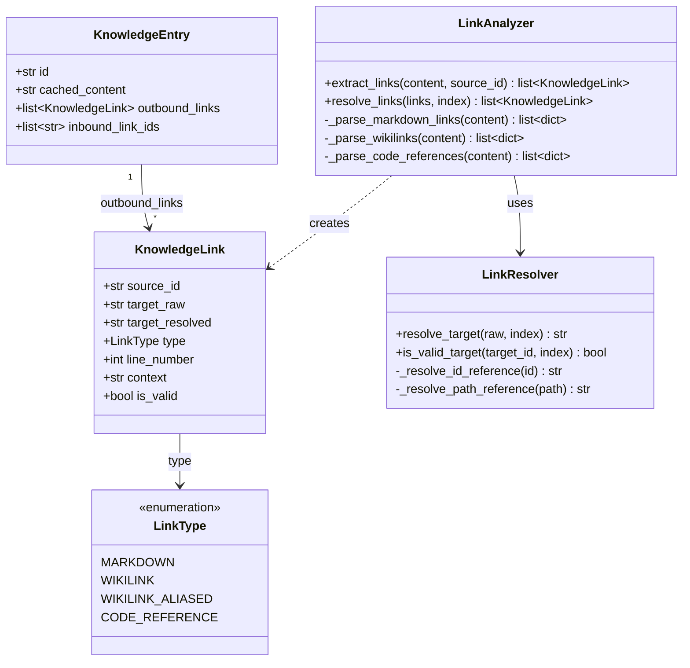
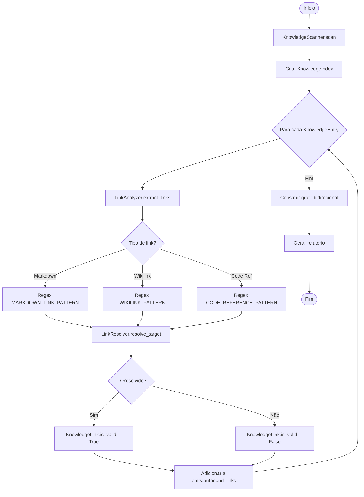

# 🧠 CORTEX - Fase 3: The Link Scanner (Design Técnico)

**Data:** 14 de Dezembro de 2025
**Status:** 🔵 Design em Aprovação
**Missão:** [006] - Transformar Nós Isolados em Grafo Conectado

---

## 📋 ÍNDICE

1. [Visão Geral](#visão-geral)
2. [Arquitetura do Componente](#arquitetura-do-componente)
3. [Modelo de Dados](#modelo-de-dados)
4. [Estratégia de Parsing (Regex)](#estratégia-de-parsing-regex)
5. [Resolução de Caminhos](#resolução-de-caminhos)
6. [Fluxo de Processamento](#fluxo-de-processamento)
7. [Integração com CLI](#integração-com-cli)
8. [Casos de Uso](#casos-de-uso)
9. [Critérios de Aceitação](#critérios-de-aceitação)

---

## 🎯 VISÃO GERAL

### Problema Atual

A **Fase 2** implementou o sistema de Knowledge Nodes, onde cada documento Markdown é representado como um `KnowledgeEntry` com metadados estruturados. No entanto:

- ✅ O campo `cached_content` armazena o texto completo do documento
- ❌ Esse conteúdo **não é processado semanticamente**
- ❌ Links entre documentos (`[[...]]`, `[...](...)`), permanecem invisíveis ao sistema
- ❌ Não há modelo de grafo para navegação entre nós

**Resultado:** Temos nós isolados, não um grafo conectado.

### Objetivo da Fase 3

Implementar um **Link Analyzer** que:

1. **Extrai** todas as referências semânticas de `cached_content`
2. **Resolve** essas referências para IDs canônicos do sistema
3. **Constrói** um grafo bidirecional (outbound/inbound links)
4. **Valida** se os alvos dos links existem (detecção de broken links)

---

## 🏗️ ARQUITETURA DO COMPONENTE

### Decisão de Design: Composição sobre Herança

**❌ Opção Descartada:** Estender `KnowledgeScanner`

```python
# Anti-pattern: Viola Single Responsibility Principle
class KnowledgeScanner:
    def scan(self) -> list[KnowledgeEntry]: ...
    def analyze_links(self, entry: KnowledgeEntry) -> list[KnowledgeLink]: ...  # ❌
```

**✅ Opção Escolhida:** Criar `LinkAnalyzer` como componente independente

```python
# Clean Architecture: Separation of Concerns
class LinkAnalyzer:
    """Analisa conteúdo textual e extrai links semânticos."""
    def extract_links(self, content: str, source_id: str) -> list[KnowledgeLink]: ...
    def resolve_links(self, links: list[KnowledgeLink], index: dict) -> list[KnowledgeLink]: ...
```

**Justificativa:**

- **SRP:** `KnowledgeScanner` = I/O + Parsing de Frontmatter
- **SRP:** `LinkAnalyzer` = Análise semântica de texto
- **Testabilidade:** Componentes podem ser testados isoladamente
- **Reusabilidade:** `LinkAnalyzer` pode ser usado em outros contextos (e.g., validação de PRs)

---

### Diagrama de Classes (Mermaid)



---

## 📊 MODELO DE DADOS

### 1. Enum `LinkType`

Define os tipos de links suportados.

```python
"""Extensão de models.py - Novos tipos para Link Analysis."""

from enum import Enum

class LinkType(Enum):
    """Tipos de links semânticos entre Knowledge Nodes.

    Attributes:
        MARKDOWN: Link padrão Markdown [label](target)
        WIKILINK: Wikilink simples [[target]]
        WIKILINK_ALIASED: Wikilink com alias [[target|label]]
        CODE_REFERENCE: Referência a código [[code:path/to/file.py]]
    """
    MARKDOWN = "markdown"
    WIKILINK = "wikilink"
    WIKILINK_ALIASED = "wikilink_aliased"
    CODE_REFERENCE = "code_reference"
```

---

### 2. Modelo `KnowledgeLink` (Pydantic)

Representa uma aresta no grafo de conhecimento.

```python
from pydantic import BaseModel, Field

class KnowledgeLink(BaseModel):
    """Aresta do grafo de conhecimento.

    Representa uma conexão semântica entre dois Knowledge Nodes,
    extraída do conteúdo textual (cached_content).

    Attributes:
        source_id: ID do documento de origem (e.g., "kno-001")
        target_raw: String original extraída do link (e.g., "[[Fase 01]]")
        target_resolved: ID canônico do alvo resolvido (e.g., "cortex-fase01-design")
        type: Tipo do link (markdown, wikilink, etc.)
        line_number: Linha onde o link foi encontrado (1-indexed)
        context: Snippet de contexto ao redor do link (±50 chars)
        is_valid: Se True, o alvo foi encontrado no índice

    Example:
        >>> link = KnowledgeLink(
        ...     source_id="kno-architecture-overview",
        ...     target_raw="[[CORTEX Fase 01]]",
        ...     target_resolved="cortex-fase01-design",
        ...     type=LinkType.WIKILINK,
        ...     line_number=42,
        ...     context="...conforme descrito em [[CORTEX Fase 01]], o sistema...",
        ...     is_valid=True,
        ... )
    """
    source_id: str
    target_raw: str
    target_resolved: str | None = None
    type: LinkType
    line_number: int = Field(ge=1)
    context: str = Field(max_length=200)
    is_valid: bool = False

    model_config = ConfigDict(frozen=True)
```

---

### 3. Extensão de `KnowledgeEntry`

Adicionar campos para suportar grafo.

```python
class KnowledgeEntry(BaseModel):
    """Knowledge Node com suporte a grafo conectado."""

    # Campos existentes (Fase 2)
    id: str
    type: Literal["knowledge"] = "knowledge"
    status: DocStatus
    tags: list[str] = Field(default_factory=list)
    golden_paths: str
    sources: list[KnowledgeSource] = Field(default_factory=list)
    cached_content: str | None = None
    file_path: Path | None = Field(default=None, exclude=True)

    # 🆕 Novos campos (Fase 3)
    outbound_links: list[KnowledgeLink] = Field(
        default_factory=list,
        description="Links que saem deste documento (referências)"
    )
    inbound_link_ids: list[str] = Field(
        default_factory=list,
        description="IDs dos documentos que referenciam este (backlinks)"
    )
```

---

## 🔍 ESTRATÉGIA DE PARSING (REGEX)

### 1. Links Markdown Padrão

**Pattern:** `[Label](target)`

```python
import re

MARKDOWN_LINK_PATTERN = re.compile(
    r'\[([^\]]+)\]\(([^)]+)\)',
    re.MULTILINE
)

# Exemplos de Match:
# ✅ [Veja o guia](docs/guide.md)
# ✅ [RFC 001](../reference/rfc-001.md)
# ✅ [API Docs](https://example.com/api)
# ❌ [[Wikilink]]  (não deve capturar)
```

**Extração:**

```python
def _parse_markdown_links(self, content: str) -> list[dict]:
    """Extrai links Markdown padrão do conteúdo."""
    links = []

    for line_num, line in enumerate(content.splitlines(), start=1):
        for match in MARKDOWN_LINK_PATTERN.finditer(line):
            label, target = match.groups()

            # Ignorar URLs externas (HTTP/HTTPS)
            if target.startswith(('http://', 'https://')):
                continue

            links.append({
                'target_raw': target,
                'line_number': line_num,
                'context': self._extract_context(line, match.start()),
                'type': LinkType.MARKDOWN,
            })

    return links
```

---

### 2. Wikilinks (Obsidian Style)

**Pattern:** `[[target]]` ou `[[target|alias]]`

```python
WIKILINK_PATTERN = re.compile(
    r'\[\[([^\]|]+)(?:\|([^\]]+))?\]\]',
    re.MULTILINE
)

# Exemplos de Match:
# ✅ [[CORTEX Fase 01]]           → target="CORTEX Fase 01", alias=None
# ✅ [[cortex-fase01-design]]     → target="cortex-fase01-design", alias=None
# ✅ [[Fase 01|Documentação]]     → target="Fase 01", alias="Documentação"
# ✅ [[docs/guide.md]]            → target="docs/guide.md", alias=None
# ❌ [Markdown](link)             (não deve capturar)
```

**Extração:**

```python
def _parse_wikilinks(self, content: str) -> list[dict]:
    """Extrai Wikilinks do conteúdo."""
    links = []

    for line_num, line in enumerate(content.splitlines(), start=1):
        for match in WIKILINK_PATTERN.finditer(line):
            target = match.group(1).strip()
            alias = match.group(2).strip() if match.group(2) else None

            link_type = (
                LinkType.WIKILINK_ALIASED if alias
                else LinkType.WIKILINK
            )

            links.append({
                'target_raw': target,
                'line_number': line_num,
                'context': self._extract_context(line, match.start()),
                'type': link_type,
            })

    return links
```

---

### 3. Code References (Proposta)

**Pattern:** `[[code:path/to/file.py]]` ou `[[code:path/to/file.py::ClassName]]`

```python
CODE_REFERENCE_PATTERN = re.compile(
    r'\[\[code:([^\]]+?)(?:::([^\]]+))?\]\]',
    re.MULTILINE
)

# Exemplos de Match:
# ✅ [[code:scripts/core/cortex/scanner.py]]
# ✅ [[code:scripts/core/cortex/models.py::KnowledgeEntry]]
# ✅ [[code:tests/test_link_analyzer.py::test_wikilinks]]
```

**Extração:**

```python
def _parse_code_references(self, content: str) -> list[dict]:
    """Extrai referências a código."""
    links = []

    for line_num, line in enumerate(content.splitlines(), start=1):
        for match in CODE_REFERENCE_PATTERN.finditer(line):
            file_path = match.group(1).strip()
            symbol = match.group(2).strip() if match.group(2) else None

            target_raw = f"code:{file_path}"
            if symbol:
                target_raw += f"::{symbol}"

            links.append({
                'target_raw': target_raw,
                'line_number': line_num,
                'context': self._extract_context(line, match.start()),
                'type': LinkType.CODE_REFERENCE,
            })

    return links
```

---

### 4. Utilitário: Extração de Contexto

```python
def _extract_context(self, line: str, match_pos: int, window: int = 50) -> str:
    """Extrai snippet de contexto ao redor do match.

    Args:
        line: Linha completa onde o match foi encontrado
        match_pos: Posição inicial do match na linha
        window: Número de caracteres antes/depois (padrão: 50)

    Returns:
        String de contexto com elipses se truncado
    """
    start = max(0, match_pos - window)
    end = min(len(line), match_pos + window)

    snippet = line[start:end]

    # Adicionar elipses se truncado
    if start > 0:
        snippet = "..." + snippet
    if end < len(line):
        snippet = snippet + "..."

    return snippet.strip()
```

---

## 🔗 RESOLUÇÃO DE CAMINHOS

### Estratégias de Resolução

O `LinkResolver` deve suportar diferentes tipos de referências:

#### 1. Referência por ID Canônico

```python
# Input: "cortex-fase01-design"
# Output: "cortex-fase01-design" (já é canônico)
```

#### 2. Referência por Título/Label Fuzzy

```python
# Input: "CORTEX Fase 01" ou "Fase 01" ou "fase-01"
# Output: "cortex-fase01-design" (busca fuzzy no índice)
```

#### 3. Referência por Caminho Relativo

```python
# Input: "../architecture/CORTEX_FASE01_DESIGN.md"
# Output: "cortex-fase01-design" (resolve caminho → lê frontmatter → extrai ID)
```

#### 4. Referência a Código

```python
# Input: "code:scripts/core/cortex/models.py::KnowledgeEntry"
# Output: "code:scripts/core/cortex/models.py::KnowledgeEntry" (validação de existência)
```

---

### Implementação do Resolver

```python
from pathlib import Path
from typing import Protocol
import frontmatter

class KnowledgeIndexProtocol(Protocol):
    """Interface para índice de Knowledge Nodes."""
    def get_by_id(self, id: str) -> KnowledgeEntry | None: ...
    def find_by_title_fuzzy(self, title: str) -> KnowledgeEntry | None: ...
    def get_all_ids(self) -> list[str]: ...


class LinkResolver:
    """Resolve referências em links para IDs canônicos."""

    def __init__(self, workspace_root: Path, knowledge_index: KnowledgeIndexProtocol):
        self.workspace_root = workspace_root
        self.index = knowledge_index

    def resolve_target(self, target_raw: str, link_type: LinkType) -> str | None:
        """Resolve um link bruto para ID canônico.

        Args:
            target_raw: String original do link (e.g., "[[Fase 01]]")
            link_type: Tipo do link

        Returns:
            ID canônico se resolvido, None caso contrário
        """
        # 1. Verificar se já é um ID canônico
        if self.index.get_by_id(target_raw):
            return target_raw

        # 2. Tentar resolver por caminho (se contém "/" ou termina com .md)
        if '/' in target_raw or target_raw.endswith('.md'):
            return self._resolve_path_reference(target_raw)

        # 3. Tentar busca fuzzy por título
        entry = self.index.find_by_title_fuzzy(target_raw)
        if entry:
            return entry.id

        # 4. Caso especial: referências a código
        if link_type == LinkType.CODE_REFERENCE:
            return self._validate_code_reference(target_raw)

        # Não foi possível resolver
        return None

    def _resolve_path_reference(self, path: str) -> str | None:
        """Resolve caminho relativo para ID do documento.

        Lê o arquivo .md, extrai o frontmatter, e retorna o campo 'id'.
        """
        # Normalizar caminho (remover ../, etc.)
        full_path = (self.workspace_root / path).resolve()

        # Verificar se arquivo existe
        if not full_path.exists():
            return None

        try:
            # Ler frontmatter
            with open(full_path, 'r', encoding='utf-8') as f:
                post = frontmatter.load(f)

            # Extrair ID
            return post.metadata.get('id')
        except Exception:
            return None

    def _validate_code_reference(self, target: str) -> str | None:
        """Valida se referência a código existe.

        Format: "code:path/to/file.py" ou "code:path/to/file.py::Symbol"
        """
        # Extrair caminho do arquivo
        parts = target.replace('code:', '').split('::')
        file_path = parts[0]

        # Verificar se arquivo existe
        full_path = self.workspace_root / file_path
        if not full_path.exists():
            return None

        # Se especificou símbolo, validar (usando AST - opcional)
        if len(parts) > 1:
            symbol = parts[1]
            # TODO: Usar CodeLinkScanner.analyze_python_exports()
            # para verificar se símbolo existe

        return target  # Retorna como canônico se válido
```

---

## 🔄 FLUXO DE PROCESSAMENTO

### Pseudocódigo Completo

```python
def process_knowledge_graph(workspace_root: Path) -> dict:
    """Pipeline completo de análise do grafo de conhecimento."""

    # ETAPA 1: Scan de Knowledge Nodes (Fase 2 - já implementado)
    scanner = KnowledgeScanner(workspace_root)
    entries = scanner.scan()

    # ETAPA 2: Criar índice para resolução rápida
    index = KnowledgeIndex(entries)

    # ETAPA 3: Análise de links
    analyzer = LinkAnalyzer()
    resolver = LinkResolver(workspace_root, index)

    for entry in entries:
        # 3.1: Extrair links brutos do conteúdo
        raw_links = analyzer.extract_links(
            content=entry.cached_content,
            source_id=entry.id
        )

        # 3.2: Resolver cada link para ID canônico
        resolved_links = []
        for link_data in raw_links:
            resolved_id = resolver.resolve_target(
                target_raw=link_data['target_raw'],
                link_type=link_data['type']
            )

            # Criar KnowledgeLink
            link = KnowledgeLink(
                source_id=entry.id,
                target_raw=link_data['target_raw'],
                target_resolved=resolved_id,
                type=link_data['type'],
                line_number=link_data['line_number'],
                context=link_data['context'],
                is_valid=(resolved_id is not None)
            )
            resolved_links.append(link)

        # 3.3: Atualizar entry com outbound links
        entry.outbound_links = resolved_links

    # ETAPA 4: Construir grafo bidirecional (backlinks)
    for entry in entries:
        for link in entry.outbound_links:
            if link.is_valid:
                target_entry = index.get_by_id(link.target_resolved)
                if target_entry:
                    target_entry.inbound_link_ids.append(entry.id)

    # ETAPA 5: Gerar relatório
    return {
        'total_nodes': len(entries),
        'total_links': sum(len(e.outbound_links) for e in entries),
        'broken_links': sum(
            1 for e in entries
            for link in e.outbound_links
            if not link.is_valid
        ),
        'graph': entries
    }
```

---

### Diagrama de Fluxo (Mermaid)



---

## 🖥️ INTEGRAÇÃO COM CLI

### Novo Comando: `cortex knowledge-graph`

```python
@app.command(name="knowledge-graph")
def knowledge_graph(
    knowledge_dir: Annotated[
        Path | None,
        typer.Option(
            "--dir",
            help="Knowledge directory to analyze (default: docs/knowledge)",
        ),
    ] = None,
    show_broken: Annotated[
        bool,
        typer.Option(
            "--show-broken",
            help="Show only broken links",
        ),
    ] = False,
    export: Annotated[
        str | None,
        typer.Option(
            "--export",
            help="Export graph as JSON or DOT format (json|dot)",
        ),
    ] = None,
    verbose: Annotated[
        bool,
        typer.Option(
            "--verbose",
            "-v",
            help="Show detailed link information",
        ),
    ] = False,
) -> None:
    """Analyze knowledge graph and display connections.

    Scans all Knowledge Nodes, extracts semantic links from content,
    resolves references, and displays the resulting graph.

    Examples:
        # Analyze default knowledge directory
        cortex knowledge-graph

        # Show only broken links
        cortex knowledge-graph --show-broken

        # Export as JSON for programmatic access
        cortex knowledge-graph --export json > graph.json

        # Export as DOT for Graphviz visualization
        cortex knowledge-graph --export dot | dot -Tpng > graph.png
    """
    workspace_root = Path.cwd()

    if knowledge_dir is None:
        knowledge_dir = workspace_root / "docs" / "knowledge"

    typer.echo(f"🧠 Analyzing knowledge graph: {knowledge_dir}")
    typer.echo("")

    # ETAPA 1: Scan
    scanner = KnowledgeScanner(workspace_root)
    entries = scanner.scan(knowledge_dir)

    typer.echo(f"📦 Found {len(entries)} knowledge nodes")

    # ETAPA 2: Build Index
    index = KnowledgeIndex(entries)

    # ETAPA 3: Analyze Links
    analyzer = LinkAnalyzer()
    resolver = LinkResolver(workspace_root, index)

    total_links = 0
    broken_links = 0

    for entry in entries:
        if not entry.cached_content:
            continue

        # Extract + Resolve
        raw_links = analyzer.extract_links(entry.cached_content, entry.id)

        for link_data in raw_links:
            resolved = resolver.resolve_target(
                link_data['target_raw'],
                link_data['type']
            )

            link = KnowledgeLink(
                source_id=entry.id,
                target_raw=link_data['target_raw'],
                target_resolved=resolved,
                type=link_data['type'],
                line_number=link_data['line_number'],
                context=link_data['context'],
                is_valid=(resolved is not None)
            )

            entry.outbound_links.append(link)
            total_links += 1

            if not link.is_valid:
                broken_links += 1

    # ETAPA 4: Build Backlinks
    for entry in entries:
        for link in entry.outbound_links:
            if link.is_valid:
                target = index.get_by_id(link.target_resolved)
                if target:
                    target.inbound_link_ids.append(entry.id)

    # ETAPA 5: Display Results
    typer.echo(f"🔗 Total links: {total_links}")
    typer.echo(f"{'❌' if broken_links > 0 else '✅'} Broken links: {broken_links}")
    typer.echo("")

    if export == "json":
        # Export as JSON
        graph_data = {
            'nodes': [
                {
                    'id': e.id,
                    'tags': e.tags,
                    'outbound_count': len(e.outbound_links),
                    'inbound_count': len(e.inbound_link_ids),
                }
                for e in entries
            ],
            'edges': [
                {
                    'source': link.source_id,
                    'target': link.target_resolved,
                    'type': link.type.value,
                    'valid': link.is_valid,
                }
                for e in entries
                for link in e.outbound_links
            ]
        }
        import json
        typer.echo(json.dumps(graph_data, indent=2))

    elif export == "dot":
        # Export as Graphviz DOT
        typer.echo("digraph KnowledgeGraph {")
        typer.echo('  rankdir=LR;')
        typer.echo('  node [shape=box];')

        for entry in entries:
            typer.echo(f'  "{entry.id}";')

        for entry in entries:
            for link in entry.outbound_links:
                if link.is_valid:
                    typer.echo(f'  "{entry.id}" -> "{link.target_resolved}";')

        typer.echo("}")

    else:
        # Display as table
        if show_broken:
            # Only show broken links
            for entry in entries:
                broken = [l for l in entry.outbound_links if not l.is_valid]
                if broken:
                    typer.echo(f"\n❌ {entry.id}")
                    for link in broken:
                        typer.echo(f"   Line {link.line_number}: {link.target_raw}")
        else:
            # Show all nodes with link counts
            for entry in entries:
                outbound = len(entry.outbound_links)
                inbound = len(entry.inbound_link_ids)
                typer.echo(
                    f"📄 {entry.id:40} "
                    f"→ {outbound:3} out  ← {inbound:3} in"
                )

                if verbose and entry.outbound_links:
                    for link in entry.outbound_links:
                        status = "✅" if link.is_valid else "❌"
                        typer.echo(
                            f"   {status} [{link.type.value:15}] "
                            f"{link.target_raw} → {link.target_resolved}"
                        )
```

---

## 🎮 CASOS DE USO

### Caso 1: Detecção de Broken Links

**Cenário:** Desenvolvedor renomeou arquivo mas não atualizou referências.

**Entrada:**

```markdown
<!-- docs/knowledge/kno-001.md -->
Veja também [[Fase 01]] para mais detalhes.
```

**Resultado:**

```bash
$ cortex knowledge-graph --show-broken

❌ kno-001
   Line 5: [[Fase 01]]  (target not found)
```

---

### Caso 2: Visualização de Dependências

**Cenário:** Arquiteto quer entender quais documentos dependem de um design específico.

**Entrada:**

```bash
cortex knowledge-graph --export dot | dot -Tpng > graph.png
```

**Saída:** Gráfico visual mostrando:

- Nós = Documentos
- Arestas = Links entre documentos
- Clusters = Grupos por tags

---

### Caso 3: Validação em CI/CD

**Cenário:** Pipeline CI deve falhar se houver broken links.

**Entrada:**

```yaml
# .github/workflows/docs.yml
- name: Validate Knowledge Graph
  run: |
    cortex knowledge-graph --show-broken > broken.txt
    if [ -s broken.txt ]; then
      cat broken.txt
      exit 1
    fi
```

---

## ✅ CRITÉRIOS DE ACEITAÇÃO

### Fase 3.1: Link Extraction (MVP)

- [ ] `LinkAnalyzer` implementado com 3 regex patterns (Markdown, Wikilink, Code)
- [ ] `KnowledgeLink` model validado com Pydantic
- [ ] `LinkType` enum definido
- [ ] Testes unitários para cada tipo de link (100% cobertura de regex)
- [ ] Extração de contexto funcionando (±50 chars)

### Fase 3.2: Link Resolution

- [ ] `LinkResolver` implementado com 4 estratégias de resolução
- [ ] `KnowledgeIndex` criado para busca rápida
- [ ] Resolução por ID canônico funciona
- [ ] Resolução por caminho relativo funciona
- [ ] Validação de código integrada com `CodeLinkScanner`
- [ ] Testes de resolução (edge cases: paths com `..`, case insensitive, etc.)

### Fase 3.3: Graph Building

- [ ] Campo `outbound_links` adicionado a `KnowledgeEntry`
- [ ] Campo `inbound_link_ids` adicionado a `KnowledgeEntry`
- [ ] Algoritmo de construção de backlinks implementado
- [ ] Testes de grafo bidirecional

### Fase 3.4: CLI Integration

- [ ] Comando `cortex knowledge-graph` implementado
- [ ] Flag `--show-broken` funciona
- [ ] Export JSON funciona
- [ ] Export DOT funciona
- [ ] Testes de integração E2E

### Fase 3.5: Documentation

- [ ] Este design doc finalizado e aprovado
- [ ] Docstrings em todos os componentes
- [ ] Exemplos de uso no `KNOWLEDGE_NODE_MANUAL.md`
- [ ] ADR (Architecture Decision Record) documentando escolha de composição sobre herança

---

## 📚 REFERÊNCIAS

- **Fase 1:** [CORTEX_FASE01_DESIGN.md](./CORTEX_FASE01_DESIGN.md)
- **Fase 2:** [CORTEX_INDICE.md](./CORTEX_INDICE.md) (seção Knowledge Node)
- **Code Link Scanner:** [scanner.py](../../scripts/core/cortex/scanner.py)
- **Obsidian Wikilinks:** [Obsidian Help - Internal Links](https://help.obsidian.md/Linking+notes+and+files/Internal+links)

---

## 📝 CHANGELOG

| Versão | Data       | Autor             | Mudanças                          |
|--------|------------|-------------------|-----------------------------------|
| 0.1.0  | 2025-12-14 | Engineering Team  | Design inicial (draft)            |

---

**Status:** 🔵 Aguardando Aprovação
**Próximo Passo:** Review do design → Implementação da Fase 3.1 (MVP)
**Responsável:** Aguardando feedback do Product Owner
