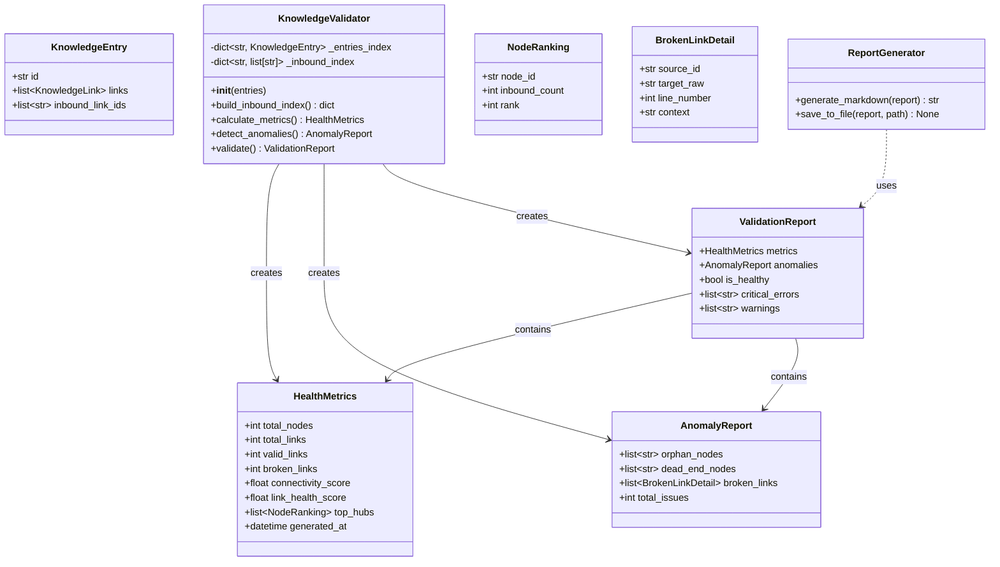

# 🧠 CORTEX Fase 03 - The Knowledge Validator (Design Técnico)

**Task:** [009] The Knowledge Validator
**Status:** Design Phase
**Prerequisite:** [008] The Link Resolver (Completed)
**Data:** 14 de Dezembro de 2025

---

## 📋 ÍNDICE

1. [Executive Summary](#executive-summary)
2. [Problema e Objetivos](#problema-e-objetivos)
3. [Arquitetura do Componente](#arquitetura-do-componente)
4. [Algoritmo de Inversão de Grafo](#algoritmo-de-inversão-de-grafo)
5. [Métricas de Saúde](#métricas-de-saúde)
6. [Detecção de Anomalias](#detecção-de-anomalias)
7. [Estrutura do Relatório](#estrutura-do-relatório)
8. [Fluxo de Dados](#fluxo-de-dados)
9. [Integração CLI](#integração-cli)
10. [Critérios de Aceitação](#critérios-de-aceitação)

---

## 📊 Executive Summary

O **KnowledgeValidator** fecha o ciclo do grafo de conhecimento do CORTEX, transformando links direcionais (outbound) em um grafo bidirecional completo através do cálculo de **Inbound Links** (backlinks/referências inversas). Este componente implementa análise de grafos para detectar anomalias estruturais e gerar diagnósticos de saúde da base de conhecimento.

**Core Value Proposition:**

- **Inversão de Grafo:** Calcula quais documentos apontam para cada nó (PageRank simplificado)
- **Detecção de Anomalias:** Identifica órfãos, becos sem saída e links quebrados
- **Health Metrics:** Fornece métricas quantitativas de conectividade e qualidade
- **CI Integration:** Falha pipelines se houver violações críticas de integridade

**Relação com Fases Anteriores:**

```
[007] LinkScanner    → Extrai links do conteúdo
[008] LinkResolver   → Valida e resolve targets
[009] KnowledgeValidator → Inverte grafo + diagnóstico ← VOCÊ ESTÁ AQUI
```

---

## 🎯 Problema e Objetivos

### Problema Atual

Após a implementação do LinkResolver:

✅ Cada `KnowledgeEntry` possui `links: list[KnowledgeLink]` (Outbound Links)
✅ Sabemos **quem aponta para onde** (A → B, A → C)
❌ Não sabemos **quem aponta para A** (Inbound Links)
❌ Não há métricas de qualidade estrutural
❌ Documentos órfãos ou becos sem saída passam despercebidos

**Consequência:** Base de conhecimento pode degradar silenciosamente (links quebrados, documentação desconectada).

### Objetivos Técnicos

1. **[P41.1.4] Indexador Reverso de Referências**
   - Calcular `inbound_link_ids: list[str]` para cada `KnowledgeEntry`
   - Complexidade O(N + E) onde N = nós, E = edges

2. **Detecção de Anomalias Estruturais**
   - **Orphans:** Documentos com 0 inbound links (ninguém aponta para eles)
   - **Dead Ends:** Documentos com 0 outbound links (não apontam para ninguém)
   - **Broken Links:** Links com `status == LinkStatus.BROKEN`

3. **Métricas de Saúde Quantitativas**
   - **Connectivity Score:** Percentual de nós conectados
   - **Link Health Score:** Razão de links válidos/total
   - **Hub Analysis:** Top documentos mais citados

4. **Relatório Markdown Automático**
   - Gerar `docs/reports/KNOWLEDGE_HEALTH.md`
   - Incluir tabelas, alertas e recomendações

5. **Integração CI/CD**
   - Comando `cortex audit --links` deve falhar se houver broken links críticos
   - Exit code 1 para falha em pipelines

---

## 🏗️ Arquitetura do Componente

### Diagrama de Classes (Mermaid)



### Princípio de Design: Single Responsibility

| Componente | Responsabilidade | Input | Output |
|------------|------------------|-------|--------|
| `KnowledgeValidator` | Análise de grafo e validação | `list[KnowledgeEntry]` | `ValidationReport` |
| `HealthMetrics` | Armazenamento de métricas | - | Dataclass |
| `AnomalyReport` | Agregação de anomalias | - | Dataclass |
| `ReportGenerator` | Formatação de relatórios | `ValidationReport` | Markdown string |

**Justificativa:**

- `KnowledgeValidator` não escreve arquivos (delegado ao `ReportGenerator`)
- Modelos de dados são Pydantic/dataclasses puros (sem lógica)
- Cada classe tem um único motivo para mudar

---

## 🔄 Algoritmo de Inversão de Grafo

### Algoritmo: Indexação Reversa de Links

**Objetivo:** Dado um grafo direcional com outbound links, construir um índice de inbound links.

**Complexidade Temporal:** O(N + E)

- N = número de nós (KnowledgeEntry)
- E = número de edges (KnowledgeLink)

**Complexidade Espacial:** O(N + E)

- Índice reverso: dict[str, list[str]]

### Pseudocódigo

```python
def build_inbound_index(entries: list[KnowledgeEntry]) -> dict[str, list[str]]:
    """
    Constrói índice reverso de referências (Inbound Links).

    Args:
        entries: Lista de KnowledgeEntry com outbound links resolvidos

    Returns:
        Dicionário mapeando target_id -> [source_id_1, source_id_2, ...]

    Complexity:
        Time: O(N + E) onde N = len(entries), E = sum(len(e.links))
        Space: O(N + E) para armazenar o índice
    """
    inbound_index: dict[str, list[str]] = defaultdict(list)

    # Iterar sobre todas as entradas (O(N))
    for entry in entries:
        # Iterar sobre todos os links de cada entrada (O(E) no total)
        for link in entry.links:
            # Apenas links válidos contribuem para inbound
            if link.status == LinkStatus.VALID and link.target_id:
                inbound_index[link.target_id].append(entry.id)

    # Converter defaultdict para dict normal
    return dict(inbound_index)
```

### Exemplo de Execução

**Grafo de Entrada (Outbound Links):**

```
KnowledgeEntry(id="kno-001", links=[
    KnowledgeLink(target_id="kno-002", status=VALID),
    KnowledgeLink(target_id="kno-003", status=VALID),
])

KnowledgeEntry(id="kno-002", links=[
    KnowledgeLink(target_id="kno-003", status=VALID),
])

KnowledgeEntry(id="kno-003", links=[])
```

**Grafo Resultante (Inbound Links):**

```python
inbound_index = {
    "kno-002": ["kno-001"],           # kno-002 é citado por kno-001
    "kno-003": ["kno-001", "kno-002"] # kno-003 é citado por kno-001 e kno-002
}
```

**Observação:** `kno-001` não aparece no índice (0 inbound links → Orphan candidate)

### Otimizações

1. **Lazy Computation:** Calcular apenas quando necessário (não em `__init__`)
2. **Caching:** Armazenar resultado em `_inbound_index` após primeira computação
3. **Invalidation:** Recalcular se lista de entries mudar

---

## 📈 Métricas de Saúde

### Health Score Formula

O **Knowledge Health Score** é uma métrica composta que avalia a qualidade estrutural do grafo:

```python
Health_Score = (0.4 × Connectivity_Score) + (0.6 × Link_Health_Score)
```

**Pesos justificados:**

- **60% Link Health:** Links quebrados são falhas críticas
- **40% Connectivity:** Documentos desconectados são problemas de UX, não bugs

### Métricas Individuais

#### 1. Connectivity Score

**Definição:** Percentual de nós que possuem pelo menos 1 conexão (inbound OU outbound)

```python
def calculate_connectivity_score(entries: list[KnowledgeEntry]) -> float:
    """
    Connectivity Score = (Nós Conectados / Total de Nós) × 100

    Um nó está conectado se:
      - len(entry.links) > 0 (tem outbound) OU
      - len(inbound_links[entry.id]) > 0 (tem inbound)
    """
    total_nodes = len(entries)
    connected_nodes = sum(
        1 for entry in entries
        if len(entry.links) > 0 or len(inbound_links.get(entry.id, [])) > 0
    )
    return (connected_nodes / total_nodes) * 100 if total_nodes > 0 else 0.0
```

**Interpretação:**

- `100%`: Todos os documentos estão conectados (ideal)
- `< 80%`: Há muitos órfãos ou documentos isolados
- `< 50%`: Base de conhecimento fragmentada (crítico)

#### 2. Link Health Score

**Definição:** Razão de links válidos sobre o total de links

```python
def calculate_link_health_score(entries: list[KnowledgeEntry]) -> float:
    """
    Link Health Score = (Links Válidos / Total de Links) × 100

    Links válidos: status == LinkStatus.VALID
    """
    total_links = sum(len(entry.links) for entry in entries)
    valid_links = sum(
        sum(1 for link in entry.links if link.status == LinkStatus.VALID)
        for entry in entries
    )
    return (valid_links / total_links) * 100 if total_links > 0 else 100.0
```

**Interpretação:**

- `100%`: Nenhum link quebrado (ideal)
- `90-99%`: Alguns links quebrados (atenção)
- `< 90%`: Muitos links quebrados (crítico)

#### 3. Hub Analysis (PageRank Simplificado)

**Definição:** Top N documentos mais citados (maior número de inbound links)

```python
@dataclass
class NodeRanking:
    node_id: str
    inbound_count: int
    rank: int  # 1 = mais citado

def calculate_top_hubs(
    inbound_index: dict[str, list[str]],
    top_n: int = 5
) -> list[NodeRanking]:
    """
    Retorna os top N nós mais citados (hubs).

    Hubs são documentos importantes que servem como referência.
    """
    rankings = [
        (node_id, len(inbound_list))
        for node_id, inbound_list in inbound_index.items()
    ]
    # Ordenar por inbound count (decrescente)
    rankings.sort(key=lambda x: x[1], reverse=True)

    return [
        NodeRanking(node_id=node_id, inbound_count=count, rank=i+1)
        for i, (node_id, count) in enumerate(rankings[:top_n])
    ]
```

**Uso:** Identificar documentação crítica que requer manutenção prioritária.

---

## 🔍 Detecção de Anomalias

### 1. Orphan Nodes (Documentos Órfãos)

**Definição:** Documentos que **não recebem** nenhum link de outros documentos.

**Detecção:**

```python
def detect_orphans(
    entries: list[KnowledgeEntry],
    inbound_index: dict[str, list[str]]
) -> list[str]:
    """
    Retorna IDs de documentos órfãos (0 inbound links).

    Exceção: Documentos de entrada (entry points) podem ser órfãos intencionais.
    """
    orphans = [
        entry.id
        for entry in entries
        if entry.id not in inbound_index or len(inbound_index[entry.id]) == 0
    ]
    return orphans
```

**Severidade:**

- ⚠️  **Warning** se < 10% dos documentos são órfãos
- 🔴 **Critical** se ≥ 30% dos documentos são órfãos

**Recomendação:** Adicionar links de documentos principais ou criar índice de navegação.

### 2. Dead End Nodes (Becos sem Saída)

**Definição:** Documentos que **não apontam** para nenhum outro documento.

**Detecção:**

```python
def detect_dead_ends(entries: list[KnowledgeEntry]) -> list[str]:
    """
    Retorna IDs de documentos becos sem saída (0 outbound links).

    Exceção: Documentos conclusivos (e.g., changelogs) podem ser dead ends intencionais.
    """
    dead_ends = [
        entry.id
        for entry in entries
        if len(entry.links) == 0
    ]
    return dead_ends
```

**Severidade:**

- ℹ️  **Info** (não é crítico, mas indica oportunidade de enriquecimento)

**Recomendação:** Adicionar seção "Veja Também" com links relacionados.

### 3. Broken Links (Links Quebrados)

**Definição:** Links que não puderam ser resolvidos (target não existe).

**Detecção:**

```python
@dataclass
class BrokenLinkDetail:
    source_id: str
    target_raw: str
    line_number: int
    context: str

def detect_broken_links(entries: list[KnowledgeEntry]) -> list[BrokenLinkDetail]:
    """
    Retorna lista detalhada de todos os links quebrados.
    """
    broken = []
    for entry in entries:
        for link in entry.links:
            if link.status == LinkStatus.BROKEN:
                broken.append(BrokenLinkDetail(
                    source_id=entry.id,
                    target_raw=link.target_raw,
                    line_number=link.line_number,
                    context=link.context,
                ))
    return broken
```

**Severidade:**

- 🔴 **Critical** (sempre)
- **Ação:** Falhar CI se houver broken links (configurable via `--strict` flag)

---

## 📄 Estrutura do Relatório

### Layout do KNOWLEDGE_HEALTH.md

O relatório gerado em `docs/reports/KNOWLEDGE_HEALTH.md` segue este template:

```markdown
---
generated_at: 2025-12-14T21:45:00Z
health_score: 87.5
status: healthy  # healthy | warning | critical
---

# 📊 Knowledge Graph Health Report

**Generated:** 2025-12-14 21:45:00 UTC
**Overall Health Score:** 87.5/100 (🟢 Healthy)

---

## 📈 Executive Summary

| Metric                  | Value    | Status |
|-------------------------|----------|--------|
| Total Nodes             | 45       | -      |
| Total Links             | 128      | -      |
| Valid Links             | 120      | 🟢     |
| Broken Links            | 8        | ⚠️      |
| Connectivity Score      | 91.1%    | 🟢     |
| Link Health Score       | 93.8%    | 🟢     |
| **Overall Health Score**| **87.5**| 🟢     |

---

## 🏆 Top 5 Most Referenced Documents (Hubs)

| Rank | Document ID | Inbound Links | Status |
|------|-------------|---------------|--------|
| 1    | kno-002     | 15            | 🟢     |
| 2    | kno-007     | 12            | 🟢     |
| 3    | kno-001     | 10            | 🟢     |
| 4    | kno-015     | 8             | 🟢     |
| 5    | kno-023     | 7             | 🟢     |

**Interpretation:** These documents are critical references. Ensure they are well-maintained.

---

## 🔴 Critical Issues

### Broken Links (8 total)

| Source      | Target       | Line | Context                           |
|-------------|--------------|------|-----------------------------------|
| kno-003     | `[[Fase 99]]`| 42   | ...Veja [[Fase 99]] para mais...  |
| kno-012     | `old-doc.md` | 15   | Confira [aqui](old-doc.md)...     |
| ...         | ...          | ...  | ...                               |

**Recommendation:** Fix these links immediately or mark them as external.

---

## ⚠️  Warnings

### Orphan Nodes (5 total - 11.1%)

Documents with no incoming links:

- `kno-018` - "Isolated Tutorial"
- `kno-022` - "Draft Proposal"
- `kno-034` - "Experimental Feature"
- ...

**Recommendation:** Add links from main navigation or index documents.

### Dead End Nodes (12 total - 26.7%)

Documents with no outgoing links:

- `kno-008` - "Changelog v1.2"
- `kno-019` - "Quick Reference"
- ...

**Recommendation:** Add "See Also" sections to enrich navigation.

---

## 📊 Detailed Statistics

### Connectivity Distribution

```

Nodes with 0 connections:  4  (8.9%)
Nodes with 1-3 connections: 18 (40.0%)
Nodes with 4-9 connections: 20 (44.4%)
Nodes with 10+ connections: 3  (6.7%)

```

### Link Status Breakdown

```

VALID:    120 (93.8%)
BROKEN:   8   (6.2%)
EXTERNAL: 0   (0.0%)

```

---

## 🎯 Action Items

### High Priority

1. ✅ Fix 8 broken links (see table above)
2. ⚠️  Review orphan nodes and add navigation links

### Medium Priority

3. ℹ️  Add "See Also" sections to dead end nodes
4. ℹ️  Update top hubs to ensure accuracy

### Low Priority

5. 📊 Monitor connectivity score (target: >90%)

---

## 📚 How to Improve This Score

**To reach 95+:**

- Fix all broken links (→ +5 points)
- Reduce orphans to <5% (→ +3 points)

**Commands:**

```bash
# Re-run analysis
cortex audit --links

# Fix specific broken link
cortex fix-link kno-003 42

# Generate updated report
cortex report --health
```

---

**Report generated by CORTEX Knowledge Validator v0.1.0**

```

### Customização do Template

O `ReportGenerator` aceita parâmetros de customização:

```python
class ReportGenerator:
    def generate_markdown(
        self,
        report: ValidationReport,
        include_orphans: bool = True,
        include_dead_ends: bool = True,
        top_hubs_count: int = 5,
    ) -> str:
        """Generate markdown report with configurable sections."""
```

---

## 🔄 Fluxo de Dados

### Pipeline Completo (Scanner → Validator → Report)



```mermaid
graph LR
    A[Markdown Files] --> B[KnowledgeScanner]
    B --> C[KnowledgeEntry<br/>cached_content]
    C --> D[LinkAnalyzer]
    D --> E[KnowledgeLink<br/>outbound links]
    E --> F[LinkResolver]
    F --> G[KnowledgeLink<br/>resolved + validated]
    G --> H[KnowledgeValidator]
    H --> I[build_inbound_index]
    I --> J[calculate_metrics]
    J --> K[detect_anomalies]
    K --> L[ValidationReport]
    L --> M[ReportGenerator]
    M --> N[KNOWLEDGE_HEALTH.md]

    style H fill:#ff9,stroke:#333,stroke-width:4px
    style I fill:#9f9,stroke:#333,stroke-width:2px
    style J fill:#9f9,stroke:#333,stroke-width:2px
    style K fill:#9f9,stroke:#333,stroke-width:2px
```

### Sequência de Chamadas (Code Level)

```python
# 1. Scan + Parse
scanner = KnowledgeScanner(docs_path)
entries = scanner.scan()

# 2. Extract Links
analyzer = LinkAnalyzer()
for entry in entries:
    links = analyzer.extract_links(entry.cached_content, entry.id)
    entry = entry.model_copy(update={"links": links})

# 3. Resolve Links
resolver = LinkResolver(entries, workspace_root)
resolved_entries = resolver.resolve_all()

# 4. Validate + Generate Report (NEW)
validator = KnowledgeValidator(resolved_entries)
report = validator.validate()

# 5. Save Report
generator = ReportGenerator()
markdown = generator.generate_markdown(report)
generator.save_to_file(markdown, "docs/reports/KNOWLEDGE_HEALTH.md")
```

---

## 🛠️ Integração CLI

### Comando: `cortex audit --links`

**Sintaxe:**

```bash
cortex audit --links [--strict] [--output PATH] [--format {text,json,markdown}]
```

**Flags:**

| Flag | Descrição | Default |
|------|-----------|---------|
| `--strict` | Fail CI if broken links exist (exit code 1) | `False` |
| `--output PATH` | Custom output path for report | `docs/reports/KNOWLEDGE_HEALTH.md` |
| `--format {text,json,markdown}` | Output format | `markdown` |

**Comportamento:**

```python
def cortex_audit_links(strict: bool = False, output: Path | None = None) -> int:
    """
    Run knowledge graph validation and generate health report.

    Returns:
        0 if validation passed or warnings only
        1 if critical errors found (broken links) and --strict is True
    """
    # Run validation pipeline
    validator = KnowledgeValidator(entries)
    report = validator.validate()

    # Generate report
    generator = ReportGenerator()
    markdown = generator.generate_markdown(report)

    # Save to file
    output_path = output or Path("docs/reports/KNOWLEDGE_HEALTH.md")
    generator.save_to_file(markdown, output_path)

    # Print summary to stdout
    print(f"Health Score: {report.metrics.health_score}/100")
    print(f"Broken Links: {report.anomalies.total_broken_links}")

    # Determine exit code
    if strict and report.anomalies.total_broken_links > 0:
        print("❌ Validation FAILED: Broken links detected (--strict mode)")
        return 1

    if not report.is_healthy:
        print("⚠️  Validation completed with warnings")
        return 0

    print("✅ Validation PASSED")
    return 0
```

**Integração CI/CD (GitHub Actions):**

```yaml
# .github/workflows/docs-validation.yml
name: Documentation Validation

on: [push, pull_request]

jobs:
  validate-knowledge-graph:
    runs-on: ubuntu-latest
    steps:
      - uses: actions/checkout@v3
      - name: Setup Python
        uses: actions/setup-python@v4
        with:
          python-version: '3.11'
      - name: Install Dependencies
        run: pip install -e .
      - name: Validate Knowledge Graph
        run: cortex audit --links --strict  # Fail CI on broken links
```

---

## ✅ Critérios de Aceitação

### Funcionalidades Obrigatórias

- [ ] **[P41.1.4] Cálculo de Inbound Links**
  - [ ] Implementar `build_inbound_index()` com complexidade O(N+E)
  - [ ] Testar com grafos de diferentes tamanhos (10, 100, 1000 nós)
  - [ ] Validar correção com casos de teste conhecidos

- [ ] **Detecção de Anomalias**
  - [ ] Detectar Orphan Nodes
  - [ ] Detectar Dead End Nodes
  - [ ] Detectar Broken Links (já identificados pelo Resolver)
  - [ ] Classificar severidade (Info/Warning/Critical)

- [ ] **Métricas de Saúde**
  - [ ] Calcular Connectivity Score
  - [ ] Calcular Link Health Score
  - [ ] Calcular Overall Health Score (fórmula composta)
  - [ ] Gerar Top 5 Hubs (documentos mais citados)

- [ ] **Geração de Relatório**
  - [ ] Implementar `ReportGenerator.generate_markdown()`
  - [ ] Salvar em `docs/reports/KNOWLEDGE_HEALTH.md`
  - [ ] Incluir todas as seções do template
  - [ ] Suportar customização (flags opcionais)

- [ ] **Integração CLI**
  - [ ] Implementar `cortex audit --links`
  - [ ] Suportar flag `--strict` (exit code 1 se broken links)
  - [ ] Suportar flag `--output` (path customizado)
  - [ ] Suportar flag `--format {text,json,markdown}`

### Testes Obrigatórios

- [ ] **Testes Unitários (scripts/core/cortex/)**
  - [ ] `test_knowledge_validator.py` (30+ testes)
  - [ ] `test_report_generator.py` (15+ testes)
  - [ ] Testar cada função de detecção isoladamente
  - [ ] Testar cálculos de métricas com casos extremos

- [ ] **Testes de Integração**
  - [ ] Pipeline completo (Scanner → Validator → Report)
  - [ ] Validar formato Markdown gerado
  - [ ] Testar CLI com diferentes flags

- [ ] **Testes de Performance**
  - [ ] Validar O(N+E) para `build_inbound_index()`
  - [ ] Benchmark com 1000+ nós

### Documentação Obrigatória

- [ ] **Docstrings Google Style**
  - [ ] Todas as classes públicas
  - [ ] Todas as funções públicas
  - [ ] Exemplos de uso em docstrings

- [ ] **Type Hints Completos**
  - [ ] 100% de cobertura em todos os módulos novos

- [ ] **Guia de Uso**
  - [ ] Atualizar `docs/guides/CORTEX_INTROSPECTION_SYSTEM.md`
  - [ ] Adicionar seção sobre auditoria de links

---

## 📊 Métricas de Sucesso

### Qualidade de Código

| Métrica | Target | Tool |
|---------|--------|------|
| Type Coverage | 100% | mypy --strict |
| Test Coverage | ≥95% | pytest-cov |
| Cyclomatic Complexity | <10 | ruff |
| Docstring Coverage | 100% | interrogate |

### Performance

| Cenário | Target | Medição |
|---------|--------|---------|
| 100 nós, 300 links | <100ms | timeit |
| 1000 nós, 5000 links | <1s | timeit |
| Geração de relatório | <500ms | timeit |

### CI/CD

- ✅ Pipeline deve passar em <2min
- ✅ Falhar se broken links em `--strict` mode
- ✅ Gerar artefato do relatório

---

## 🔮 Extensões Futuras (Out of Scope)

### Fase 04 - Advanced Analytics

- **Ciclos no Grafo:** Detectar dependências circulares (A → B → C → A)
- **Caminho Mais Curto:** Algoritmo de Dijkstra para navegação
- **Clustering:** Agrupar documentos por similaridade de conexões
- **Temporal Analysis:** Rastrear evolução do grafo ao longo do tempo

### Integração com Ferramentas

- **VS Code Extension:** Visualizar grafo interativamente
- **GitHub Bot:** Comentar em PRs com impacto no grafo
- **Slack Alerts:** Notificar quando Health Score < 80%

---

## 📚 Referências

### Teoria de Grafos

- **PageRank Algorithm:** Brin, S., & Page, L. (1998). The anatomy of a large-scale hypertextual Web search engine.
- **Graph Inversion:** Cormen et al. (2009). Introduction to Algorithms, 3rd Edition. Chapter 22: Elementary Graph Algorithms.

### Best Practices

- **Documentation as Code:** Docs-as-Code Movement (writethedocs.org)
- **Link Rot Prevention:** Archive Team Best Practices
- **Knowledge Management:** Second Brain Methodology (Forte, 2020)

---

**Status Final:** 🟢 Pronto para Implementação
**Próximo Passo:** Criar Issue/Branch para Tarefa [009]
**Responsável:** Aguardando aprovação do design
**Estimativa:** 2-3 dias de desenvolvimento + 1 dia de testes

---
