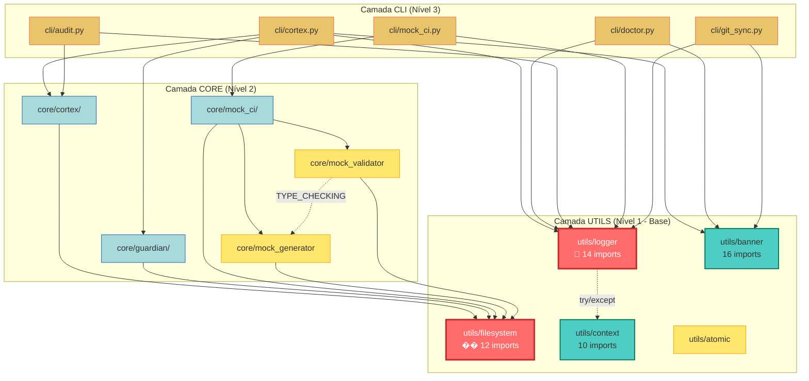

# Diagrama de Dependências do Projeto

## Visão Geral da Arquitetura

Este diagrama mostra as dependências entre as principais camadas e módulos do projeto.

**Legenda:**
- 🔴 **Vermelho:** Módulos Hub Críticos (>10 imports)
- 🔵 **Azul:** Módulos Hub Normais (5-10 imports)
- Linha sólida: Dependência direta
- Linha pontilhada: Dependência condicional (TYPE_CHECKING, try/except)

## Observações

1. **Fluxo Unidirecional:** CLI → CORE → UTILS (nenhuma violação)
2. **Hubs Críticos:** `logger` e `filesystem` são pontos centrais
3. **TYPE_CHECKING:** Usado corretamente entre `mock_validator` e `mock_generator`
4. **Graceful Degradation:** `logger` tem fallback para `context`

---

*Gerado automaticamente pela Tarefa [004]*
