# Diagrama de Dependências do Projeto

## Visão Geral da Arquitetura

Este diagrama mostra as dependências entre as principais camadas e módulos do projeto.

**Legenda:**
- 🔴 **Vermelho:** Módulos Hub Críticos (>10 imports)
- 🔵 **Azul:** Módulos Hub Normais (5-10 imports)
- Linha sólida: Dependência direta
- Linha pontilhada: Dependência condicional (TYPE_CHECKING, try/except)

```mermaid

graph TB
    subgraph "Camada CLI (Nível 3)"
        CLI_CORTEX[cli/cortex.py]
        CLI_DOCTOR[cli/doctor.py]
        CLI_AUDIT[cli/audit.py]
        CLI_MOCK[cli/mock_ci.py]
        CLI_GIT[cli/git_sync.py]
    end

    subgraph "Camada CORE (Nível 2)"
        CORE_CORTEX[core/cortex/]
        CORE_GUARDIAN[core/guardian/]
        CORE_MOCKCI[core/mock_ci/]
        CORE_MOCKGEN[core/mock_generator]
        CORE_MOCKVAL[core/mock_validator]
    end

    subgraph "Camada UTILS (Nível 1 - Base)"
        UTILS_LOGGER[utils/logger<br/>🔴 14 imports]
        UTILS_FS[utils/filesystem<br/>�� 12 imports]
        UTILS_CTX[utils/context<br/>10 imports]
        UTILS_BANNER[utils/banner<br/>16 imports]
        UTILS_ATOMIC[utils/atomic]
    end

    %% Dependências CLI → CORE
    CLI_CORTEX --> CORE_CORTEX
    CLI_CORTEX --> CORE_GUARDIAN
    CLI_AUDIT --> CORE_CORTEX
    CLI_MOCK --> CORE_MOCKCI

    %% Dependências CLI → UTILS
    CLI_CORTEX --> UTILS_LOGGER
    CLI_CORTEX --> UTILS_BANNER
    CLI_DOCTOR --> UTILS_LOGGER
    CLI_DOCTOR --> UTILS_BANNER
    CLI_AUDIT --> UTILS_LOGGER
    CLI_MOCK --> UTILS_LOGGER
    CLI_GIT --> UTILS_LOGGER
    CLI_GIT --> UTILS_BANNER

    %% Dependências CORE → UTILS
    CORE_CORTEX --> UTILS_FS
    CORE_GUARDIAN --> UTILS_FS
    CORE_MOCKCI --> UTILS_FS
    CORE_MOCKGEN --> UTILS_FS
    CORE_MOCKVAL --> UTILS_FS

    %% Dependências dentro de CORE
    CORE_MOCKCI --> CORE_MOCKGEN
    CORE_MOCKCI --> CORE_MOCKVAL
    CORE_MOCKVAL -.TYPE_CHECKING.-> CORE_MOCKGEN

    %% Dependências internas UTILS
    UTILS_LOGGER -.try/except.-> UTILS_CTX

    %% Estilos
    classDef criticalHub fill:#ff6b6b,stroke:#c92a2a,stroke-width:3px,color:#fff
    classDef normalHub fill:#4ecdc4,stroke:#087f5b,stroke-width:2px
    classDef layer1 fill:#ffe66d,stroke:#f59f00
    classDef layer2 fill:#a8dadc,stroke:#1864ab
    classDef layer3 fill:#e9c46a,stroke:#e76f51

    class UTILS_LOGGER,UTILS_FS criticalHub
    class UTILS_BANNER,UTILS_CTX normalHub
    class UTILS_ATOMIC,CORE_MOCKGEN,CORE_MOCKVAL layer1
    class CORE_CORTEX,CORE_GUARDIAN,CORE_MOCKCI layer2
    class CLI_CORTEX,CLI_DOCTOR,CLI_AUDIT,CLI_MOCK,CLI_GIT layer3
```

## Observações

1. **Fluxo Unidirecional:** CLI → CORE → UTILS (nenhuma violação)
2. **Hubs Críticos:** `logger` e `filesystem` são pontos centrais
3. **TYPE_CHECKING:** Usado corretamente entre `mock_validator` e `mock_generator`
4. **Graceful Degradation:** `logger` tem fallback para `context`

---

*Gerado automaticamente pela Tarefa [004]*
