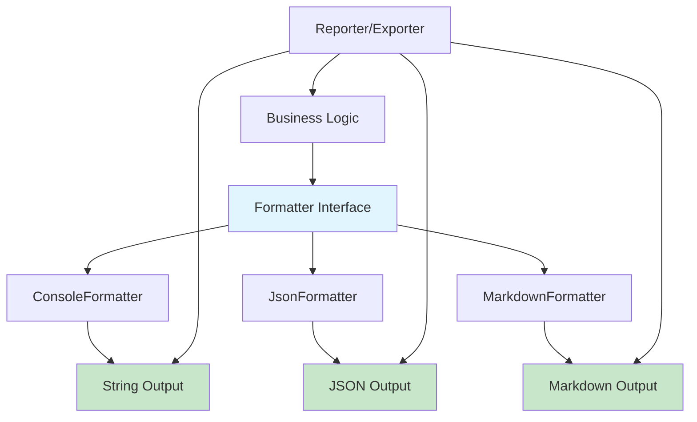

# 📝 Formatter Pattern - Decoupling Output from Business Logic

## Status

**Active** - Padrão extraído e validado durante Sprint 4 (Tarefa P34 - Nov 2025)

## Contexto e Motivação

### O Problema: Acoplamento Output-Lógica

Durante a refatoração de `audit_dashboard.py` (Tarefa P34), identificamos um **anti-padrão crítico**:

```python
# ❌ ANTI-PADRÃO: Lógica + Output mesclados
class AuditReporter:
    def print_summary(self, report: dict) -> None:
        """Imprime relatório no console (viola SRP)."""
        # LÓGICA DE FORMATAÇÃO mesclada com I/O
        print("=" * 60)
        print("CODE SECURITY AUDIT REPORT")
        print("=" * 60)
        print(f"Timestamp: {report['metadata']['timestamp']}")
        print(f"Workspace: {report['metadata']['workspace']}")

        # ... 50+ linhas de formatação hardcoded ...

        for finding in report['findings']:
            print(f"  • {finding['file']}:{finding['line']} - {finding['description']}")
```

**Problemas Identificados:**

1. **Violação SRP (Single Responsibility Principle):** `AuditReporter` faz DUAS coisas:
   - Formata dados para exibição
   - Imprime no console

2. **Impossível Testar Formatação:** Testes precisam capturar `stdout` via `capsys` (frágil e lento)

3. **Impossível Adicionar Novos Formatos:** Para adicionar JSON ou Markdown, seria necessário duplicar lógica ou criar condicionais gigantes

4. **Código não Reutilizável:** A lógica de formatação não pode ser usada fora de `print()`

### A Solução: Extrair Formatter como Componente Independente

Durante a **Tarefa P34**, aplicamos o **Protocolo de Fracionamento Iterativo** para extrair a formatação em classe separada:

```python
# ✅ SOLUÇÃO: Formatter isolado (testável unitariamente)
class ConsoleAuditFormatter:
    """Formatter para relatórios de auditoria (output: string)."""

    def format(self, report: dict[str, Any]) -> str:
        """Formata relatório como string (SEM I/O)."""
        lines = []
        lines.append("=" * 60)
        lines.append("CODE SECURITY AUDIT REPORT")
        # ... lógica de formatação ...
        return "\n".join(lines)

# AuditReporter agora DELEGA formatação
class AuditReporter:
    def print_summary(self, report: dict) -> None:
        """Imprime relatório (delegação ao Formatter)."""
        formatter = ConsoleAuditFormatter()
        output = formatter.format(report)  # Pure function!
        print(output)  # I/O isolado
```

**Benefícios Imediatos:**

- ✅ **Testabilidade:** Testes unitários validam formatação sem mocks de I/O
- ✅ **Extensibilidade:** Adicionar `JsonAuditFormatter` ou `MarkdownAuditFormatter` é trivial
- ✅ **Reutilização:** Formatter pode ser usado em contexts diferentes (HTTP response, file export, etc.)
- ✅ **Type Safety:** `mypy` valida contratos de formatação

---

## Arquitetura do Padrão

### Diagrama de Componentes



### Separação de Responsabilidades

| Componente | Responsabilidade | Input | Output |
|------------|------------------|-------|--------|
| **Business Logic** | Coleta e processa dados | Raw data | Structured dict |
| **Formatter** | Transforma dados em representação | Structured dict | String (formatted) |
| **Reporter/Exporter** | Escreve output em destino | Formatted string | Side effect (print, file, HTTP) |

**Princípio:** Cada componente faz **UMA** coisa, e faz bem.

---

## Implementações de Referência

### Caso 1: Audit Reporter (P34 - Extraction Complete)

**Estrutura:**

```python
# scripts/audit/reporter.py

class ConsoleAuditFormatter:
    """Pure formatter - sem I/O, apenas transformação de dados."""

    def format(self, report: dict[str, Any]) -> str:
        """Formata relatório como string para console.

        Args:
            report: Structured audit report (metadata + findings + summary)

        Returns:
            Formatted string ready for console output
        """
        metadata = report["metadata"]
        summary = report["summary"]
        findings = report["findings"]

        lines = []
        lines.append("=" * 60)
        lines.append(_("🔍 CODE SECURITY AUDIT REPORT"))
        lines.append("=" * 60)
        lines.append(_("📅 Timestamp: {timestamp}").format(
            timestamp=metadata["timestamp"]
        ))
        lines.append(_("📁 Workspace: {workspace}").format(
            workspace=metadata["workspace"]
        ))
        # ... formatação completa ...

        return "\n".join(lines)


class AuditReporter:
    """High-level reporter - delega formatação e gerencia I/O."""

    def __init__(self, workspace_root: Path):
        self.workspace_root = workspace_root

    def print_summary(self, report: dict[str, Any]) -> None:
        """Imprime resumo de auditoria no console."""
        formatter = ConsoleAuditFormatter()
        output = formatter.format(report)  # Delegação
        print(output)  # I/O isolado

    def save_report(
        self,
        report: dict[str, Any],
        output_path: str,
        format: str = "json",
    ) -> None:
        """Salva relatório em arquivo (JSON ou YAML)."""
        path = Path(output_path)

        # Atomic write with fsync (data integrity)
        with AtomicFileWriter(path, fsync=True) as f:
            if format == "json":
                json.dump(report, f, indent=2, ensure_ascii=False)
            elif format == "yaml":
                yaml.dump(report, f, allow_unicode=True)
```

**Uso:**

```python
# Código consumidor
reporter = AuditReporter(workspace_root=Path.cwd())

# Console output
reporter.print_summary(audit_report)

# File output
reporter.save_report(audit_report, "audit_report.json")
reporter.save_report(audit_report, "audit_report.yaml", format="yaml")
```

### Caso 2: Dashboard Exporters (Multi-Format Export)

**Estrutura:**

```python
# scripts/audit_dashboard/exporters.py

class HTMLExporter:
    """Formatter para dashboard HTML."""

    @staticmethod
    def export(metrics: dict[str, Any]) -> str:
        """Formata métricas como HTML dashboard.

        Returns:
            HTML completo (string)
        """
        template = _get_html_template()  # Template hardcoded
        data = _prepare_template_data(metrics)
        return template.format(**data)


class JSONExporter:
    """Formatter para export JSON."""

    @staticmethod
    def export(metrics: dict[str, Any]) -> str:
        """Formata métricas como JSON.

        Returns:
            JSON formatado (string)
        """
        export_data = {
            "exported_at": datetime.now().isoformat(),
            "metrics": metrics.copy(),
        }
        return json.dumps(export_data, indent=2, ensure_ascii=False)


class ConsoleReporter:
    """Formatter para output de console."""

    @staticmethod
    def print_dashboard(metrics: dict[str, Any]) -> None:
        """Imprime dashboard no console (tem I/O - não é pure)."""
        print(_("📊 DASHBOARD DE AUDITORIA DEVOPS"))
        print("=" * 50)
        # ... formatação e impressão ...


# Dashboard usa os exporters
class AuditDashboard:
    def __init__(self):
        self.html_exporter = HTMLExporter()
        self.json_exporter = JSONExporter()
        self.console_reporter = ConsoleReporter()

    def export_html_dashboard(self) -> Path:
        """Gera dashboard HTML."""
        html_content = self.html_exporter.export(self._metrics)
        output_path = self.workspace_root / "audit_dashboard.html"
        output_path.write_text(html_content, encoding="utf-8")
        return output_path

    def export_json_metrics(self) -> Path:
        """Exporta métricas como JSON."""
        json_content = self.json_exporter.export(self._metrics)
        output_path = self.workspace_root / "audit_metrics.json"
        output_path.write_text(json_content, encoding="utf-8")
        return output_path

    def print_console_dashboard(self) -> None:
        """Imprime dashboard no console."""
        self.console_reporter.print_dashboard(self._metrics)
```

### Caso 3: CI Reporter (Mock CI System)

**Estrutura:**

```python
# scripts/core/mock_ci/reporter.py

class CIReporter:
    """Reporter para sistema de Mock CI."""

    def __init__(self, filesystem: FileSystemAdapter):
        self.filesystem = filesystem

    def generate_json_report(
        self,
        report: CIReport,
        output_file: Path,
    ) -> None:
        """Salva relatório como JSON."""
        report_dict = {
            "summary": {
                "total_checks": report.total_checks,
                "passed": report.passed,
                "failed": report.failed,
                # ...
            },
            "checks": [check.to_dict() for check in report.checks],
        }

        # Atomic write via filesystem adapter
        json_content = json.dumps(report_dict, indent=REPORT_INDENT)
        self.filesystem.write_text(output_file, json_content)

    def print_console_summary(self, report: CIReport) -> None:
        """Imprime resumo colorizado no console."""
        print("\n" + "=" * 60)
        print("CI VERIFICATION REPORT")
        print("=" * 60)

        # Status com emoji
        status_icon = "✅" if report.passed == report.total_checks else "❌"
        print(f"{status_icon} Status: {report.status}")

        # Estatísticas
        print(f"\n📊 Results:")
        print(f"  • Total checks: {report.total_checks}")
        print(f"  • Passed: {report.passed}")
        print(f"  • Failed: {report.failed}")

        # Detalhes de falhas
        if report.failed > 0:
            print("\n⚠️  Failed Checks:")
            for check in report.checks:
                if check.status == "failed":
                    print(f"  ❌ {check.name}: {check.message}")
```

---

## Padrões de Teste

### Testando Formatters (Pure Functions)

**Formatter é uma função pura:** Dado um input, sempre retorna o mesmo output.

```python
# tests/test_reporter.py

class TestConsoleAuditFormatter:
    """Testes do formatter (isolado, sem I/O)."""

    def test_format_structure(self, sample_report: dict[str, Any]) -> None:
        """Valida que output contém todas as seções esperadas."""
        formatter = ConsoleAuditFormatter()
        output = formatter.format(sample_report)

        assert isinstance(output, str)
        assert "CODE SECURITY AUDIT REPORT" in output
        assert "Timestamp:" in output
        assert "Workspace:" in output
        assert "OVERALL STATUS:" in output
        assert "SEVERITY DISTRIBUTION:" in output

    def test_format_findings(self, sample_report: dict[str, Any]) -> None:
        """Valida que findings são formatados corretamente."""
        formatter = ConsoleAuditFormatter()
        output = formatter.format(sample_report)

        assert "TOP FINDINGS:" in output
        assert "test.py:10" in output
        assert "SQL injection vulnerability" in output

    def test_format_no_findings(
        self,
        sample_report_no_findings: dict[str, Any],
    ) -> None:
        """Valida que relatório sem findings não quebra."""
        formatter = ConsoleAuditFormatter()
        output = formatter.format(sample_report_no_findings)

        assert "TOP FINDINGS:" not in output
        assert "PASS" in output
```

**Benefícios:**

- ✅ **Rápido:** Sem I/O, apenas manipulação de strings
- ✅ **Determinístico:** Sem dependência de estado externo
- ✅ **Isolado:** Não precisa de mocks de filesystem, console, etc.

### Testando Reporters (Delegação)

**Reporter delega para Formatter:** Teste valida que delegação ocorre.

```python
# tests/test_reporter.py

class TestAuditReporter:
    """Testes do reporter (integração com formatter)."""

    def test_print_summary_calls_formatter(
        self,
        sample_report: dict[str, Any],
    ) -> None:
        """Valida que print_summary delega para ConsoleAuditFormatter."""
        reporter = AuditReporter(Path("/tmp"))

        with (
            patch("builtins.print") as mock_print,
            patch.object(
                ConsoleAuditFormatter,
                "format",
                return_value="FORMATTED_REPORT",
            ) as mock_format,
        ):
            reporter.print_summary(sample_report)

            # Valida que formatter foi chamado com report correto
            mock_format.assert_called_once_with(sample_report)

            # Valida que print recebeu output do formatter
            mock_print.assert_called_once_with("FORMATTED_REPORT")

    def test_print_summary_integration(
        self,
        sample_report: dict[str, Any],
        capsys: pytest.CaptureFixture[str],
    ) -> None:
        """Teste de integração: valida output real no console."""
        reporter = AuditReporter(Path("/tmp"))
        reporter.print_summary(sample_report)

        captured = capsys.readouterr()
        assert "CODE SECURITY AUDIT REPORT" in captured.out
```

---

## Quando Usar o Formatter Pattern

### ✅ Use Quando

1. **Output Múltiplo:** Precisa gerar JSON, HTML, Markdown, Console para os mesmos dados
2. **Lógica de Formatação Complexa:** Mais de 20 linhas de código para formatar output
3. **Testabilidade:** Quer testar formatação sem capturar I/O (stdout, files)
4. **Internacionalização:** Strings de output precisam ser traduzidas (i18n)
5. **Reutilização:** Formatação pode ser usada em múltiplos contextos (CLI, API, export)

### ❌ Não Use Quando

1. **Formatação Trivial:** Output é simples (ex: `print(f"Status: {status}")`)
2. **Formato Único:** Só precisa de um tipo de output (ex: apenas JSON)
3. **Acoplamento Aceitável:** Código é script descartável, não biblioteca

---

## Extensibilidade: Adicionando Novos Formatos

### Pattern: Formatter como Protocolo (Duck Typing)

```python
# Não é necessário interface formal, mas pode usar Protocol
from typing import Protocol, runtime_checkable

@runtime_checkable
class AuditFormatter(Protocol):
    """Contrato para formatters de audit reports."""

    def format(self, report: dict[str, Any]) -> str:
        """Formata relatório.

        Args:
            report: Structured audit report

        Returns:
            Formatted string
        """
        ...


# Implementações concretas
class ConsoleAuditFormatter:
    def format(self, report: dict[str, Any]) -> str:
        # ... formatação para console ...
        return console_output


class MarkdownAuditFormatter:
    def format(self, report: dict[str, Any]) -> str:
        """Formata relatório como Markdown (para GitHub Issues, etc)."""
        lines = []
        lines.append("# 🔍 Code Security Audit Report")
        lines.append("")
        lines.append(f"**Timestamp:** {report['metadata']['timestamp']}")
        lines.append(f"**Workspace:** `{report['metadata']['workspace']}`")
        # ... formatação Markdown ...
        return "\n".join(lines)


class JsonAuditFormatter:
    def format(self, report: dict[str, Any]) -> str:
        """Formata relatório como JSON (já estruturado)."""
        return json.dumps(report, indent=2, ensure_ascii=False)


# Reporter aceita qualquer formatter (Dependency Injection)
class AuditReporter:
    def __init__(
        self,
        workspace_root: Path,
        formatter: AuditFormatter | None = None,
    ):
        self.workspace_root = workspace_root
        self.formatter = formatter or ConsoleAuditFormatter()

    def print_summary(self, report: dict[str, Any]) -> None:
        """Imprime usando formatter configurado."""
        output = self.formatter.format(report)
        print(output)


# Uso
reporter = AuditReporter(
    workspace_root=Path.cwd(),
    formatter=MarkdownAuditFormatter(),  # Injeção de dependência
)
reporter.print_summary(audit_report)
```

---

## Roadmap: Formatters Futuros

### Prioridade Alta (P35.1)

- [ ] **`JsonAuditFormatter`**: Já tem no `save_report`, mas não como formatter isolado
- [ ] **`MarkdownAuditFormatter`**: Para export de relatórios para GitHub Issues/Wiki

### Prioridade Média (P36)

- [ ] **`HtmlAuditFormatter`**: Dashboard HTML estático (similar ao `HTMLExporter` existente)
- [ ] **`CsvAuditFormatter`**: Export de findings para planilhas (data analysis)

### Prioridade Baixa (Future)

- [ ] **`SlackFormatter`**: Formatação para mensagens Slack (webhooks)
- [ ] **`EmailFormatter`**: Template de email para relatórios automáticos

---

## Referências Técnicas

### Implementações Completas

- [scripts/audit/reporter.py](../../scripts/audit/reporter.py) - `ConsoleAuditFormatter` (P34 extraction)
- [scripts/audit_dashboard/exporters.py](../../scripts/audit_dashboard/exporters.py) - Multi-format exporters
- [scripts/core/mock_ci/reporter.py](../../scripts/core/mock_ci/reporter.py) - CI reporter pattern

### Testes de Referência

- [tests/test_reporter.py](../../tests/test_reporter.py) - Testes de formatters e reporters

### Documentação Relacionada

- [REFACTORING_PROTOCOL_ITERATIVE_FRACTIONATION.md](../guides/REFACTORING_PROTOCOL_ITERATIVE_FRACTIONATION.md) - Metodologia de extração
- [CODE_AUDIT.md](../architecture/CODE_AUDIT.md) - Arquitetura do sistema de auditoria
- [ENGINEERING_STANDARDS.md](../guides/ENGINEERING_STANDARDS.md) - Padrões de design

### Design Patterns

- [Strategy Pattern](https://refactoring.guru/design-patterns/strategy) - Formatters são strategies intercambiáveis
- [Adapter Pattern](https://refactoring.guru/design-patterns/adapter) - Formatters adaptam dados para diferentes outputs

---

## Histórico de Revisões

| Versão | Data | Mudanças |
|--------|------|----------|
| 1.0.0 | 2025-12-16 | Versão inicial baseada em P34 extraction e retrospectiva v8.0 |

---

**Mantenha este documento atualizado conforme novos formatters forem adicionados ao projeto.**
