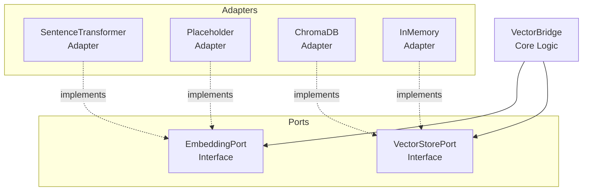

# Hexagonal Architecture Diagrams & Validation

## 📋 Overview

Este documento descreve o sistema de geração automática de diagramas arquiteturais e validação da Arquitetura Hexagonal (Ports & Adapters) no projeto CORTEX.

## 🎯 Objetivo

- **Fonte da Verdade Arquitetural**: Diagrams auto-gerados a partir do código real
- **Validação Contínua**: Detectar violações de arquitetura hexagonal
- **Documentação Viva**: Diagramas sempre sincronizados com implementação
- **Onboarding**: Desenvolvedores visualizam arquitetura sem ler código

## 🏗️ Arquitetura Hexagonal (Ports & Adapters)

### Conceito

A Arquitetura Hexagonal (também conhecida como Ports & Adapters) separa:

1. **Core Logic (Domain)**: Regras de negócio puras, sem dependências externas
2. **Ports (Interfaces)**: Contratos que definem como o core se comunica com o mundo externo
3. **Adapters (Implementations)**: Implementações concretas dos ports para tecnologias específicas

### Benefícios

- ✅ **Testabilidade**: Core testável sem infraestrutura real (mocks)
- ✅ **Substituibilidade**: Trocar tecnologias sem refactor (ex: ChromaDB → Pinecone)
- ✅ **Independência**: Core não conhece frameworks/libs externas
- ✅ **Manutenibilidade**: Mudanças isoladas em adapters

### Exemplo: Neural Cortex

```
┌─────────────────────────────────────────┐
│         VectorBridge (Core Logic)       │  ← Domain: regras de negócio
│                                         │
│  ┌──────────────┐    ┌──────────────┐  │
│  │ EmbeddingPort│    │VectorStorePort│ │  ← Ports: contratos
│  └──────┬───────┘    └──────┬────────┘ │
└─────────┼──────────────────┼───────────┘
          │                  │
     ┌────▼────┐       ┌─────▼──────┐
     │Adapters │       │  Adapters  │     ← Adapters: implementações
     │─────────│       │────────────│
     │Sentence │       │  ChromaDB  │
     │Transform│       │  InMemory  │
     │OpenAI   │       │  Pinecone  │
     └─────────┘       └────────────┘
```

## 🛠️ Script de Geração de Diagramas

### Localização

```bash
scripts/docs/HEXAGONAL_VALIDATOR_DIAGRAMS.py
```

### Uso

```bash
# Gerar diagramas completos
python scripts/docs/HEXAGONAL_VALIDATOR_DIAGRAMS.py

# Output:
# - docs/architecture/diagrams/neural_hexagonal.mmd (Mermaid)
# - docs/architecture/diagrams/neural_hexagonal.png (Imagem)
# - docs/architecture/diagrams/neural_ports_adapters.json (Metadata)
```

### Funcionalidades

1. **Detecção Automática de Ports**:
   - Analisa `scripts/core/cortex/neural/ports.py`
   - Extrai classes que herdam de `Protocol` ou `ABC`
   - Lista métodos públicos (contratos)

2. **Detecção Automática de Adapters**:
   - Varre `scripts/core/cortex/neural/adapters/`
   - Identifica classes que implementam ports
   - Mapeia adapter → port

3. **Validação de Arquitetura**:
   - ❌ Adapter sem port correspondente
   - ❌ Port sem pelo menos um adapter
   - ❌ Core importando adapters diretamente
   - ❌ Adapters acessando core sem port

4. **Geração de Diagramas**:
   - **Mermaid**: Para inclusão em Markdown/GitHub
   - **PlantUML**: Para documentação técnica
   - **JSON**: Para processamento programático

### Exemplo de Output (Mermaid)



## 🧪 Validação Contínua

### Integração com CI/CD

Adicione ao `.github/workflows/ci.yml`:

```yaml
- name: Validate Hexagonal Architecture
  run: |
    python scripts/docs/HEXAGONAL_VALIDATOR_DIAGRAMS.py --validate
    # Falha se violações encontradas
```

### Violações Comuns

**❌ Core importando Adapter diretamente:**

```python
# scripts/core/cortex/neural/vector_bridge.py
from scripts.core.cortex.neural.adapters.chroma import ChromaDBVectorStore  # ERRADO!

bridge = VectorBridge(vector_store=ChromaDBVectorStore())
```

**✅ Core usando Port (DI):**

```python
# scripts/cli/neural.py
from scripts.core.cortex.neural.adapters.chroma import ChromaDBVectorStore
from scripts.core.cortex.neural.vector_bridge import VectorBridge

vector_store = ChromaDBVectorStore()  # Factory externa
bridge = VectorBridge(vector_store=vector_store)  # Dependency Injection
```

## 📊 Métricas de Conformidade

O script gera métricas de conformidade arquitetural:

```json
{
  "architecture": "hexagonal",
  "ports_count": 2,
  "adapters_count": 4,
  "coverage": {
    "EmbeddingPort": ["SentenceTransformerAdapter", "PlaceholderAdapter"],
    "VectorStorePort": ["ChromaDBVectorStore", "InMemoryVectorStore"]
  },
  "violations": [],
  "health_score": 100
}
```

### Interpretação

- **Health Score = 100**: Arquitetura perfeita (todos os ports têm adapters, sem violações)
- **Health Score < 80**: Risco de acoplamento forte ou falta de adapters
- **Violations > 0**: Requer refactoring imediato

## 🔄 Workflow de Desenvolvimento

### Adicionar Novo Adapter

1. **Definir Port** (se não existir):

```python
# scripts/core/cortex/neural/ports.py
from typing import Protocol

class CachePort(Protocol):
    """Port para sistemas de cache."""

    def get(self, key: str) -> str | None:
        ...

    def set(self, key: str, value: str) -> None:
        ...
```

1. **Implementar Adapter**:

```python
# scripts/core/cortex/neural/adapters/redis_cache.py
from scripts.core.cortex.neural.ports import CachePort

class RedisCacheAdapter(CachePort):
    def get(self, key: str) -> str | None:
        # Implementação Redis
        ...

    def set(self, key: str, value: str) -> None:
        # Implementação Redis
        ...
```

1. **Validar Arquitetura**:

```bash
python scripts/docs/HEXAGONAL_VALIDATOR_DIAGRAMS.py --validate
# Output: ✅ CachePort → RedisCacheAdapter (valid)
```

1. **Gerar Diagramas Atualizados**:

```bash
python scripts/docs/HEXAGONAL_VALIDATOR_DIAGRAMS.py
# Diagramas agora incluem CachePort + RedisCacheAdapter
```

### Remover Adapter Obsoleto

1. Deletar arquivo adapter
2. Executar validação:

```bash
python scripts/docs/HEXAGONAL_VALIDATOR_DIAGRAMS.py --validate
# Output: ⚠️ EmbeddingPort sem adapters (se foi o único)
```

1. Ajustar ou adicionar adapter alternativo

## 📖 Referências

- [ADR-005: CLI Hexagonal Refactor](./ADR_005_CLI_HEXAGONAL_REFACTOR.md)
- [CORTEX Fase 04: Vector Store Design](./CORTEX_FASE04_VECTOR_STORE_DESIGN.md)
- [Alistair Cockburn - Hexagonal Architecture](https://alistair.cockburn.us/hexagonal-architecture/)
- [Ports & Adapters Pattern](https://herbertograca.com/2017/09/14/ports-adapters-architecture/)

## 🎯 Roadmap

- [ ] Auto-geração de PlantUML diagrams
- [ ] Detecção de dependências cíclicas entre adapters
- [ ] Métricas de cobertura de testes por port/adapter
- [ ] Dashboard HTML interativo de arquitetura
- [ ] Integração com `import-linter` para enforcement

---

**Última Atualização**: 2026-01-03 (v0.2.0 - The AI Update)
**Mantido por**: Engineering Team
**Status**: Fonte da Verdade Arquitetural ✅
