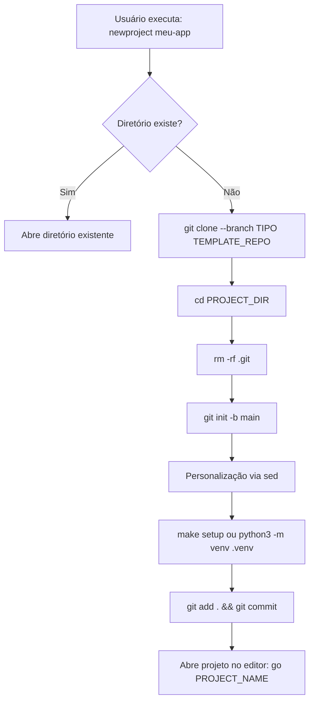

# 🏗️ Arquitetura de Scaffolding de Projetos (Molde + Fábrica)

**Data:** 16 de Dezembro de 2025
**Status:** 🔴 DOCUMENTO HISTÓRICO (Sistema Legado v1.x)
**Versão:** 1.0.0

---

## ⚠️ AVISO: Evolução Arquitetural

**Sistema Atual (v2.0 — Dezembro 2025):** Este projeto agora usa **Copier** para scaffolding.

```bash
# ✅ Método Atual (Recomendado)
copier copy gh:Ismael-1712/python-template-profissional meu-projeto
copier update  # Para atualizar projetos existentes
```

**Sistema Legado (v1.0-1.5):** Função Bash `newproject` (git clone + sed)

**Este documento descreve o sistema legado** para contexto histórico e compreensão de decisões arquiteturais.

Para documentação do sistema atual:

- **README.md** — Seção "Como Usar Este Template"
- **docs/guides/TOML_FUSION.md** — Sistema de merge inteligente
- **docs/guides/KNOWLEDGE_NODE.md** — Sincronização de conhecimento

---

## 📋 Visão Geral (Sistema Legado)

Este projeto implementa um **sistema de scaffolding automatizado** para criação de novos projetos Python profissionais. A arquitetura é baseada no padrão **"Molde + Fábrica"**, que separa a **definição do template** (molde) da **lógica de instanciação** (fábrica).

### Metáfora Arquitetural

```
┌─────────────────────────────────────────────────────────────┐
│                    ECOSSISTEMA DE SCAFFOLDING               │
├─────────────────────────────────────────────────────────────┤
│                                                             │
│  📐 MOLDE (Template Repository)                            │
│  ├─ GitHub: Ismael-1712/python-template-profissional       │
│  ├─ Marcado como "Template Repository"                     │
│  └─ Branches especializadas (main, api, cli)              │
│                                                             │
│                        ⬇️  clone                            │
│                                                             │
│  🏭 FÁBRICA (Função Bash)                                  │
│  ├─ Comando: newproject                                    │
│  ├─ Localização: ~/.bashrc                                 │
│  └─ Workflow: clone → personalize → commit                │
│                                                             │
│                        ⬇️  instantiate                      │
│                                                             │
│  📦 INSTÂNCIA (Novo Projeto)                               │
│  ├─ Diretório: ~/projects/<nome>                          │
│  ├─ Personalizado com dados do desenvolvedor              │
│  └─ Pronto para desenvolvimento (venv + deps)             │
│                                                             │
└─────────────────────────────────────────────────────────────┘
```

---

## 🏗️ Componente 1: O Molde (Template Repository)

### Responsabilidades

O **molde** é um repositório Git que serve como **planta baixa oficial** para novos projetos. Ele contém:

- ✅ Estrutura de diretórios profissional
- ✅ Arquivos de configuração pré-preenchidos (`pyproject.toml`, `.gitignore`, `.pre-commit-config.yaml`)
- ✅ Documentação inicial (`README.md`, `CONTRIBUTING.md`, `LICENSE`)
- ✅ Configuração Docker (`Dockerfile`, `docker-compose.yml`)
- ✅ Workflows CI/CD (`.github/workflows/`)
- ✅ Scripts utilitários (`Makefile`, `scripts/`)

### Características Técnicas

| Aspecto | Implementação |
|---------|---------------|
| **Repositório** | `git@github.com:Ismael-1712/python-template-profissional.git` |
| **Branch Principal** | `main` (projeto genérico CLI/Script) |
| **Branches Especializadas** | `api` (FastAPI), `cli` (Typer) |
| **Marcação GitHub** | ✅ Template Repository (permite "Use this template") |
| **Placeholders** | `meu_projeto_placeholder`, `[ano]`, `Seu Nome` |

### Estrutura de Branches

```
main          → Projeto genérico (CLI/Script)
├── api       → Variante FastAPI (REST API)
└── cli       → Variante Typer (CLI Application)
```

#### Diferenças entre Branches

| Aspecto | `main` | `api` | `cli` |
|---------|--------|-------|-------|
| **Dependências** | Básico + dev tools | + `fastapi`, `uvicorn` | + `typer`, `rich` |
| **Estrutura** | `src/` genérico | `src/api/` com routes | `src/cli/` com commands |
| **Arquivo Inicial** | `src/main.py` | `src/api/main.py` | `src/cli/app.py` |
| **Documentação** | Genérica | API-specific (OpenAPI) | CLI-specific (--help) |

---

## 🏭 Componente 2: A Fábrica (Função `newproject`)

### Responsabilidades

A **fábrica** é uma função Bash que **instancia** o molde e **personaliza** os arquivos para o desenvolvedor.

### Localização

```bash
~/.bashrc  # ou ~/.zshrc para usuários do Zsh
```

### Assinatura do Comando

```bash
newproject <nome> [--tipo <cli|api|lib>]
```

**Exemplos de Uso:**

```bash
# Projeto genérico (branch main)
newproject meu-app-legal

# Projeto API REST (branch api)
newproject servico-usuarios --tipo=api

# Projeto CLI (branch cli)
newproject ferramenta-backup --tipo=cli
```

### Workflow Interno



### Etapas Detalhadas

#### 1. **Validação e Parsing**

```bash
# Valida argumentos
if [ -z "$PROJECT_NAME" ]; then
    echo "❌ Erro: Forneça um nome para o novo projeto."
    return 1
fi

# Verifica se diretório já existe
if [ -d "$PROJECT_DIR" ]; then
    echo "⚠️  O diretório já existe. Abrindo..."
    go "$PROJECT_NAME"
    return 1
fi
```

#### 2. **Clonagem do Molde**

```bash
# Clona o template (branch específica se --tipo fornecido)
git clone --branch "$BRANCH_NAME" "$TEMPLATE_REPO" "$PROJECT_DIR"
```

**Nota:** `$BRANCH_NAME` é `main` por padrão, mas muda para `api`, `cli`, etc. se `--tipo` for fornecido.

#### 3. **Reset de Histórico Git**

```bash
# Remove vínculo com o template
rm -rf .git

# Cria novo repositório limpo
git init -b main
```

**Razão:** Novos projetos não devem herdar o histórico do template.

#### 4. **Personalização Automática (sed)**

```bash
# Obtém dados do desenvolvedor
AUTHOR_NAME=$(git config user.name)
AUTHOR_EMAIL=$(git config user.email)
CURRENT_YEAR=$(date +"%Y")

# Substitui placeholders
grep -rl "$PLACEHOLDER_NAME" . --exclude-dir={.git,.venv} | \
    xargs -r sed -i "s/$PLACEHOLDER_NAME/$PROJECT_NAME/g"

grep -rl "$PLACEHOLDER_AUTHOR" . --exclude-dir={.git,.venv} | \
    xargs -r sed -i "s/$PLACEHOLDER_AUTHOR/$AUTHOR_NAME/g"

grep -rl "$PLACEHOLDER_EMAIL" . --exclude-dir={.git,.venv} | \
    xargs -r sed -i "s/$PLACEHOLDER_EMAIL/$AUTHOR_EMAIL/g"

grep -rl "\[ano\]" . --exclude-dir={.git,.venv} | \
    xargs -r sed -i "s/\[ano\]/$CURRENT_YEAR/g"
```

**Arquivos Afetados:**

- `README.md` → Título e badges personalizados
- `pyproject.toml` → Nome do projeto, autor e email
- `LICENSE` → Nome do autor e ano
- `SECURITY.md` → Email de contato
- `docker-compose.yml` → Nome do serviço

#### 5. **Instalação de Dependências**

```bash
# Prefere Makefile se disponível
if [ -f "Makefile" ]; then
    make setup
else
    # Fallback manual
    python3 -m venv .venv
    source .venv/bin/activate
    pip install -e .[dev]
fi
```

**Nota:** `make setup` é o padrão do molde e executa:

- Criação do venv
- Instalação de dependências (`pip install -e .[dev]`)
- Instalação de pre-commit hooks

#### 6. **Commit Inicial**

```bash
git add .
git commit -m "feat: initial project setup from template ($BRANCH_NAME)"
```

**Razão:** Garante que o projeto nasce com um histórico limpo e rastreável.

#### 7. **Abertura Automática**

```bash
go "$PROJECT_NAME"
```

**Nota:** `go` é um alias/função auxiliar que navega para `~/projects/$PROJECT_NAME` e abre o VS Code.

---

## 📊 Análise de Trade-offs

### Vantagens da Arquitetura

| Vantagem | Descrição |
|----------|-----------|
| **Velocidade** | Criação de projetos em ~5 segundos (vs. 30+ minutos manual) |
| **Padronização** | Todos os projetos seguem as "Regras da Casa" automaticamente |
| **Manutenibilidade** | Mudanças no template propagam para novos projetos automaticamente |
| **Variedade** | Branches especializadas suportam diferentes tipos de projeto |
| **Personalização Automática** | Desenvolvedor não precisa editar manualmente `pyproject.toml`, `LICENSE`, etc. |
| **Histórico Limpo** | Novos projetos começam com `git log` limpo (sem histórico do template) |

### Desvantagens e Mitigações

| Desvantagem | Mitigação Implementada |
|-------------|------------------------|
| **Propagação de Bugs** | Molde é testado rigorosamente antes de releases |
| **Personalização Limitada** | Branches especializadas cobrem casos comuns |
| **Dependência de Bash** | Documentação clara para reimplementação em Python/Rust se necessário |
| **Atualizações Manuais** | Projetos existentes não recebem updates automáticos (trade-off consciente) |

---

## 🔄 Casos de Uso

### Caso 1: Desenvolvedor Iniciando Novo Microserviço

```bash
# 1. Criar projeto API
newproject servico-autenticacao --tipo=api

# 2. Sistema executa:
#    - Clone do branch 'api'
#    - Personalização (nome, email)
#    - Setup (venv, deps)
#    - Commit inicial
#    - Abre no VS Code

# 3. Desenvolvedor já tem:
#    - FastAPI configurado
#    - Docker pronto
#    - Pre-commit ativo
#    - Estrutura src/api/
```

### Caso 2: Desenvolvedor Criando CLI Tool

```bash
newproject backup-manager --tipo=cli

# Sistema cria projeto com:
# - Typer framework
# - Comandos de exemplo
# - Estrutura src/cli/
# - Testes pré-configurados
```

### Caso 3: Projeto Genérico (Data Science, ETL)

```bash
newproject analise-vendas

# Sistema cria projeto com:
# - Estrutura básica src/
# - Jupyter notebooks suportados
# - pytest configurado
# - Docker genérico
```

---

## 🧪 Validação e Testes

### Teste Manual da Fábrica

```bash
# 1. Criar projeto de teste
newproject _test_scaffold_

# 2. Validações
cd ~/projects/_test_scaffold_

# Verificar personalização
grep "meu_projeto_placeholder" README.md  # Não deve retornar nada
grep "_test_scaffold_" README.md          # Deve encontrar

# Verificar histórico Git
git log --oneline  # Deve ter apenas 1 commit inicial

# Verificar ambiente
source .venv/bin/activate
which python       # Deve apontar para .venv

# 3. Limpeza
cd ~ && rm -rf ~/projects/_test_scaffold_
```

### Validação de Integridade do Molde

```bash
# No repositório do template
cd /home/ismae/projects/python-template-profissional

# Validar estrutura
tree -a -L 2

# Validar placeholders
grep -r "meu_projeto_placeholder" . --exclude-dir=.git

# Validar branches
git branch -a  # Deve listar: main, api, cli
```

---

## 🚀 Evolução Futura

### Roadmap (Prioridades do Relatório Original)

| Prioridade | Tarefa | Status | Próximo Passo |
|-----------|--------|--------|---------------|
| 🔴 Crítica | Implementar CI/CD workflows no molde | 🟡 Planejado | Criar `.github/workflows/ci.yml` |
| 🟠 Alta | Adicionar branch `data-science` | 🔵 Design | Definir deps (pandas, jupyter, scikit-learn) |
| 🟡 Média | Transplante de scripts reutilizáveis | 🔵 Avaliação | Identificar scripts genéricos de projetos antigos |
| 🟢 Baixa | Teste automatizado da fábrica | 🔵 Proposto | Criar `~/test_factory.sh` |

### Sugestões Arquiteturais

#### 1. **Migração para Python CLI**

Reimplementar `newproject` como comando Python (usando Typer) para:

- Melhor portabilidade (Windows/Linux/Mac)
- Tratamento de erros mais robusto
- Integração com sistema de plugins

**Exemplo:**

```bash
cortex scaffold create meu-app --type=api
```

#### 2. **Sistema de Plugins**

Permitir que desenvolvedores adicionem "recheios" customizados:

```bash
newproject ecommerce --tipo=api --plugins=auth,payments,stripe
```

#### 3. **Sincronização Bidirecional**

Permitir que projetos existentes "puxem" atualizações do molde:

```bash
cortex scaffold sync --preview  # Mostra diff
cortex scaffold sync --apply    # Aplica patches
```

---

## 📚 Referências

- Relatório Técnico de Evolução v1.5 (28 de Outubro de 2025)
- [Copilot Instructions](.github/copilot-instructions.md)
- [Documentação do CORTEX](docs/architecture/CORTEX_INDICE.md)

---

**Autor:** Engineering Team
**Última Atualização:** 2025-12-16
**Status:** ✅ Documentação Completa e Validada
