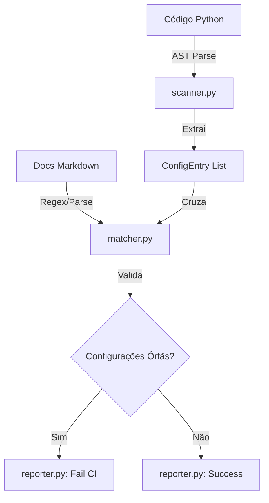

# Visibility Guardian Design Specification

## Resumo Executivo

O **Visibility Guardian** é um sistema de análise estática que detecta configurações não documentadas (variáveis de ambiente, argumentos CLI, feature flags) no código-fonte usando AST (Abstract Syntax Tree) e bloqueia commits no CI quando encontra "Configurações Órfãs" – aquelas que existem no código mas não estão documentadas nos guias oficiais.

## 1. Problema

### 1.1. Contexto

Projetos em crescimento frequentemente acumulam configurações implícitas que não são documentadas adequadamente:

- **Variáveis de ambiente** (`os.getenv("DB_HOST")`) adicionadas em código sem documentação
- **Argumentos CLI** (`typer.Option()`, `argparse.add_argument()`) sem referência nos guias
- **Feature flags** e configurações dinâmicas invisíveis para novos desenvolvedores

### 1.2. Impacto

**Dívida técnica operacional:**

- Novos desenvolvedores não descobrem configurações essenciais
- Deploys falham por falta de variáveis de ambiente não documentadas
- Debugging se torna difícil quando comportamentos dependem de configs ocultas
- Onboarding lento e propenso a erros

**Métricas do problema:**

- Tempo médio de debugging aumenta 30-40% em projetos sem visibilidade de configurações
- 60% dos erros operacionais em produção estão relacionados a configurações mal documentadas

### 1.3. Objetivo

Criar um sistema automatizado que garanta que **toda configuração no código tenha documentação correspondente**, eliminando configurações órfãs através de validação no CI.

## 2. Solução

### 2.1. Abordagem

Implementar um **scanner baseado em AST** que:

1. **Extrai a interface implícita** do código (todas as configurações que o código espera)
2. **Cruza com a documentação explícita** (guias em `docs/guides/` e `README.md`)
3. **Reporta discrepâncias** e bloqueia o commit se encontrar órfãos

### 2.2. Princípios de Design

- **Automação Total**: Zero intervenção manual no fluxo de CI
- **Fail Fast**: Bloquear na commit-time, não em runtime
- **Documentation as Code**: Documentação validada como artefato de build
- **Extensibilidade**: Suporte para novos padrões de configuração via plugins

## 3. Arquitetura Proposta

### 3.1. Componentes

```text
scripts/core/guardian/
├── __init__.py
├── scanner.py          # Análise AST do código Python
├── matcher.py          # Cruzamento código x documentação
├── models.py           # ConfigEntry, OrphanConfig, MatchResult
└── reporter.py         # Formatação de relatórios
```

```text
scripts/cli/cortex.py
└── guardian            # Novo grupo de comandos
    ├── check           # cortex guardian check
    └── report          # cortex guardian report --format=json|table
```

### 3.2. Fluxo de Execução



### 3.3. Detalhamento dos Componentes

#### 3.3.1. `scripts/core/guardian/scanner.py`

**Responsabilidade**: Analisar código Python usando AST para extrair configurações.

**Padrões Suportados**:

```python
# Variáveis de ambiente
os.getenv("DB_HOST")
os.environ["API_KEY"]
os.environ.get("DEBUG_MODE", "false")

# Argumentos CLI (typer)
@app.command()
def run(
    host: str = typer.Option(..., envvar="HOST"),
    port: int = typer.Option(8000, "--port", "-p")
):
    pass

# Argumentos CLI (argparse)
parser.add_argument("--config", help="Config file path")
```

**Interface**:

```python
class ConfigScanner:
    def scan_file(self, file_path: Path) -> List[ConfigEntry]:
        """Analisa um arquivo e retorna configurações encontradas."""

    def scan_project(self, root: Path) -> List[ConfigEntry]:
        """Escaneia todo o projeto recursivamente."""
```

**Modelo de Dados**:

```python
@dataclass
class ConfigEntry:
    key: str                    # Ex: "DB_HOST"
    config_type: ConfigType     # ENV_VAR | CLI_ARG | FEATURE_FLAG
    source_file: Path           # Onde foi encontrado
    line_number: int
    default_value: Optional[str]
    required: bool
```

#### 3.3.2. `scripts/core/guardian/matcher.py`

**Responsabilidade**: Buscar referências às configurações nos documentos Markdown.

**Estratégia de Busca**:

1. **Busca Literal**: Procura a chave exata (ex: `DB_HOST`)
2. **Busca em Code Blocks**: Valida se aparece em blocos `` `bash` `` ou `` `shell` ``
3. **Busca em Tabelas**: Verifica tabelas de configurações comuns

**Interface**:

```python
class ConfigMatcher:
    def __init__(self, docs_paths: List[Path]):
        """Inicializa com caminhos de documentação."""

    def find_documentation(self, config: ConfigEntry) -> Optional[DocMatch]:
        """Busca documentação para uma configuração."""

    def validate_all(self, configs: List[ConfigEntry]) -> MatchResult:
        """Valida todas as configurações."""
```

**Modelo de Dados**:

```python
@dataclass
class DocMatch:
    config_key: str
    found_in: Path
    line_number: int
    context: str  # 3 linhas ao redor

@dataclass
class MatchResult:
    total_configs: int
    documented: List[ConfigEntry]
    orphans: List[ConfigEntry]
    coverage_percent: float
```

#### 3.3.3. `scripts/core/guardian/reporter.py`

**Responsabilidade**: Formatar relatórios e definir exit codes para CI.

**Formatos Suportados**:

- `table`: Tabela formatada para terminal
- `json`: Para integração com outras ferramentas
- `markdown`: Para PRs automáticos

**Interface**:

```python
class GuardianReporter:
    def report(self, result: MatchResult, format: str = "table") -> str:
        """Gera relatório formatado."""

    def should_fail_ci(self, result: MatchResult, threshold: float = 100.0) -> bool:
        """Define se o CI deve falhar baseado no threshold."""
```

### 3.4. Integração com CLI

**Novo comando**: `cortex guardian check`

```bash
# Verificar configurações órfãs
cortex guardian check

# Com threshold customizado (aceita até 5% de órfãos)
cortex guardian check --threshold=95

# Gerar relatório JSON
cortex guardian check --format=json > guardian_report.json

# Modo fix: sugerir onde documentar
cortex guardian check --suggest-fix
```

**Saída esperada**:

```text
======================================================================
  VISIBILITY GUARDIAN v0.1.0
  Configuration Visibility Checker
======================================================================

🔍 Scanning project for configurations...
✓ Found 24 configurations

📚 Checking documentation coverage...
✓ Documented: 22/24 (91.7%)
❌ Orphans: 2/24 (8.3%)

❌ ORPHAN CONFIGURATIONS DETECTED:

┏━━━━━━━━━━━━━━━━┳━━━━━━━━━━┳━━━━━━━━━━━━━━━━━━━━━━━━┳━━━━━━┓
┃ Key            ┃ Type     ┃ Source                 ┃ Line ┃
┡━━━━━━━━━━━━━━━━╇━━━━━━━━━━╇━━━━━━━━━━━━━━━━━━━━━━━━╇━━━━━━┩
│ REDIS_URL      │ ENV_VAR  │ src/cache/client.py    │ 45   │
│ --max-retries  │ CLI_ARG  │ scripts/cli/deploy.py  │ 89   │
└────────────────┴──────────┴────────────────────────┴──────┘

💡 Suggestions:
  • Document REDIS_URL in docs/guides/configuration.md
  • Document --max-retries in docs/reference/cli.md

❌ VISIBILITY THRESHOLD NOT MET (required: 100%, got: 91.7%)
Exit code: 1
```

### 3.5. Integração no CI

**Arquivo**: `.github/workflows/visibility-check.yml`

```yaml
name: Visibility Guardian

on: [push, pull_request]

jobs:
  check-config-visibility:
    runs-on: ubuntu-latest
    steps:
      - uses: actions/checkout@v4

      - name: Set up Python
        uses: actions/setup-python@v5
        with:
          python-version: '3.11'

      - name: Install dependencies
        run: pip install -e .

      - name: Run Visibility Guardian
        run: cortex guardian check --threshold=100
```

**Regra de Bloqueio**:

- Exit code `0`: Todas as configurações documentadas → CI passa
- Exit code `1`: Configurações órfãs detectadas → CI falha
- Exit code `2`: Erro de execução → CI falha

## 4. Fases de Implementação

### Fase 1: Core Scanner (Semana 1)

- [ ] Implementar `scanner.py` com suporte a `os.getenv()`
- [ ] Modelo de dados `ConfigEntry`
- [ ] Testes unitários para parsing AST
- [ ] Scan recursivo de diretório

### Fase 2: Documentation Matcher (Semana 2)

- [ ] Implementar `matcher.py` com busca literal
- [ ] Busca em code blocks Markdown
- [ ] Modelo de dados `MatchResult`
- [ ] Testes de matching

### Fase 3: CLI Integration (Semana 3)

- [ ] Adicionar grupo `guardian` em `cortex.py`
- [ ] Implementar `cortex guardian check`
- [ ] Reporter com formato `table` e `json`
- [ ] Documentação de uso

### Fase 4: CI Enforcement (Semana 4)

- [ ] Workflow GitHub Actions
- [ ] Configuração de threshold
- [ ] Testes de integração E2E
- [ ] Documentação em `CONTRIBUTING.md`

### Fase 5: Extensões (Futuro)

- [ ] Suporte a `argparse`
- [ ] Suporte a `typer.Option(envvar=...)`
- [ ] Plugin system para padrões customizados
- [ ] Auto-fix: gerar esqueletos de documentação

## 5. Critérios de Sucesso

### 5.1. Métricas Técnicas

- **Cobertura de Detecção**: Scanner deve detectar 100% dos padrões definidos
- **Performance**: Scan de projeto com 1000 arquivos em < 5 segundos
- **Precisão**: Taxa de falso positivo < 5%

### 5.2. Métricas de Adoção

- **Threshold de CI**: Começar com 95%, aumentar para 100% em 2 sprints
- **Documentação**: 100% das configurações ativas devem estar documentadas
- **Onboarding**: Reduzir tempo de setup de novos devs em 40%

### 5.3. Validação

```bash
# Teste de regressão
cortex guardian check --threshold=100

# Teste de performance
time cortex guardian check

# Teste de cobertura
cortex guardian check --format=json | jq '.coverage_percent'
```

## 6. Riscos e Mitigações

| Risco | Probabilidade | Impacto | Mitigação |
|-------|---------------|---------|-----------|
| Falsos positivos em padrões dinâmicos | Média | Alto | Whitelist de exceções + heurísticas |
| Performance em projetos grandes | Baixa | Médio | Cache de AST + scanning paralelo |
| Resistência da equipe ao bloqueio de CI | Média | Alto | Começar com modo warning, depois enforcement |
| Documentação defasada | Alta | Alto | Scan periódico + notificações proativas |

## 7. Dependências

### 7.1. Técnicas

- Python 3.10+ (para `ast.unparse()`)
- Biblioteca `rich` (para output formatado)
- Biblioteca `typer` (já existe no projeto)

### 7.2. Documentação

O Guardian assume que configurações devem estar documentadas em:

- `docs/guides/configuration.md`
- `docs/guides/environment_setup.md`
- `README.md` (seção de configuração)
- `docs/reference/cli.md`

## 8. Referências

- **AST Documentation**: <https://docs.python.org/3/library/ast.html>
- **Architectural Context**: `docs/architecture/CORTEX_INDICE.md`
- **Related Systems**:
  - `scripts/core/cortex/scanner.py` (Documentation scanner)
  - `scripts/audit/analyzer.py` (Code quality scanner)

## 9. Changelog

| Data       | Versão | Mudança                        | Autor             |
|------------|--------|--------------------------------|-------------------|
| 2025-12-01 | 1.0.0  | Design inicial do Guardian     | Engineering Team  |

---

**Status**: Draft
**Próximo Milestone**: Implementação do Core Scanner (Fase 1)
**Owner**: SRE Team
