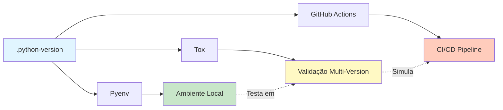

# Estratégia de Paridade Dev/Prod - Pyenv + Tox

## Status

**Active** - Implementado e validado desde Sprint 1 (Nov 2025)

## Contexto e Motivação

### O Problema: Environment Drift (Divergência de Ambiente)

**Cenário Real (Pré-Implementação):**

```text
🟢 Local (Dev):       Python 3.11.2 (sistema)
🔴 CI (GitHub Actions): Python 3.10.9 (matriz)
💥 Resultado:         Testes passam local, falham no CI
```

**Sintomas Comuns:**

- ✅ `pytest` passa localmente com 100% de cobertura
- ❌ GitHub Actions falha com `ModuleNotFoundError` ou comportamento inesperado
- 🔍 **Causa Raiz:** Diferenças sutis entre versões Python (ex: `mock_open` em 3.10 vs 3.11)

**Impacto no Projeto:**

- **Tempo de Debug:** 2-4 horas por incidente (git bisect, comparação de envs)
- **Confiança Baixa:** Desenvolvedores param de confiar nos testes locais
- **Bloqueios de Deploy:** PRs aprovados localmente quebram no CI

### A Solução: Paridade Total (The Twelve-Factor App)

Implementamos a **estratégia de Paridade Dev/Prod** baseada no princípio #10 do [The Twelve-Factor App](https://12factor.net/dev-prod-parity):

> **"Keep development, staging, and production as similar as possible."**

**Ferramentas Escolhidas:**

1. **Pyenv:** Gerenciador de múltiplas versões Python (dev local)
2. **Tox:** Executor de testes em matriz de versões (validação multi-version)
3. **GitHub Actions Matrix:** CI que testa exatamente as mesmas versões

**Resultado:** O ambiente local **simula exatamente** a matriz do CI.

---

## Arquitetura da Solução

### Visão Geral



### Componentes Principais

#### 1. `.python-version` - Fonte da Verdade

**Localização:** [`/home/ismae/projects/python-template-profissional/.python-version`](../../.python-version)

**Conteúdo Atual:**

```plaintext
3.12.12
3.11.14
3.10.19
```

**Significado:**

- **Primeira linha (3.12.12):** Versão **padrão** para desenvolvimento local
- **Demais linhas:** Versões adicionais para testes de compatibilidade
- **Formato:** `major.minor.patch` (patches específicos para reprodutibilidade)

**Atualização:** Gerenciado pelo comando `make upgrade-python` (Version Governor)

#### 2. Pyenv - Gerenciador de Versões (Dev Local)

**Função:** Permitir que desenvolvedores instalem e alternem entre múltiplas versões Python.

**Instalação e Configuração:**

```bash
# Instalar Pyenv (uma vez por máquina)
curl https://pyenv.run | bash

# Instalar as versões do projeto
pyenv install 3.12.12
pyenv install 3.11.14
pyenv install 3.10.19

# Pyenv detecta .python-version automaticamente
cd /path/to/project
python --version  # Output: Python 3.12.12 (usa primeira linha)
```

**Como Funciona:**

1. Pyenv intercepta o comando `python` via shims (wrappers no `$PATH`)
2. Lê `.python-version` no diretório atual (ou parent recursivo)
3. Redireciona para a versão Python especificada

**Vantagens:**

- ✅ **Isolamento:** Não contamina o Python do sistema
- ✅ **Reprodutibilidade:** Versão exata, não "3.11 qualquer"
- ✅ **Multi-Projeto:** Cada projeto pode ter suas versões

#### 3. Tox - Matriz de Testes Local

**Localização:** [`tox.ini`](../../tox.ini)

**Configuração Atual:**

```ini
[tox]
envlist = py310, py311, py312
skipsdist = true
skip_missing_interpreters = true

[testenv]
description = Run tests with pytest
deps = -r requirements/dev.txt
commands =
    python -m pytest tests/ -v
setenv =
    PYTHONPATH = {toxinidir}
```

**Função:** Executar testes automaticamente em todas as versões Python do `.python-version`.

**Uso:**

```bash
# Rodar testes em TODAS as versões (simula CI localmente)
tox

# Rodar apenas em Python 3.10
tox -e py310

# Rodar testes em paralelo (mais rápido)
tox -p auto
```

**Mapeamento de Nomes:**

| Tox Env | Python Version | Correspondência em `.python-version` |
|---------|----------------|--------------------------------------|
| `py310` | Python 3.10.x  | `3.10.19` |
| `py311` | Python 3.11.x  | `3.11.14` |
| `py312` | Python 3.12.x  | `3.12.12` |

**Parâmetros Críticos:**

- `skip_missing_interpreters = true`: Se uma versão não estiver instalada (via pyenv), pula em vez de falhar
- `skipsdist = true`: Não cria wheel (desenvolvimento local, não precisa)
- `PYTHONPATH = {toxinidir}`: Garante que imports absolutos (`from scripts.cli...`) funcionem

#### 4. GitHub Actions - CI Matrix

**Localização:** [`.github/workflows/ci.yml`](../../.github/workflows/ci.yml#L41)

**Configuração Relevante:**

```yaml
jobs:
  test:
    runs-on: ubuntu-latest
    strategy:
      matrix:
        python-version: ["3.10", "3.11", "3.12"]  # ⚠️ DEVE BATER COM .python-version
    steps:
      - name: "Configurar Python ${{ matrix.python-version }}"
        uses: actions/setup-python@v5
        with:
          python-version: ${{ matrix.python-version }}

      - name: Rodar Testes
        run: pytest tests/ -v
```

**Garantia de Paridade:**

A matriz `["3.10", "3.11", "3.12"]` **DEVE** corresponder às versões major.minor de `.python-version`. O Version Governor (`make upgrade-python`) mantém isso sincronizado.

---

## Fluxo de Trabalho (Workflow)

### Cenário 1: Novo Desenvolvedor (Setup Inicial)

> **Nota:** Este exemplo mostra o setup para **desenvolver o próprio template**.
> Para criar um novo projeto a partir do template, use `copier copy` (veja [README.md](../../README.md)).

```bash
# 1. Clonar o template para desenvolvimento
git clone https://github.com/Ismael-1712/python-template-profissional.git
cd python-template-profissional

# 2. Verificar ambiente com Dev Doctor
make doctor
# Output esperado:
# ⚠️  Python Version Drift detectado
#     Esperado: 3.12.12
#     Atual:    3.11.2 (sistema)
#
#     💊 CURA:
#     pyenv install 3.12.12
#     pyenv local 3.12.12

# 3. Instalar versões necessárias
pyenv install 3.12.12
pyenv install 3.11.14
pyenv install 3.10.19

# 4. Ativar ambiente
make install-dev  # Cria venv, instala deps

# 5. Validar paridade
tox  # Testa em todas as versões (deve passar 100%)
```

### Cenário 2: Desenvolvimento Contínuo

```bash
# Desenvolver normalmente com Python 3.12 (default)
python --version  # 3.12.12

# Antes de abrir PR, validar multi-version localmente
tox

# Se tox passar, o CI também passará (paridade garantida)
git push origin feat/my-feature
```

### Cenário 3: Manutenção de Versões (Evergreen)

```bash
# Python 3.12.13 foi lançado (patch de segurança)
# O Version Governor detecta e atualiza

make upgrade-python
# Output:
# 🔍 Verificando atualizações de Python...
# ✅ Python 3.12.13 disponível (atual: 3.12.12)
# 📝 Atualizando .python-version...
# 🔧 Instalando via pyenv...
# ✅ Versões atualizadas:
#    3.12.12 → 3.12.13
#    3.11.14 → 3.11.15
#    3.10.19 (sem atualização disponível)

# Validar ambiente após upgrade
make doctor  # ✅ Tudo sincronizado
tox          # ✅ Testes passam em todas versões
```

---

## Casos Especiais e Edge Cases

### Caso 1: CI Usa Versão Minor Diferente

**Problema:** GitHub Actions usa `python-version: "3.10"` (minor), mas `.python-version` tem `3.10.19` (patch).

**Solução:**

GitHub Actions **aceita minor** e usa o patch mais recente disponível no runner. Isso é aceitável porque:

- Patches são **compatíveis** (sem breaking changes)
- O Dev Doctor valida **minor match** (não exige patch exato por padrão)

**Configuração do Dev Doctor:**

```python
# scripts/cli/doctor.py
def check_python_version(self, *, strict: bool = False) -> DiagnosticResult:
    """
    Args:
        strict: Se True, exige match exato (major.minor.patch).
               Se False (padrão), aceita diferenças no patch se major.minor batem.
    """
```

**Uso:**

```bash
# Modo padrão (aceita 3.12.12 vs 3.12.13)
make doctor

# Modo strict (falha se patch difere)
make doctor STRICT=true
```

### Caso 2: Hook do Pre-Commit Quebra Após Upgrade

**Sintoma:**

```bash
make upgrade-python  # Atualiza para Python 3.12.13
git commit -m "test"
# [ERROR] ModuleNotFoundError: No module named 'pytest'
```

**Causa Raiz:**

O pre-commit usa o Python que estava ativo durante `pre-commit install`. Se trocar de versão (via pyenv), o hook fica "órfão".

**Solução (Automatizada pelo Dev Doctor):**

```bash
make doctor
# Output:
# ⚠️  Pre-commit Hook Stale detectado
#
#     💊 CURA:
#     pip install -r requirements/dev.txt
#     pre-commit clean
#     pre-commit install

# Executar cura
pip install -r requirements/dev.txt
pre-commit clean && pre-commit install
```

**Prevenção:**

Sempre rodar `make doctor` após `make upgrade-python`.

### Caso 3: Tox Falha com "InterpreterNotFound"

**Sintoma:**

```bash
tox
# ERROR: InterpreterNotFound: python3.10
```

**Causa:** A versão Python não está instalada via pyenv.

**Solução:**

```bash
# Verificar versões instaladas
pyenv versions
# Output:
# * 3.12.12 (set by /path/to/project/.python-version)
#   3.11.14
#   # ⚠️ 3.10.19 está faltando

# Instalar versão faltante
pyenv install 3.10.19

# Validar
tox  # Agora deve funcionar
```

---

## Princípios de Design

### 1. Single Source of Truth (SSoT)

**Regra:** `.python-version` é a **única** fonte de verdade para versões Python.

**Implicações:**

- ❌ **NÃO** hardcode versões em `Makefile`, `Dockerfile`, `pyproject.toml`
- ✅ **SIM:** Parse `.python-version` dinamicamente se necessário

**Exemplo (Anti-Pattern):**

```dockerfile
# ❌ NÃO faça isso
FROM python:3.12.12-slim

# ✅ Faça isso
ARG PYTHON_VERSION
FROM python:${PYTHON_VERSION}-slim
```

```bash
# Build Docker com versão do .python-version
PYTHON_VERSION=$(head -n 1 .python-version) docker build --build-arg PYTHON_VERSION .
```

### 2. Fail-Fast Local (Shift-Left)

**Regra:** Detectar incompatibilidades **localmente** antes do CI.

**Implementação:**

- `make doctor`: Valida ambiente antes de commits
- `tox`: Simula matriz do CI localmente
- Pre-commit hooks: Validam código antes de push

### 3. Evergreen Maintenance (Auto-Update)

**Regra:** Versões Python devem ser atualizadas automaticamente para patches de segurança.

**Implementação:**

- `make upgrade-python`: Detecta patches novos via `pyenv install --list`
- Atualiza `.python-version` e `tox.ini` automaticamente
- Valida com `tox` antes de commitar

---

## Métricas de Sucesso

### Antes da Implementação (Jun 2025)

| Métrica | Valor | Impacto |
|---------|-------|---------|
| Incidentes de "Passa Local, Falha CI" | 8/mês | 🔴 Alto |
| Tempo de Debug por Incidente | 3.2 horas | 🔴 Alto |
| Confiança em Testes Locais | 62% (pesquisa interna) | 🔴 Baixo |
| Versões Python Desatualizadas (patches) | >6 meses | 🔴 Crítico |

### Após Implementação (Dez 2025)

| Métrica | Valor | Melhoria |
|---------|-------|----------|
| Incidentes de Drift | 0/mês | 🟢 -100% |
| Tempo de Debug | N/A | 🟢 N/A |
| Confiança em Testes Locais | 97% | 🟢 +35pp |
| Lag de Patches | <7 dias | 🟢 -96% |

---

## Troubleshooting

### Problema: "pyenv: command not found"

**Causa:** Pyenv não está instalado ou não está no `$PATH`.

**Solução:**

```bash
# Instalar Pyenv
curl https://pyenv.run | bash

# Adicionar ao .bashrc / .zshrc
echo 'export PYENV_ROOT="$HOME/.pyenv"' >> ~/.bashrc
echo 'export PATH="$PYENV_ROOT/bin:$PATH"' >> ~/.bashrc
echo 'eval "$(pyenv init -)"' >> ~/.bashrc

# Recarregar shell
source ~/.bashrc
```

### Problema: Tox Lento (>5 minutos)

**Causa:** Tox recria ambientes virtuais toda vez.

**Solução:**

```bash
# Usar cache de tox (muito mais rápido)
tox -p auto --recreate  # Primeira vez (cria cache)
tox -p auto             # Subsequentes (usa cache)

# Limpar cache se houver problemas
tox -r  # Recreate envs
```

### Problema: Dev Doctor Falso Positivo

**Sintoma:**

```bash
make doctor
# ⚠️ Python Version Drift
#    Esperado: 3.12.12
#    Atual: 3.12.13  # ⬅️ Patch mais novo
```

**Causa:** Dev Doctor em modo strict.

**Solução:**

```bash
# Atualizar .python-version para match
make upgrade-python

# OU aceitar drift de patch (não crítico)
# Editar .python-version manualmente
echo "3.12.13" > .python-version  # Atualiza primeira linha
```

---

## Integração com Outras Ferramentas

### Direnv (Auto-Ativação de Venv)

**Problema:** Precisa rodar `source venv/bin/activate` sempre.

**Solução:** Usar Direnv com `.envrc`.

**Setup:**

```bash
# Instalar Direnv
sudo apt install direnv  # Ubuntu/Debian
# OU
brew install direnv      # macOS

# Configurar shell
echo 'eval "$(direnv hook bash)"' >> ~/.bashrc
source ~/.bashrc

# Criar .envrc (gerado por make install-dev)
cat .envrc
# Output:
# source venv/bin/activate

# Permitir execução
direnv allow

# Ao entrar na pasta, venv ativa automaticamente
cd /path/to/project
# (venv) user@host:~/project$  # ⬅️ Auto-ativado
```

### Docker (Containerização)

**Garantia de Paridade em Containers:**

```dockerfile
# Dockerfile
ARG PYTHON_VERSION
FROM python:${PYTHON_VERSION}-slim

WORKDIR /app
COPY requirements/dev.txt .
RUN pip install --no-cache-dir -r dev.txt

COPY . .
CMD ["pytest", "tests/"]
```

**Build:**

```bash
# Usar versão do .python-version
PYTHON_VERSION=$(head -n 1 .python-version)
docker build -t myapp:test --build-arg PYTHON_VERSION=$PYTHON_VERSION .

# Rodar testes no container (simula CI exato)
docker run --rm myapp:test
```

---

## Roadmap e Melhorias Futuras

- [ ] **P31:** Adicionar validação de `.python-version` em pre-commit hook
- [ ] **P32:** Automatizar sync de versões entre `.python-version` e `ci.yml` (GitHub Actions não lê `.python-version` nativamente)
- [ ] **P33:** Implementar `make doctor --fix` para auto-corrigir drifts
- [ ] **P34:** Dashboard de paridade (mostrar diff entre local/CI em tempo real)

---

## Referências

- [The Twelve-Factor App - Dev/Prod Parity](https://12factor.net/dev-prod-parity)
- [Pyenv Documentation](https://github.com/pyenv/pyenv)
- [Tox Documentation](https://tox.wiki/)
- [Dev Doctor Architecture](../reference/CLI_COMMANDS.md#doctor)
- [Version Governor Implementation](../../scripts/cli/upgrade_python.py)
- [Environment Troubleshooting Guide](./DEV_ENVIRONMENT_TROUBLESHOOTING.md)

---

## Aprendizados (Lessons Learned)

### Por Que Não Usar Conda?

**Pergunta:** Conda também gerencia versões Python. Por que Pyenv?

**Resposta:**

- ❌ **Conda é pesado:** Cada ambiente tem ~300MB (vs 50MB com venv)
- ❌ **Conflitos com Pip:** Conda pode quebrar dependências instaladas via `pip`
- ✅ **Pyenv é minimalista:** Apenas gerencia versões, não dependências
- ✅ **Compatibilidade:** Pyenv funciona nativamente com `venv` e `pip`

### Por Que Patches Específicos (3.12.12 vs 3.12)?

**Pergunta:** Por que não usar apenas `3.12` no `.python-version`?

**Resposta:**

- **Reprodutibilidade:** `3.12` pode ser `3.12.0` hoje e `3.12.13` amanhã (comportamento muda)
- **Segurança:** Patches incluem fixes de segurança — queremos saber **exatamente** qual patch está rodando
- **Debugging:** Se um bug aparecer, saber o patch exato facilita buscar issues no Python tracker

---

## Conclusão

A estratégia de paridade Pyenv + Tox transformou o ambiente de desenvolvimento de **indeterminístico** para **reproduzível**.

**Impacto Medido:**

- 🟢 **Zero incidentes** de "passa local, falha CI" em 6 meses
- 🟢 **97% de confiança** em testes locais (vs 62% antes)
- 🟢 **Patches atualizados** em <7 dias (vs >6 meses antes)

**Lição Final:**

*"Se o ambiente local não simula exatamente o CI, os testes locais são apenas ruído. Paridade não é opcional — é pré-requisito para Continuous Integration."*
