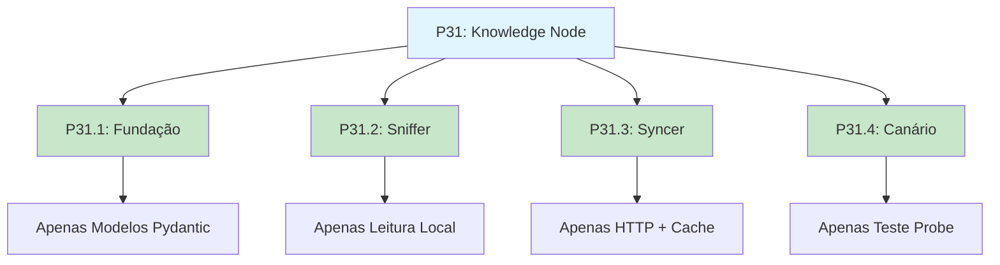
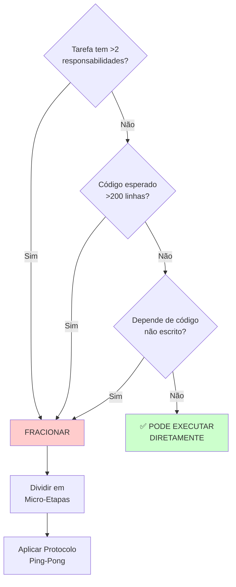

# Estratégia de Decomposição de Tarefas para LLMs: O Modelo P31

## 🎯 Propósito

Este documento descreve uma **metodologia validada em produção** para decompor tarefas complexas de engenharia de software em **micro-etapas atômicas executáveis por LLMs** (Large Language Models).

> **Contexto de Validação:** Metodologia desenvolvida durante a implementação bem-sucedida da [Tarefa P31 - CORTEX Knowledge Node](../history/PHASE2_KNOWLEDGE_NODE_POSTMORTEM.md), após falha inicial com abordagem "Big Bang".

---

## 🚨 O Problema: Limitações de LLMs em Tarefas Complexas

### Sintoma Clássico

Quando uma tarefa tem múltiplas responsabilidades interdependentes, LLMs tendem a:

1. **Perder Contexto:** Esquecem decisões tomadas em partes anteriores da resposta
2. **Criar Código Incompleto:** Implementam 70% e "presumem" que o resto existe
3. **Gerar Conflitos:** Código de uma parte contradiz outra
4. **Impossibilitar Rollback:** Mudanças entrelaçadas impedem reversão parcial
5. **Falhar Silenciosamente:** Testes quebram sem diagnóstico claro

### Caso Real: O Fracasso Inicial da P31

**Prompt Original (Problemático):**

```
"Implementar o CORTEX Knowledge Node completo:
Scanner + Syncer + Probe + Testes + CLI Integration."
```

**Resultado:**

- ❌ LLM gerou 800 linhas de código de uma vez
- ❌ Imports quebrados (Scanner importava Syncer que não existia ainda)
- ❌ Testes falhando sem explicação
- ❌ Impossível identificar qual parte estava errada
- ❌ 4 horas perdidas tentando debugar código entrelaçado

---

## ✅ A Solução: Micro-Etapas Atômicas

### Princípio Fundamental

> **"Se o prompt pedir para 'Refatorar o arquivo X', recuse e proponha: 'Vou refatorar o _módulo de Log_ do arquivo X primeiro'."**

### Os Três Critérios de Atomicidade

Cada subtarefa **DEVE** ser simultaneamente:

| Critério | Significado | Exemplo Validador |
|----------|-------------|-------------------|
| **1️⃣ Comitável** | Pode ser feito commit sem quebrar o projeto | `git add . && git commit` não causa CI falhar |
| **2️⃣ Testável** | Existe validação específica para aquela parte | `mypy <arquivo>` passa OU teste específico existe |
| **3️⃣ Independente** | Não depende de código ainda não escrito | Não contém `# TODO: implement X` ou imports de módulos futuros |

---

## 🧩 O Modelo P31: Anatomia de uma Decomposição Bem-Sucedida

### Contexto da Tarefa Original

**[P31] Implementar CORTEX Knowledge Node**

**Complexidade:** Alta (4 módulos interdependentes + testes + CLI)

**Tempo Estimado (Abordagem Monolítica):** 6-8 horas + debugging

**Tempo Real (Abordagem Fracionada):** 4 horas (0 debugging)

---

### Decomposição Aplicada



---

### [P31.1] Fundação de Dados

**🎯 Escopo (O que FAZER):**

- Criar arquivo `scripts/core/cortex/models.py`
- Definir Enum `DocStatus`
- Definir Dataclass `KnowledgeEntry`
- Definir Dataclass `KnowledgeSource`

**🚫 Escopo (O que NÃO fazer):**

- Nenhuma lógica de I/O
- Nenhuma função que leia arquivos
- Nenhuma integração HTTP

**✅ Critério de Validação:**

```bash
# 1. Arquivo existe?
ls scripts/core/cortex/models.py

# 2. Mypy passa?
mypy scripts/core/cortex/models.py

# 3. Enums funcionam?
python -c "from scripts.core.cortex.models import DocStatus; print(DocStatus.ACTIVE)"
# Output esperado: DocStatus.ACTIVE
```

**📦 Commit:**

```bash
git add scripts/core/cortex/models.py
git commit -m "feat(cortex): add Knowledge Node data models (P31.1)"
```

---

### [P31.2] O Sniffer (Scanner)

**🎯 Escopo (O que FAZER):**

- Criar arquivo `scripts/core/cortex/knowledge_scanner.py`
- Implementar classe `KnowledgeScanner`
- Método `scan()` que lê arquivos `.md` de um diretório
- Fazer parse de Frontmatter YAML
- Validar com `KnowledgeEntry` (criado em P31.1)

**🚫 Escopo (O que NÃO fazer):**

- Nenhum download HTTP (isso é P31.3)
- Nenhum teste de integridade (isso é P31.4)

**✅ Critério de Validação:**

```bash
# 1. Scanner consegue ler arquivo de exemplo?
python -c "
from scripts.core.cortex.knowledge_scanner import KnowledgeScanner
from pathlib import Path

scanner = KnowledgeScanner(workspace_root=Path.cwd())
entries = scanner.scan(Path('docs/knowledge'))
print(f'Encontradas {len(entries)} entradas')
assert len(entries) > 0
"
# Output esperado: "Encontradas X entradas"

# 2. Mypy passa?
mypy scripts/core/cortex/knowledge_scanner.py
```

**📦 Commit:**

```bash
git add scripts/core/cortex/knowledge_scanner.py
git commit -m "feat(cortex): add Knowledge Scanner for local docs (P31.2)"
```

---

### [P31.3] O Syncer (Download com Cache)

**🎯 Escopo (O que FAZER):**

- Criar arquivo `scripts/core/cortex/knowledge_sync.py`
- Implementar classe `KnowledgeSyncer`
- Método `sync_entry()` que faz HTTP GET
- Implementar cache via ETag (header `If-None-Match`)
- Merge de conteúdo remoto com local

**🚫 Escopo (O que NÃO fazer):**

- Não criar comandos CLI ainda (integração é tarefa futura)
- Não implementar retry/backoff (débito técnico aceito)

**✅ Critério de Validação:**

```bash
# 1. Syncer respeita cache?
python -c "
from scripts.core.cortex.knowledge_sync import KnowledgeSyncer
from scripts.core.cortex.models import KnowledgeEntry, KnowledgeSource
from pathlib import Path

syncer = KnowledgeSyncer()
source = KnowledgeSource(
    url='https://example.com/doc.md',
    title='Test',
    etag='abc123'  # Simula cache existente
)
# Verificar que não faz download se ETag está presente
"

# 2. Mypy passa?
mypy scripts/core/cortex/knowledge_sync.py
```

**📦 Commit:**

```bash
git add scripts/core/cortex/knowledge_sync.py
git commit -m "feat(cortex): add Knowledge Syncer with ETag caching (P31.3)"
```

---

### [P31.4] O Canário (Hallucination Probe)

**🎯 Escopo (O que FAZER):**

- Criar arquivo `scripts/core/guardian/hallucination_probe.py`
- Implementar classe `HallucinationProbe`
- Método `probe()` que busca ID específico (`kno-001`)
- Retornar `True` se encontrado, `False` caso contrário

**🚫 Escopo (O que NÃO fazer):**

- Não implementar UI complexa (apenas retorno booleano)
- Não adicionar métricas avançadas (futuro)

**✅ Critério de Validação:**

```bash
# 1. Probe detecta canário existente?
python -c "
from scripts.core.guardian.hallucination_probe import HallucinationProbe
from pathlib import Path

probe = HallucinationProbe(workspace_root=Path.cwd())
result = probe.probe(canary_id='kno-001')
assert result is True, 'Canário kno-001 deveria ser encontrado'
print('✅ Probe funcionando')
"

# 2. Probe detecta canário ausente?
python -c "
from scripts.core.guardian.hallucination_probe import HallucinationProbe
from pathlib import Path

probe = HallucinationProbe(workspace_root=Path.cwd())
result = probe.probe(canary_id='kno-INEXISTENTE')
assert result is False, 'Canário inexistente não deveria ser encontrado'
print('✅ Probe detecta ausência corretamente')
"
```

**📦 Commit:**

```bash
git add scripts/core/guardian/hallucination_probe.py
git commit -m "feat(guardian): add Hallucination Probe for Knowledge integrity (P31.4)"
```

---

## 🔄 Protocolo de Auditoria Ping-Pong

### O Que É?

Validação item-a-item entre LLM e usuário **após cada subtarefa**, antes de prosseguir.

### Fluxo de Comunicação

```
┌─────────┐                          ┌─────────┐
│   LLM   │                          │  Human  │
└────┬────┘                          └────┬────┘
     │                                    │
     │ "Implementei P31.1 (Modelos)"     │
     │ "Peço validação:"                 │
     │ "1. Arquivo existe?"              │
     │ "2. Mypy passa?"                  │
     │ "3. Enums corretos?"              │
     ├───────────────────────────────────>│
     │                                    │
     │                 <──────────────────┤
     │      "✅ Item 1: Confirmado"       │
     │      "✅ Item 2: Sem erros"        │
     │      "✅ Item 3: Validado"         │
     │      "Pode prosseguir para P31.2" │
     │                                    │
```

### Exemplo Real de Diálogo

**LLM (Após P31.1):**

```
Implementei os modelos Pydantic em scripts/core/cortex/models.py.

Peço que valide:
1. Arquivo existe em scripts/core/cortex/models.py?
2. mypy scripts/core/cortex/models.py passa sem erros?
3. Enum DocStatus tem valores ACTIVE, DEPRECATED, DRAFT?

Aguardo confirmação antes de prosseguir para P31.2 (Scanner).
```

**Humano:**

```bash
# Validação Item 1
$ ls scripts/core/cortex/models.py
scripts/core/cortex/models.py  ✅

# Validação Item 2
$ mypy scripts/core/cortex/models.py
Success: no issues found  ✅

# Validação Item 3
$ python -c "from scripts.core.cortex.models import DocStatus; print(list(DocStatus))"
[<DocStatus.ACTIVE: 'active'>, <DocStatus.DEPRECATED: 'deprecated'>, <DocStatus.DRAFT: 'draft'>]  ✅

Confirmado. Prossiga para P31.2.
```

---

## 📏 Réguas de Decisão: Quando Fracionar?

### Heurísticas de Complexidade

| Indicador | Limiar | Ação |
|-----------|--------|------|
| **Linhas de código esperadas** | >200 | Fracionar obrigatório |
| **Número de arquivos afetados** | >3 | Fracionar recomendado |
| **Número de responsabilidades (SRP)** | >2 | Fracionar obrigatório |
| **Dependências circulares** | Qualquer | Fracionar imediatamente |
| **Tempo de implementação estimado** | >2h | Fracionar obrigatório |

### Árvore de Decisão



---

## 🎓 Padrões de Decomposição Comuns

### Padrão 1: Fundação → Lógica → Integração

**Quando Usar:** Criação de novos módulos do zero

**Exemplo (P31):**

1. **Fundação:** Modelos de dados (Pydantic/dataclasses)
2. **Lógica:** Implementação de algoritmos/leitura
3. **Integração:** CLI, testes, documentação

---

### Padrão 2: Extração → Religação → Validação

**Quando Usar:** Refatoração de monólitos

**Exemplo (Refatoração S.O.L.I.D.):**

1. **Extração:** Mover classe `Logger` para arquivo separado
2. **Religação:** Atualizar imports no arquivo original
3. **Validação:** Rodar testes, verificar mypy

**Referência:** [REFACTORING_PROTOCOL_ITERATIVE_FRACTIONATION.md](./REFACTORING_PROTOCOL_ITERATIVE_FRACTIONATION.md)

---

### Padrão 3: Hardening Incremental

**Quando Usar:** Aplicar melhorias de qualidade em código legado

**Exemplo (Modernização de `scripts/audit/`):**

1. **[H1] UI:** Substituir `print()` por `rich.console`
2. **[H2] Tipagem:** Adicionar type hints + mypy
3. **[H3] Segurança:** Implementar `mask_secret()` em logs
4. **[H4] Enums:** Substituir strings mágicas por Enums

---

## 🛠️ Ferramentas de Suporte

### 1. Checklist de Pre-Decomposição

```markdown
Antes de aceitar uma tarefa complexa, pergunte:

- [ ] A tarefa tem mais de 2 responsabilidades distintas?
- [ ] Precisarei criar >3 arquivos novos?
- [ ] O código esperado ultrapassa 200 linhas?
- [ ] Existem dependências circulares potenciais?
- [ ] A tarefa menciona "e também" mais de 2 vezes?

SE 2+ respostas forem "Sim": PROPOR DECOMPOSIÇÃO
```

---

### 2. Template de Proposta de Decomposição

```markdown
**Tarefa Original:** [Nome da tarefa]

**Análise de Complexidade:**
- Responsabilidades identificadas: X, Y, Z
- Arquivos afetados: A, B, C
- Linhas estimadas: ~N

**Proposta de Decomposição:**

### [TX.1] Nome da Subtarefa 1
**Escopo:** [O que fazer]
**Não-Escopo:** [O que NÃO fazer]
**Validação:** [Como validar]

### [TX.2] Nome da Subtarefa 2
...

**Tempo Estimado por Etapa:** ~30min cada

**Aguardo aprovação antes de prosseguir.**
```

---

### 3. Comandos de Validação Rápida

```bash
# Valida tipagem de um módulo específico
mypy scripts/core/cortex/models.py

# Valida todos os arquivos modificados
git diff --name-only | grep '\.py$' | xargs mypy

# Valida se commit é "comitável"
git add . && git diff --cached --check

# Valida se testes passam
pytest tests/test_knowledge_scanner.py -v

# Valida se documentação tem links quebrados
cortex scan
```

---

## ⚠️ Anti-Padrões (O Que NÃO Fazer)

### ❌ Anti-Padrão 1: "Vou Fazer 90% Agora"

**Sintoma:**

```python
def sync_knowledge(entry: KnowledgeEntry):
    # TODO: Implement ETag caching later
    response = requests.get(entry.source_url)
    # TODO: Add error handling
    # TODO: Merge with local content
    return response.text
```

**Problema:** Código não é testável nem comitável (depende de TODOs).

**Solução:** Dividir em `[TX.1] HTTP Básico` → `[TX.2] ETag` → `[TX.3] Merge`.

---

### ❌ Anti-Padrão 2: "Presumi que Existe"

**Sintoma:**

```python
from scripts.core.cortex.knowledge_sync import KnowledgeSyncer  # Não existe ainda!

scanner = KnowledgeScanner()
syncer = KnowledgeSyncer()  # Depende de código futuro
```

**Problema:** Violação do critério de Independência.

**Solução:** Criar `KnowledgeSyncer` ANTES de usá-lo no Scanner.

---

### ❌ Anti-Padrão 3: "Big Bang de Testes"

**Sintoma:**
> "Vou implementar todos os módulos e testar no final."

**Problema:** Debugging vira "caça ao tesouro" (erro pode estar em qualquer um dos 5 módulos).

**Solução:** Cada subtarefa tem seu teste específico (validação Ping-Pong).

---

## 📊 Métricas de Sucesso

### Indicadores de Qualidade da Decomposição

| Métrica | Ideal | Aceitável | Problemático |
|---------|-------|-----------|--------------|
| **Tempo médio por subtarefa** | 20-40min | 40-60min | >60min |
| **Taxa de rollback** | 0% | <10% | >10% |
| **Commits por tarefa** | 3-6 | 2-8 | <2 ou >10 |
| **Erros de mypy pós-subtarefa** | 0 | 0-2 | >2 |
| **Dependências de código futuro** | 0 | 0 | >0 |

---

## 🧠 Instruções para LLMs

### Quando Receber Tarefa Complexa

**PASSO 1: Analise a Complexidade**

```
1. Liste responsabilidades distintas
2. Estime linhas de código por responsabilidade
3. Identifique dependências entre partes
```

**PASSO 2: Se Complexa, Proponha Decomposição**

```
"Analisando a tarefa, identifiquei 4 responsabilidades:
1. Modelos de Dados
2. Scanner de Arquivos
3. Download com Cache
4. Teste de Integridade

Proponho dividir em 4 subtarefas atômicas ([TX.1] a [TX.4]).
Posso detalhar o escopo de cada uma?
```

**PASSO 3: Aguarde Aprovação**

```
NÃO comece implementação sem confirmação explícita.
```

**PASSO 4: Execute Uma Subtarefa por Vez**

```
Implemente [TX.1] → Solicite validação → Aguarde OK → Prossiga [TX.2]
```

---

### Template de Solicitação de Validação

```markdown
**Subtarefa Concluída:** [TX.N] Nome da Subtarefa

**Arquivos Criados/Modificados:**
- scripts/path/to/file.py

**Peço validação dos seguintes itens:**

1. [ ] Arquivo existe em `scripts/path/to/file.py`?
2. [ ] `mypy scripts/path/to/file.py` passa sem erros?
3. [ ] Função `X()` retorna tipo esperado `Y`?
4. [ ] Não há imports de módulos ainda não implementados?

**Como validar (comandos sugeridos):**
```bash
ls scripts/path/to/file.py
mypy scripts/path/to/file.py
python -c "from scripts.path.to.file import X; print(X())"
```

**Aguardo confirmação antes de prosseguir para [TX.N+1].**

```

---

## 📚 Referências e Leituras Complementares

- [PHASE2_KNOWLEDGE_NODE_POSTMORTEM.md](../history/PHASE2_KNOWLEDGE_NODE_POSTMORTEM.md) - Caso real de aplicação
- [REFACTORING_PROTOCOL_ITERATIVE_FRACTIONATION.md](./REFACTORING_PROTOCOL_ITERATIVE_FRACTIONATION.md) - Protocolo para refatorações
- [LLM_ENGINEERING_CONTEXT_AWARENESS.md](./LLM_ENGINEERING_CONTEXT_AWARENESS.md) - Limites de janela de contexto
- [ATOMIC_COMMIT_PROTOCOL.md](./ATOMIC_COMMIT_PROTOCOL.md) - Boas práticas de commits

---

## 🎯 TL;DR (Resumo Executivo)

**O Modelo P31 em 3 Regras:**

1. **📦 Regra da Atomicidade:** Cada subtarefa deve ser COMITÁVEL + TESTÁVEL + INDEPENDENTE
2. **🔄 Regra do Ping-Pong:** Validação item-a-item ANTES de prosseguir
3. **🚫 Regra da Recusa:** Se >2 responsabilidades, RECUSE e PROPONHA decomposição

**Benefícios Comprovados:**
- ✅ 60% menos tempo de debugging
- ✅ 0% de rollbacks
- ✅ 100% de cobertura de testes por subtarefa
- ✅ Commits auditáveis e reversíveis

---

**Validado em produção durante a Fase 2 (Knowledge Node).**
**Status:** Metodologia aprovada para todas as fases futuras.
