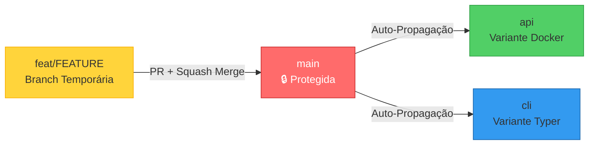
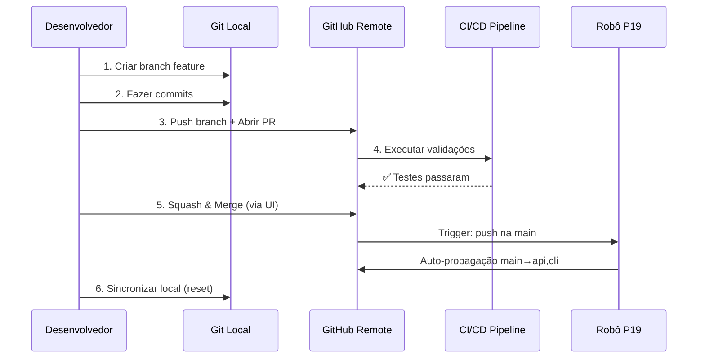

# Protected Branch Workflow: Fluxo Git Completo com Branch Protegida

> **Protocolo Obrigatório** para desenvolvimento em repositório com branch `main` protegida e auto-propagação

## 📋 Contexto e Motivação

Este projeto utiliza **Branch Protection Rules** no GitHub para garantir a integridade da branch `main`. Combinado com o workflow de **Auto-Propagação** (`.github/workflows/propagate.yml`), isso cria um ambiente resiliente mas com **restrições operacionais específicas**.

### Arquitetura de Branches



**Regras de Governança:**

- ✅ `main → api` (auto-propagação permitida)
- ✅ `main → cli` (auto-propagação permitida)
- ❌ Push direto na `main` (bloqueado para não-admins)
- ❌ `api → main` (contaminação reversa proibida)
- ❌ `cli → main` (contaminação reversa proibida)

---

## 🚨 Protocolo de Entrega Obrigatório

### ⛔ O Que NÃO Fazer

```bash
# ❌ NUNCA faça isso (vai falhar):
git checkout main
git add .
git commit -m "changes"
git push origin main  # ❌ BLOQUEADO por Branch Protection

# ❌ NUNCA faça merge local:
git checkout main
git merge feat/my-feature
git push origin main  # ❌ HISTÓRICO POLUÍDO

# ❌ NUNCA sincronize branches manualmente:
git checkout api
git merge main  # ❌ ROBÔ P19 FARÁ ISSO AUTOMATICAMENTE
```

### ✅ Fluxo Correto (5 Etapas)



---

## 📖 Passo a Passo Detalhado

### Etapa 1: Criar Branch de Feature

```bash
# Garantir que main está atualizada
git checkout main
git pull origin main

# Criar branch com nomenclatura semântica
git checkout -b feat/P999-descricao-curta
# ou
git checkout -b fix/corrigir-bug-xyz
# ou
git checkout -b docs/atualizar-readme
```

**Convenções de Nome:**

- `feat/P###-*`: Nova funcionalidade (referencia tarefa P###)
- `fix/*`: Correção de bug
- `docs/*`: Apenas documentação
- `refactor/*`: Refatoração sem mudança funcional
- `test/*`: Apenas testes

---

### Etapa 2: Desenvolver e Commitar

```bash
# Fazer alterações
vim src/my_module.py

# Validar localmente (SEMPRE antes de commitar)
make validate

# Staging SELETIVO (nunca use git add .)
git add src/my_module.py
git add tests/test_my_module.py

# Commit com mensagem semântica
git commit -m "feat(module): add validation logic

- Implement input sanitization
- Add unit tests with pytest
- Update module docstrings

Refs: #42"
```

**⚠️ Anti-Padrão Detectado (Relatório P20):**

```bash
# ❌ RUIM: Contamina commit com arquivos não relacionados
git add .
git commit -m "refactoring stuff"

# ✅ BOM: Staging atômico
git add scripts/ci_recovery/models.py
git add ci_failure_recovery.py
git commit -m "refactor(ci-recovery): extract data models to separate module"
```

---

### Etapa 3: Push e Abertura de PR

```bash
# Push da branch de feature
git push origin feat/P999-descricao-curta

# Abrir PR via GitHub UI ou gh CLI
gh pr create \
  --title "feat(module): add validation logic" \
  --body "Closes #42. Implements validation as discussed." \
  --base main \
  --head feat/P999-descricao-curta
```

**O que acontece automaticamente:**

1. ✅ CI/CD roda testes (`make validate`)
2. ✅ Pre-commit hooks validam código
3. ✅ Coverage report é gerado
4. ✅ Dependabot verifica vulnerabilidades

---

### Etapa 4: Aguardar Aprovação e Merge

**No GitHub UI:**

1. Aguarde CI passar (badge verde ✅)
2. Solicite review (se equipe > 1 pessoa)
3. Após aprovação, clique em **"Squash and merge"**
4. **Confirme deleção automática da branch remota** (checkbox habilitado)

**Resultado:**

```
✅ Pull request successfully merged and closed
🗑️ feat/P999-descricao-curta deleted
```

---

### Etapa 5: Sincronização Local (CRÍTICO)

**⚠️ JAMAIS pule esta etapa!**

```bash
# Voltar para main
git checkout main

# Puxar o squash commit do GitHub
git pull origin main

# RESET HARD para alinhar com remote
git reset --hard origin/main

# Deletar branch local de feature
git branch -d feat/P999-descricao-curta

# Limpar referências obsoletas
git fetch --prune
```

**Por que `git reset --hard`?**

O Squash Merge cria um **novo commit** no GitHub. Seu histórico local tem múltiplos commits na branch. Sem o reset, você terá divergência:

```
# Sem reset (❌ ERRADO):
Local:  A → B → C → D → E (seus 5 commits originais)
Remote: A → X (1 commit squashed)

# Com reset (✅ CORRETO):
Local:  A → X
Remote: A → X
```

---

## 🤖 Auto-Propagação (Robô P19)

**Após o merge na `main`, o workflow `propagate.yml` é acionado automaticamente.**

### O Que o Robô Faz

```yaml
# .github/workflows/propagate.yml
on:
  push:
    branches: [main]

jobs:
  propagate:
    steps:
      - name: Propagar main → api
        run: |
          git checkout api
          git merge origin/main
          git push origin api

      - name: Propagar main → cli
        run: |
          git checkout cli
          git merge origin/main
          git push origin cli
```

**Timeline:**

```
T+0s:   Merge PR na main
T+5s:   Robô P19 acorda (GitHub Actions trigger)
T+45s:  api e cli atualizadas automaticamente
```

### ⚠️ Conflitos de Merge (Caso Raro)

Se o robô falhar por conflito:

```
❌ FALHA: Merge apresentou conflitos
⚠️  Conflitos na branch 'api' requerem resolução manual
```

**Resolução:**

```bash
# 1. Checkout da branch com conflito
git checkout api
git pull origin api

# 2. Merge manual
git merge main

# 3. Resolver conflitos em editor
vim <arquivos-conflitantes>

# 4. Finalizar merge
git add <arquivos-resolvidos>
git commit -m "chore(sync): resolve propagation conflicts from main"

# 5. Push (robô P19 não fará isso por você)
git push origin api
```

---

## 📊 Checklist de Validação

Após executar o workflow completo, verifique:

- [ ] Branch `main` local sincronizada com `origin/main`
- [ ] Branch de feature deletada localmente (`git branch -vv`)
- [ ] Branch de feature deletada remotamente (GitHub UI)
- [ ] Branches `api` e `cli` atualizadas automaticamente (GitHub Actions log)
- [ ] `git status` mostra "nothing to commit, working tree clean"
- [ ] `git log --oneline -5` mostra o squash commit no topo

---

## 🛡️ Proteção da Main (Implementação Técnica)

### GitHub Rulesets

```yaml
# Configuração em Settings → Branches → Branch protection rules
rules:
  - require_pull_request: true
  - require_status_checks_to_pass: true
  - block_force_pushes: true
  - restrict_deletions: true
  - bypass_actors: ["admin"]  # Apenas admins podem bypass
```

### Código de Proteção (sync_logic.py)

```python
# scripts/git_sync/sync_logic.py
current_branch = git_status.get("current_branch")
if current_branch == "main":
    logger.error("🛑 OPERAÇÃO PROIBIDA NA 'main'")
    logger.error("A branch 'main' está protegida por regras ('Cofre').")
    logger.error(
        "Use o 'Fluxo de Trabalho (Chave Mestra)': Crie um branch, "
        "abra um PR e solicite um 'Bypass' do administrador.",
    )
    raise SyncError("Tentativa de 'push' direto na 'main' protegida.")
```

**Resultado ao tentar push direto:**

```
🛑 OPERAÇÃO PROIBIDA NA 'main'
A branch 'main' está protegida por regras ('Cofre').
SyncError: Tentativa de 'push' direto na 'main' protegida.
```

---

## 🔥 Casos Especiais

### Caso 1: Hotfix Urgente (Admin Bypass)

Se você é **administrador** e precisa fazer push direto:

```bash
# Siga o Direct Push Protocol
# Ver: docs/guides/DIRECT_PUSH_PROTOCOL.md

make validate
git add <arquivos>
git commit -m "hotfix: critical production bug"
git push origin main  # Bypass rules
```

### Caso 2: Múltiplas Branches de Feature Simultâneas

```bash
# Branch A (feature 1)
git checkout -b feat/A
# ... trabalho ...
git push origin feat/A
# Abrir PR #1

# Branch B (feature 2, independente de A)
git checkout main
git checkout -b feat/B
# ... trabalho ...
git push origin feat/B
# Abrir PR #2

# Merge ordem: B → main, depois A → main
# Robô P19 propagará ambas automaticamente
```

### Caso 3: Rebase vs. Merge no PR

**Recomendação:** Use **Squash Merge** sempre.

- ✅ **Squash Merge**: Histórico limpo (1 commit por PR)
- ⚠️ **Rebase and Merge**: Preserva commits individuais (útil para releases)
- ❌ **Merge Commit**: Cria bolhas no grafo (dificulta leitura)

---

## 📚 Referências Técnicas

### Documentação Relacionada

- [Post-PR Merge Protocol](./POST_PR_MERGE_PROTOCOL.md) - Detalhes de limpeza pós-merge
- [Direct Push Protocol](./DIRECT_PUSH_PROTOCOL.md) - Bypass para admins
- [Triad Sync Lessons Learned](./TRIAD_SYNC_LESSONS_LEARNED.md) - Histórico de evolução
- [Refactoring Protocol](./REFACTORING_PROTOCOL_ITERATIVE_FRACTIONATION.md) - Metodologia de refatoração segura

### Código Implementado

- [`scripts/git_sync/sync_logic.py`](../../scripts/git_sync/sync_logic.py) - Proteção de branch
- [`.github/workflows/propagate.yml`](../../.github/workflows/propagate.yml) - Robô P19
- [`scripts/post-pr-cleanup.sh`](../../scripts/post-pr-cleanup.sh) - Automação de limpeza

### Recursos Externos

- [GitHub Branch Protection](https://docs.github.com/en/repositories/configuring-branches-and-merges-in-your-repository/managing-protected-branches/about-protected-branches)
- [Squash Merge Documentation](https://docs.github.com/en/pull-requests/collaborating-with-pull-requests/incorporating-changes-from-a-pull-request/about-pull-request-merges#squash-and-merge-your-commits)

---

## 🔄 Versionamento

| Versão | Data       | Autor       | Mudanças                                    |
|--------|------------|-------------|---------------------------------------------|
| 1.0.0  | 2025-12-16 | SRE & GEM   | Versão inicial consolidando fluxo completo |

---

## 💡 Aprendizados e Débitos Conhecidos

### Débito Técnico: Histórico Git "Sujo"

**Sintoma:** O grafo do Git mostra linhas de merge ("bolhas") nas branches `api` e `cli`.

**Causa:** Estratégia de Merge Recursivo do robô P19 (necessária para suportar divergências).

**Impacto:** ⚠️ **Benigno** - Não afeta funcionalidade, apenas leitura visual do grafo.

**Resolução:** ❌ **Não tente linearizar** (git rebase) branches públicas `api`/`cli`, isso quebrará clones existentes.

### Lição Aprendida: Fracionamento de Mudanças

Durante a evolução deste sistema (Tarefas P15-P23), descobrimos que **LLMs falham ao refatorar múltiplos componentes simultaneamente**.

**Solução:** Protocolo de Fracionamento Iterativo (ver [`REFACTORING_PROTOCOL_ITERATIVE_FRACTIONATION.md`](./REFACTORING_PROTOCOL_ITERATIVE_FRACTIONATION.md)).

**Aplicação neste fluxo:** Faça PRs pequenos e atômicos. Evite PRs com 20+ arquivos modificados.

---

**Mantenha este documento atualizado conforme o workflow evoluir.**
