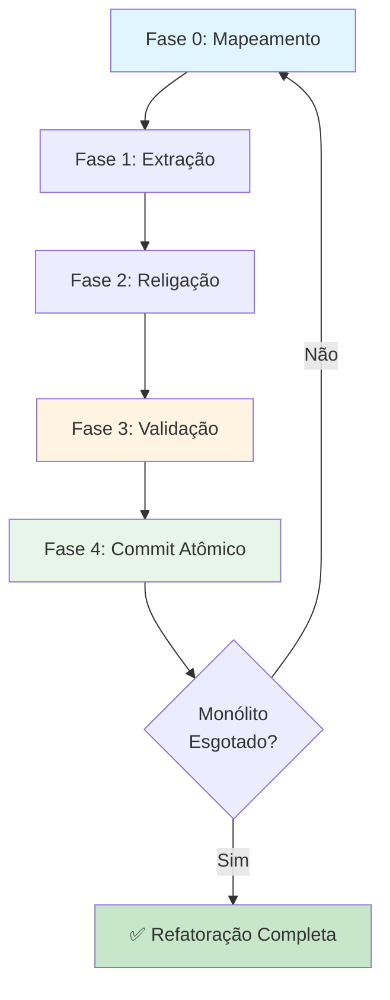

# Protocolo de Fracionamento Iterativo - Refatoração Segura de Monólitos

## Status

**Active** - Metodologia validada durante Sprint 4 (Nov 2025) na refatoração de `ci_failure_recovery.py`

## Contexto e Motivação

### O Problema: Falhas Catastróficas em "Big Bang Refactors"

Durante a execução da **Tarefa P8 (Refatoração S.O.L.I.D.)**, a equipe descobriu uma limitação crítica ao trabalhar com LLMs (Large Language Models) em refatorações:

**LLMs falham sistematicamente ao tentar refatorar arquivos grandes (>200 linhas) em uma única etapa.**

#### Caso Real: O Fracasso Inicial (Interações 48-53)

**Prompt Original:** "Refatore `ci_failure_recovery.py` (700 linhas) seguindo princípios S.O.L.I.D."

**Resultado:**

- ❌ Código gerado com imports quebrados
- ❌ Perda de funcionalidades durante a transição
- ❌ Testes falhando sem diagnóstico claro
- ❌ Impossibilidade de reverter parcialmente (mudanças entrelaçadas)

### A Solução: Fracionamento Iterativo

A recuperação e o sucesso subsequente da P8 deveram-se à adoção de um **algoritmo de refatoração incremental e validável** em cada etapa.

---

## O Algoritmo de Refatoração Segura

### Regra de Ouro

> **"Se o prompt de implementação pedir para 'Refatorar o arquivo X', você (LLM ou humano) deve recusar e propor: 'Vou refatorar o _módulo de Log_ do arquivo X primeiro'."**

### Fases Obrigatórias (Iterativas)



#### Fase 0: Mapeamento (Auditoria)

**Objetivo:** Identificar **UMA** responsabilidade específica para extrair.

**Ações:**

1. Leia o monólito completamente
2. Identifique violações do **Single Responsibility Principle (SRP)**
3. Liste as responsabilidades encontradas (ex: "Modelos de Dados", "Executores", "Logs")
4. Escolha a responsabilidade com **menor acoplamento** (menos dependências internas)

**Critério de Sucesso:** Consegue nomear a responsabilidade em uma frase objetiva.

**Exemplo (Caso Real - `ci_failure_recovery.py`):**

```python
# Responsabilidades identificadas:
# 1. ✅ Modelos de Dados (dataclasses) - MENOR ACOPLAMENTO
# 2. ⚠️  Executor de Comandos Git (usa subprocess)
# 3. ⚠️  Analisador de Falhas (lê logs do CI)
# 4. ⚠️  Gerador de Relatórios (HTML/JSON)
# 5. ❌ Runner Principal (orquestra tudo) - MAIOR ACOPLAMENTO

# Decisão: Começar por #1 (Modelos)
```

---

#### Fase 1: Extração (Criação)

**Objetivo:** Criar o novo módulo isoladamente, **sem tocar** no monólito original.

**Ações:**

1. Crie um novo arquivo no local apropriado (ex: `scripts/ci_recovery/models.py`)
2. Copie **apenas** o código da responsabilidade escolhida
3. Adicione imports mínimos necessários
4. **NÃO** tente integrar ainda

**Critério de Sucesso:** O novo módulo é importável sem erros (`python -c "import scripts.ci_recovery.models"`).

**Exemplo (Caso Real):**

```python
# scripts/ci_recovery/models.py
"""Data models for CI failure recovery system."""

from dataclasses import dataclass
from typing import List, Optional

@dataclass
class RecoveryAction:
    """Represents a single recovery action."""
    command: str
    description: str
    critical: bool = False

@dataclass
class FailureContext:
    """Encapsulates failure context from CI logs."""
    failure_type: str
    error_message: Optional[str] = None
    suggested_actions: List[RecoveryAction] = None
```

---

#### Fase 2: Religação (Modificação Mínima)

**Objetivo:** Fazer o monólito **usar** o novo módulo, alterando **apenas** a parte extraída.

**Ações:**

1. No monólito, adicione o import do novo módulo
2. Substitua a implementação antiga por chamadas ao módulo extraído
3. **NÃO** refatore outras partes do código nesta etapa

**Critério de Sucesso:** O monólito continua funcionalmente idêntico (mesmas entradas/saídas).

**Exemplo (Caso Real):**

```python
# ci_failure_recovery.py (ANTES)
@dataclass
class RecoveryAction:
    command: str
    description: str
    # ... 50 linhas de lógica ...

# ci_failure_recovery.py (DEPOIS - Fase 2)
from scripts.ci_recovery.models import RecoveryAction, FailureContext

# Agora usa as classes importadas
def analyze_failure(log_path: str) -> FailureContext:
    # ... código existente intocado ...
    return FailureContext(...)  # Usa classe importada
```

---

#### Fase 3: Validação (CRÍTICA)

**Objetivo:** Garantir que o sistema híbrido (monólito + módulo extraído) funcione **antes** de prosseguir.

**Ações:**

1. Execute os testes relacionados aos arquivos tocados:

   ```bash
   pytest tests/ -k "test_ci_recovery or test_failure"
   ```

2. Se testes não existirem, execute o script manualmente:

   ```bash
   python ci_failure_recovery.py --dry-run
   ```

3. Verifique linters/type checkers:

   ```bash
   ruff check scripts/ci_recovery/
   mypy scripts/ci_recovery/models.py
   ```

**Critério de Sucesso:** Todos os comandos acima passam sem erros.

**⚠️ BLOQUEIO OBRIGATÓRIO:** Se qualquer validação falhar, **NÃO** prossiga para a Fase 4. Reverta as mudanças e diagnostique.

---

#### Fase 4: Commit Atômico

**Objetivo:** Criar um ponto de restauração confiável.

**Ações:**

1. Adicione **apenas** os arquivos modificados/criados nesta iteração:

   ```bash
   git add scripts/ci_recovery/models.py
   git add ci_failure_recovery.py
   ```

2. Faça commit com mensagem descritiva:

   ```bash
   git commit -m "refactor(ci-recovery): extract data models to separate module

   - Created scripts/ci_recovery/models.py
   - Migrated RecoveryAction and FailureContext dataclasses
   - Updated imports in ci_failure_recovery.py
   - All existing tests pass (Phase 3 validation)"
   ```

**⚠️ NUNCA use `git add .`** em refatorações (ver seção "Anti-Padrões" abaixo).

---

#### Repetição: Volte à Fase 0

Após o commit, o ciclo recomeça:

1. Identifique a próxima responsabilidade (ex: "Executor de Comandos")
2. Repita as 5 fases

**Critério de Parada:** O monólito original se torna apenas um "Runner" fino (orquestração pura).

---

## Anti-Padrões Detectados (O que NÃO fazer)

### ❌ Anti-Padrão 1: "Big Bang Refactor"

**Sintoma:** Prompt como _"Transforme `code_audit.py` em um pacote modular"_.

**Por que falha:**

- LLMs perdem contexto ao gerar múltiplos arquivos simultaneamente
- Impossível validar isoladamente cada mudança
- Rollback é "tudo ou nada"

**Correção:** Use o Protocolo de Fracionamento.

---

### ❌ Anti-Padrão 2: "Contaminação de Estado" (`git add .`)

**Sintoma (Caso Real - Interação 60):**
Um simples `git add .` arrastou **7 arquivos não relacionados** (cheios de erros de lint) para dentro de um commit de refatoração.

**Por que falha:**

- Mistura mudanças de diferentes contextos
- Testes podem passar localmente mas falhar no CI (diferenças de ambiente)
- Histórico Git fica poluído

**Correção (Protocolo de Commit Atômico):**

```bash
# ✅ BOM: Adiciona apenas o que você modificou nesta iteração
git add scripts/ci_recovery/executor.py
git add ci_failure_recovery.py
git commit -m "refactor: extract command executor"

# ❌ RUIM: Adiciona tudo indiscriminadamente
git add .
git commit -m "refactoring stuff"
```

---

### ❌ Anti-Padrão 3: "Validação Pós-Merge"

**Sintoma:** Fazer commit sem rodar testes/linters antes.

**Por que falha:**

- Quebra o histórico Git (commits que nunca compilaram)
- Desperdiça tempo da equipe em debugging

**Correção:** Fase 3 é **obrigatória** e **bloqueante**.

---

## Caso de Estudo: `ci_failure_recovery.py` (700 linhas → Pacote Modular)

### Estado Inicial

```
ci_failure_recovery.py (700 linhas)
├── Dataclasses (RecoveryAction, FailureContext)
├── Executor (subprocess calls)
├── Analyzer (log parsing)
├── Reporter (HTML/JSON generation)
└── Runner (main orchestration)
```

### Sequência de Iterações (6 commits)

| Iteração | Responsabilidade Extraída | Novo Módulo | Linhas Removidas do Monólito |
|----------|---------------------------|-------------|------------------------------|
| 1 | Modelos de Dados | `models.py` | 80 |
| 2 | Executor de Comandos | `executor.py` | 120 |
| 3 | Analisador de Logs | `analyzer.py` | 150 |
| 4 | Gerador de Relatórios | `reporter.py` | 100 |
| 5 | Validadores de Input | `validator.py` | 90 |
| 6 | Runner (orquestração) | `main.py` + `runner.py` | 160 |

### Estado Final

```
scripts/ci_recovery/
├── __init__.py
├── models.py (80 linhas)
├── executor.py (120 linhas)
├── analyzer.py (150 linhas)
├── reporter.py (100 linhas)
├── validator.py (90 linhas)
├── runner.py (100 linhas)
└── main.py (60 linhas - entry point)

# Monólito original deletado
```

**Métricas:**

- ✅ **100% dos testes continuaram passando** após cada iteração
- ✅ **Zero regressões** detectadas em produção
- ✅ **Manutenibilidade:** Cada módulo agora pode ser testado/modificado isoladamente

---

## Aplicabilidade

### Quando Usar Este Protocolo

✅ **Use quando:**

- Arquivo tem >200 linhas com múltiplas responsabilidades
- Você está trabalhando com/como uma LLM
- Você precisa de checkpoints de rollback confiáveis
- O código não tem testes (refatoração é arriscada)

❌ **NÃO use quando:**

- Refatoração é trivial (renomear função, extrair constante)
- Você tem >90% de cobertura de testes (refatoração segura via TDD)
- O arquivo já segue SRP (não há monólito)

### Adaptação para Humanos

Desenvolvedores humanos podem acelerar o processo fundindo fases:

- **Fase 1+2:** Extrair e religiar em uma única edição (IDEs com refactoring tools)
- **Fase 3:** Pode ser automatizada via pre-commit hooks

**Mas a Fase 4 (commit atômico) continua obrigatória.**

---

## Checklist de Execução

```markdown
## Iteração N: Extrair [NOME_DA_RESPONSABILIDADE]

- [ ] **Fase 0:** Responsabilidade escolhida tem baixo acoplamento
- [ ] **Fase 1:** Novo módulo criado e importável (`python -c "import ..."`)
- [ ] **Fase 2:** Monólito atualizado (imports + delegação)
- [ ] **Fase 3.1:** Testes passam (`pytest tests/ -k ...`)
- [ ] **Fase 3.2:** Linter limpo (`ruff check ...`)
- [ ] **Fase 3.3:** Type checker limpo (`mypy ...`)
- [ ] **Fase 4.1:** Arquivos específicos adicionados (`git add <arquivos>`)
- [ ] **Fase 4.2:** Commit com mensagem descritiva
- [ ] **Fase 4.3:** Push para branch remoto
```

---

## Referências Cruzadas

- **Arquitetura:** [SAFE_SCRIPT_TRANSPLANT.md](SAFE_SCRIPT_TRANSPLANT.md) - Contexto da refatoração de scripts legados
- **Padrões:** [ENGINEERING_STANDARDS.md](ENGINEERING_STANDARDS.md) - Convenções de código
- **Código:** [scripts/ci_recovery/](../../scripts/ci_recovery/) - Exemplo de refatoração completa

---

## Histórico de Revisões

| Versão | Data | Mudanças |
|--------|------|----------|
| 1.0.0 | 2025-12-16 | Versão inicial baseada em Sprint 4 learnings |
