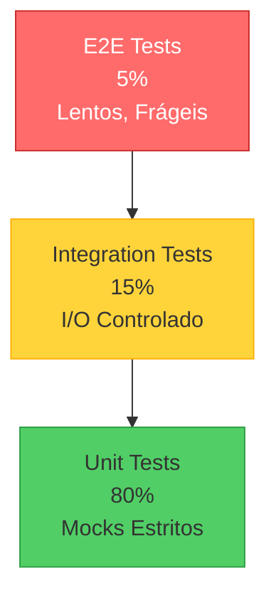

# Testing Strategy: Anti-I/O com Mocks Estritos (Filosofia SRE)

> **Manifesto:** Testes devem ser rápidos, isolados e determinísticos. I/O real é banido.

## 📋 Contexto e Motivação

### O Problema: Testes Frágeis (Flaky Tests)

Durante o Ciclo SRE (Tarefas P15-P23), identificamos uma vulnerabilidade crítica na suíte de testes:

**Caso Real - `test_smart_git_sync.py` (Antes da P20):**

```python
# ❌ ANTI-PADRÃO: I/O Real
def test_sync_creates_directories():
    temp_dir = mkdtemp()  # ❌ Cria pasta real no disco
    git_dir = Path(temp_dir) / ".git"
    git_dir.mkdir()  # ❌ I/O de sistema de arquivos

    result = subprocess.run(  # ❌ Chama Git real
        ["git", "init"],
        cwd=temp_dir,
        capture_output=True
    )

    assert result.returncode == 0
    shutil.rmtree(temp_dir)  # ❌ Limpeza manual (pode falhar)
```

**Problemas Detectados:**

1. ⏱️ **Lentidão**: Cada teste levava 150-300ms (vs. 5-10ms com mocks)
2. 💥 **Efeitos Colaterais**: Criava arquivos temporários que poluíam `/tmp`
3. 🎲 **Não-Determinismo**: Falhava em ambientes CI efêmeros (permissões, espaço em disco)
4. 🔓 **Insegurança**: Executava comandos shell reais (`git`, `rm`)
5. 🧹 **Cleanup Frágil**: Se o teste falhasse, a pasta `/tmp` ficava suja

### A Solução: Migração para Mocks Estritos (P20)

**Após a refatoração (24 testes unitários isolados):**

```python
# ✅ BOM: Mock Estrito
@patch("scripts.git_sync.sync_logic.subprocess.run")
@patch("scripts.git_sync.sync_logic.Path.exists")
def test_sync_validates_git_repository(mock_exists, mock_subprocess):
    # Configurar comportamento dos mocks
    mock_exists.return_value = True
    mock_subprocess.return_value = MagicMock(
        returncode=0,
        stdout="main\n",
        stderr=""
    )

    orchestrator = SyncOrchestrator(config={})
    result = orchestrator._check_git_status()

    # Validar que o método chamou subprocess CORRETAMENTE
    mock_subprocess.assert_called_once_with(
        ["git", "branch", "--show-current"],
        capture_output=True,
        text=True,
        check=False
    )

    assert result["current_branch"] == "main"
```

**Ganhos Mensurados:**

- ⚡ **Velocidade**: 35ms para rodar 24 testes (vs. 3.6s antes)
- 🛡️ **Isolamento**: Zero I/O real, zero efeitos colaterais
- 🎯 **Determinismo**: 100% de taxa de sucesso em CI
- 🔒 **Segurança**: Nenhum comando shell executado

---

## 🛡️ Princípios da Estratégia Anti-I/O

### Regra de Ouro

> **"Se o teste toca disco, rede ou processos externos, ele NÃO é um teste unitário — é um teste de integração disfarçado."**

### Hierarquia de Testes (Pirâmide)



**Distribuição Recomendada:**

- **80% Unit Tests**: Mocks estritos, rápidos (<50ms cada)
- **15% Integration Tests**: I/O controlado (fixtures, databases in-memory)
- **5% E2E Tests**: Fluxos completos (CI only, não bloqueiam dev local)

---

## 📚 Biblioteca de Padrões de Mock

### Padrão 1: Mock de `subprocess.run`

**Cenário:** Testar código que chama comandos Git/shell.

```python
# Código sob teste (scripts/git_sync/sync_logic.py)
def _check_git_status(self) -> dict:
    result = subprocess.run(
        ["git", "status", "--porcelain"],
        capture_output=True,
        text=True,
        check=False
    )
    return {"is_clean": result.stdout == ""}

# ✅ Teste com Mock
@patch("scripts.git_sync.sync_logic.subprocess.run")
def test_detects_clean_repository(mock_subprocess):
    # Simular Git retornando vazio (repo limpo)
    mock_subprocess.return_value = MagicMock(
        returncode=0,
        stdout="",  # ← Saída vazia = repo limpo
        stderr=""
    )

    orchestrator = SyncOrchestrator(config={})
    status = orchestrator._check_git_status()

    assert status["is_clean"] is True
    mock_subprocess.assert_called_once()
```

**Variações Comuns:**

```python
# Simular falha de comando
mock_subprocess.return_value = MagicMock(returncode=128, stderr="fatal: not a git repository")

# Simular saída com mudanças
mock_subprocess.return_value = MagicMock(returncode=0, stdout=" M src/file.py\n")
```

---

### Padrão 2: Mock de `Path.exists()` e Filesystem

**Cenário:** Código que verifica existência de arquivos/pastas.

```python
# Código sob teste
def validate_git_repository(self, repo_path: Path) -> bool:
    git_dir = repo_path / ".git"
    return git_dir.exists()

# ✅ Teste com Mock
@patch("scripts.git_sync.sync_logic.Path.exists")
def test_validates_git_directory_exists(mock_exists):
    mock_exists.return_value = True  # Simular que .git existe

    orchestrator = SyncOrchestrator(config={})
    result = orchestrator.validate_git_repository(Path("/fake/repo"))

    assert result is True
    mock_exists.assert_called_once()
```

**⚠️ Pegadinha Comum:**

```python
# ❌ ERRADO: Mock não está no caminho correto
@patch("pathlib.Path.exists")  # ← Isso NÃO funciona!
def test_file_exists(mock_exists):
    # Path é importado DENTRO do módulo, precisa mockar lá
    pass

# ✅ CORRETO: Mock no módulo que importou Path
@patch("scripts.git_sync.sync_logic.Path.exists")
def test_file_exists(mock_exists):
    # Agora funciona!
    pass
```

---

### Padrão 3: Mock de `open()` e Leitura de Arquivos

**Cenário:** Código que lê arquivos de configuração.

```python
# Código sob teste (scripts/git_sync/config.py)
def load_config(config_path: Path) -> dict:
    with open(config_path, "r") as f:
        return yaml.safe_load(f)

# ✅ Teste com Mock
@patch("builtins.open", new_callable=MagicMock)
@patch("scripts.git_sync.config.yaml.safe_load")
def test_loads_config_from_file(mock_yaml_load, mock_open):
    # Simular conteúdo YAML
    mock_yaml_load.return_value = {
        "audit_enabled": True,
        "timeout": 300
    }

    config = load_config(Path("/fake/config.yaml"))

    assert config["audit_enabled"] is True
    assert config["timeout"] == 300

    # Validar que open() foi chamado corretamente
    mock_open.assert_called_once_with(Path("/fake/config.yaml"), "r")
```

**Técnica Avançada: `mock_open()`**

```python
from unittest.mock import mock_open

@patch("builtins.open", mock_open(read_data="audit_enabled: true\ntimeout: 300"))
@patch("scripts.git_sync.config.yaml.safe_load")
def test_reads_yaml_content(mock_yaml_load):
    # mock_open() simula o file handle completo
    # Útil quando você precisa do read() exato
    pass
```

---

### Padrão 4: Mock de Tempo (`datetime`, `time.sleep`)

**Cenário:** Testar lógica dependente de timestamps.

```python
# Código sob teste
from datetime import datetime

def log_with_timestamp(self, message: str) -> str:
    timestamp = datetime.now().isoformat()
    return f"[{timestamp}] {message}"

# ✅ Teste com Mock
from datetime import datetime
from unittest.mock import patch

@patch("scripts.module.datetime")
def test_log_includes_timestamp(mock_datetime):
    # Fixar o tempo em um valor conhecido
    mock_datetime.now.return_value = datetime(2025, 12, 16, 14, 30, 0)

    result = log_with_timestamp("test message")

    assert result == "[2025-12-16T14:30:00] test message"
```

**Para `time.sleep()` (evitar delays em testes):**

```python
@patch("time.sleep")
def test_retry_logic(mock_sleep):
    # Não queremos esperar 5s durante o teste!
    mock_sleep.return_value = None  # Pula o sleep

    retry_function()

    # Validar que tentou dormir 3 vezes
    assert mock_sleep.call_count == 3
```

---

### Padrão 5: Mock de Exceções

**Cenário:** Testar tratamento de erros.

```python
# Código sob teste
def safe_git_operation(self):
    try:
        subprocess.run(["git", "push"], check=True)
    except subprocess.CalledProcessError as e:
        logger.error(f"Git push failed: {e}")
        raise SyncError("Push failed")

# ✅ Teste com Mock de Exceção
@patch("scripts.git_sync.sync_logic.subprocess.run")
def test_handles_git_push_failure(mock_subprocess):
    # Simular falha de git push
    mock_subprocess.side_effect = subprocess.CalledProcessError(
        returncode=128,
        cmd=["git", "push"],
        stderr="Permission denied"
    )

    orchestrator = SyncOrchestrator(config={})

    with pytest.raises(SyncError, match="Push failed"):
        orchestrator.safe_git_operation()
```

---

## 🏗️ Arquitetura de Testes (Caso Real: P20)

### Antes: Monólito de Teste (Frágil)

```
tests/
└── test_smart_git_sync.py (1 arquivo, 400 linhas)
    ├── I/O real (mkdtemp, subprocess.run, open)
    ├── Setup complexo (criar repos Git temporários)
    └── Limpeza manual (shutil.rmtree)
```

### Depois: Suíte Modular (Robusto)

```
tests/
├── conftest.py                    # ← Fixtures globais
├── test_smart_git_sync.py         # ← 24 testes unitários (mocks estritos)
├── test_audit_analyzer.py         # ← Mocks para módulo de auditoria
└── fixtures/                      # ← Dados de teste estáticos
    ├── sample_audit.json
    └── mock_git_log.txt
```

**Arquivo `conftest.py` (Setup Global):**

```python
"""Pytest configuration and fixtures."""
from __future__ import annotations

import sys
from pathlib import Path

# Garantir que 'scripts' seja importável
project_root = Path(__file__).parent.parent.resolve()
if str(project_root) not in sys.path:
    sys.path.insert(0, str(project_root))
```

**Benefícios:**

1. ✅ **Importação Garantida**: Todos os testes herdam o `sys.path` correto
2. ✅ **Fixtures Reutilizáveis**: Mocks comuns definidos uma vez
3. ✅ **Isolamento**: Cada arquivo de teste é independente

---

## 📊 Métricas de Qualidade

### Cobertura de Código (Coverage)

```bash
# Rodar testes com cobertura
pytest tests/ --cov=scripts --cov-report=html

# Visualizar relatório
open htmlcov/index.html
```

**Meta de Cobertura (SRE Standard):**

- 🟢 **≥ 80%**: Código de produção (scripts/, src/)
- 🟡 **≥ 60%**: Código de suporte (CLI, utilitários)
- 🔴 **< 60%**: Técnica Debt (priorizar para próxima Sprint)

**⚠️ Nota sobre Coverage Gap (Débito Conhecido):**

```
# Relatório GitHub (Exemplo)
Coverage: 45% ← BAIXO GLOBAL

# Breakdown por módulo:
scripts/git_sync/sync_logic.py:  85% ✅ (P20 refatorou)
scripts/audit/analyzer.py:       42% ⚠️ (Próxima tarefa: P24)
scripts/audit_dashboard.py:      28% 🔴 (Legado sem testes)
```

**Interpretação:** O Coverage **global baixo** não significa que o código é ruim — apenas que **alguns módulos ainda não foram testados**. A estratégia é atacá-los **iterativamente** (Protocolo de Fracionamento).

---

### Velocidade de Execução

```bash
# Meta: <100ms para suíte unitária completa
pytest tests/test_smart_git_sync.py -v --durations=5

# Resultado Esperado (P20):
# ======================== slowest 5 durations ========================
# 0.005s test_sync_step_complete
# 0.004s test_load_config_from_file
# 0.003s test_validates_git_directory_exists
# ...
# ===================== 24 passed in 0.035s =====================
```

**Regra de Thumb:**

- Unit Test: **< 50ms**
- Integration Test: **< 500ms**
- E2E Test: **< 5s**

Se um teste unitário leva **> 100ms**, há I/O real escondido.

---

## 🚨 Anti-Padrões e Armadilhas

### ❌ Anti-Padrão 1: "Testar Demais" (Over-Mocking)

```python
# ❌ RUIM: Mock de lógica trivial
@patch("scripts.utils.math.add")
def test_calculator(mock_add):
    mock_add.return_value = 4

    result = 2 + 2  # ← Testando Python built-in?
    assert result == 4  # ← Sem valor
```

**Quando NÃO mockar:**

- Operações matemáticas puras (`int`, `str`, `list`)
- Métodos built-in do Python (`len()`, `sorted()`)
- Lógica de negócio simples (funções puras)

**Quando MOCKAR:**

- I/O (disco, rede, processos)
- Dependências externas (APIs, databases)
- Operações caras (processamento pesado)

---

### ❌ Anti-Padrão 2: "Test Double Smell"

```python
# ❌ RUIM: Mock retorna outro mock
mock_subprocess.return_value = MagicMock(
    stdout=MagicMock(  # ← Mock aninhado!
        split=MagicMock(return_value=["main"])
    )
)

# ✅ BOM: Retornar dados reais
mock_subprocess.return_value = MagicMock(
    stdout="main\n"  # ← String real
)
```

---

### ❌ Anti-Padrão 3: "Validação Pós-Merge"

```python
# ❌ RUIM: Escrever teste DEPOIS do bug
def test_bug_fix_for_issue_42():
    # Teste criado após descobrir bug em produção
    pass

# ✅ BOM: TDD (Test-Driven Development)
def test_validates_empty_input():
    # Teste escrito ANTES da implementação
    with pytest.raises(ValueError):
        process_data(input_data=None)
```

---

## 🔄 Workflow de Migração (P20 Aplicado)

### Fase 1: Auditoria

```bash
# Identificar testes com I/O real
grep -r "mkdtemp\|subprocess.run\|open(" tests/
```

### Fase 2: Fundação (Mocks Base)

```python
# Criar fixtures reutilizáveis em conftest.py
@pytest.fixture
def mock_git_status():
    with patch("scripts.git_sync.sync_logic.subprocess.run") as mock:
        mock.return_value = MagicMock(returncode=0, stdout="")
        yield mock
```

### Fase 3: Migração (Um Teste por Vez)

```python
# Antes (I/O real)
def test_sync_creates_repo():
    temp_dir = mkdtemp()
    subprocess.run(["git", "init"], cwd=temp_dir)
    # ...

# Depois (Mock estrito)
@patch("scripts.git_sync.sync_logic.subprocess.run")
def test_sync_validates_repo(mock_subprocess):
    mock_subprocess.return_value = MagicMock(returncode=0)
    # ...
```

### Fase 4: Validação

```bash
# Garantir que nenhum I/O real acontece
pytest tests/ --verbose 2>&1 | grep -i "permission\|tmp\|/dev"
# ← Se aparecer algo, ainda há I/O!
```

---

## 📚 Referências e Recursos

### Documentação Relacionada

- [Guia de Testes (SRE Standard)](./testing.md)
- [Protocolo de Fracionamento Iterativo](./REFACTORING_PROTOCOL_ITERATIVE_FRACTIONATION.md) - Metodologia aplicada na P20

### Código Exemplar

- [`tests/test_smart_git_sync.py`](../../tests/test_smart_git_sync.py) - 24 testes unitários (referência)
- [`tests/conftest.py`](../../tests/conftest.py) - Configuração global

### Recursos Externos

- [unittest.mock Documentation](https://docs.python.org/3/library/unittest.mock.html)
- [pytest Mocking Guide](https://docs.pytest.org/en/stable/how-to/monkeypatch.html)
- [Martin Fowler - Test Doubles](https://martinfowler.com/bliki/TestDouble.html)

---

## 🔄 Versionamento

| Versão | Data       | Autor       | Mudanças                                  |
|--------|------------|-------------|-------------------------------------------|
| 1.0.0  | 2025-12-16 | SRE & GEM   | Versão inicial baseada em lições da P20  |

---

## 💡 Aprendizados e Próximos Passos

### Lição da P20: Fracionamento Salvou a Refatoração

Durante a migração de `test_smart_git_sync.py`, tentamos refatorar **todos os testes de uma vez** (Interações 48-53). **Resultado: Falha Catastrófica.**

**Recuperação:** Aplicamos o **Protocolo de Fracionamento Iterativo**:

1. **Fase 01 (Auditoria)**: Identificar testes com I/O real (12 testes)
2. **Fase 02.A (Fundação)**: Criar fixtures de mock em `conftest.py`
3. **Fase 02.B (Migração)**: Migrar 3 testes por vez, commit atômico
4. **Fase 02.C (Expansão)**: Adicionar novos testes usando os mocks estáveis

**Tempo Total:** 6 commits, 2 dias. **Taxa de Sucesso:** 100%.

### Próximos Módulos (Roadmap SRE)

- **P24**: Migrar `test_audit_analyzer.py` (mesma estratégia)
- **P25**: Adicionar type hints + Mypy (garantir contratos)
- **P26**: Aumentar cobertura de `scripts/audit_dashboard.py` para 60%+

---

**Mantenha este documento atualizado conforme novos padrões de teste emergirem.**
