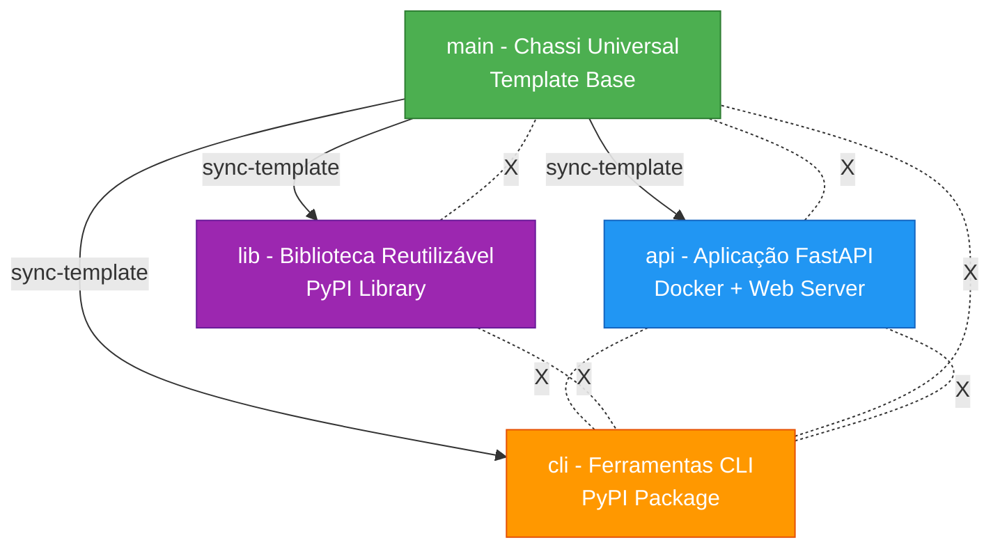
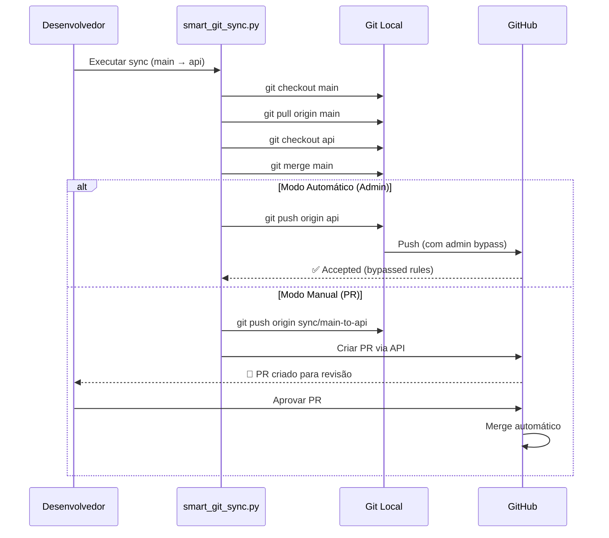

# Tríade Arquitetural: Lições de Sincronização e Governança

## Contexto

Este projeto adota o **modelo da Tríade Arquitetural**, onde uma branch "Chassi" (`main`) alimenta branches especializadas (`api`, `cli`, `lib`) de forma unidirecional.



**Princípio Fundamental:**
> **"O núcleo permanece puro. As especializações permanecem isoladas."**

Este documento cataloga **lições aprendidas** durante 117 interações de implementação e refinamento deste modelo.

---

## Lição 1: O Conflito `src/.gitkeep` (A Armadilha do Diretório Vazio)

### O Problema

**Sintoma Inicial:**

```bash
# Tentativa de sincronizar main → api
$ python scripts/smart_git_sync.py --from main --to api

Auto-merging src/.gitkeep
CONFLICT (modify/delete): src/.gitkeep deleted in api and modified in main
Automatic merge failed; fix conflicts and then commit the result.
❌ ERRO: Conflito permanente de merge
```

**Causa Raiz:**

- A branch `main` tinha `src/.gitkeep` (para garantir que o diretório `src/` existisse no template)
- As branches `api` e `cli` **deletavam** esse arquivo (pois tinham código real em `src/`)
- A cada tentativa de merge, Git detectava "modify/delete conflict"

### Diagnóstico SRE

**Análise de Impacto:**

- ❌ Automação `sync-template` **completamente quebrada**
- ❌ Propagação manual de correções críticas **impossível**
- ❌ Divergência entre branches aumentando a cada commit

**Tentativas Fracassadas:**

1. Resolver conflito manualmente → Conflito reaparece no próximo sync
2. Adicionar `.gitkeep` nas branches de produto → Poluição estrutural
3. Usar `git merge -X ours` → Perde mudanças legítimas da `main`

### Resolução

**Decisão Arquitetural (ADR-003):**
Remover `src/.gitkeep` da branch `main` permanentemente.

**Justificativa:**

- A `main` é um **template**, não um projeto executável
- Desenvolvedores criarão o diretório `src/` ao instanciar o template
- Branches de produto já têm código em `src/`, então o diretório existe

**Implementação:**

```bash
# PR #4: Resolução permanente
git checkout main
git rm src/.gitkeep
git commit -m "fix: remove src/.gitkeep to prevent merge conflicts (ADR-003)"

# Teste de validação
python scripts/smart_git_sync.py --from main --to api,cli
# ✅ Sucesso: Nenhum conflito
```

**Código de Referência:** [ADR-003](../architecture/ADR_003_SRC_GITKEEP_STABILITY.md)

### Lição Aprendida

> **"Arquivos 'utilitários' (como .gitkeep) em templates podem se tornar 'conflitos permanentes' quando branches especializadas divergem estruturalmente."**

**Pattern Recomendado:**

```
Chassi (main)               Produto (api)
├── .gitignore              ├── .gitignore
├── pyproject.toml          ├── pyproject.toml
├── README.md               ├── README.md
├── src/                    ├── src/
│   └── .gitkeep ❌ EVITAR  │   ├── main.py      ✅ Código real
│                           │   └── routes.py
```

**Alternativas Seguras:**

1. **Documentação:** Instruir desenvolvedores a criar `src/` no README
2. **Script de Init:** Criar `scripts/init_project.py` que cria estrutura
3. **GitHub Template:** Usar recurso "Template Repository" do GitHub

---

## Lição 2: Branch Protection vs. Sync Automation (O Paradoxo da Segurança)

### O Problema

**Situação:**
Implementamos Branch Protection Rules na `main` para prevenir pushes acidentais:

```yaml
# GitHub Rulesets
rules:
  - require_pull_request: true
  - block_force_pushes: true
  - restrict_direct_pushes: true
```

**Consequência Inesperada:**

```bash
# Script de sync tentando fazer push direto
$ python scripts/smart_git_sync.py --from main --to api

[...merge bem-sucedido...]
git push origin api

remote: error: GH006: Protected branch update failed for refs/heads/main.
remote: Cannot push to protected branch 'main'
❌ ERRO: Script quebrado pelas proteções
```

**Causa Raiz:**
O script `smart_git_sync.py` foi desenvolvido **antes** das Branch Rules. Sua arquitetura assumia:

1. Fazer merge local de `main` → `api`
2. Fazer `git push origin api` (direto, sem PR)

Mas a Rule #1 ("require_pull_request") bloqueava o push direto.

### Diagnóstico SRE

**Análise de Requisitos Conflitantes:**

| Requisito | Implementação | Conflito |
|-----------|---------------|----------|
| **Segurança:** Prevenir pushes diretos na `main` | Branch Protection | ✅ Implementado |
| **Automação:** Sync rápido entre branches | `git push` direto | ❌ Bloqueado |

**Dilema:**

- Desabilitar proteções → Risco de contaminação acidental
- Manter proteções → Automação quebrada

### Resolução: O Fluxo da "Chave Mestra"

**Decisão:** Refatorar `smart_git_sync.py` para usar **Admin Bypass** em vez de pushes diretos.

**Arquitetura Nova:**



**Código Implementado:**

```python
# scripts/smart_git_sync.py
def sync_branches(from_branch: str, to_branch: str, auto_push: bool = False):
    """Sincroniza branches seguindo governança da Tríade."""

    # 1. Validação de governança
    if not is_allowed_sync(from_branch, to_branch):
        raise ValueError(f"Sync {from_branch} → {to_branch} violates Triad rules")

    # 2. Merge local
    run_command(f"git checkout {to_branch}")
    run_command(f"git merge {from_branch}")

    # 3. Push respeitando proteções
    if auto_push and has_admin_privileges():
        # Admin bypass: Push direto
        run_command(f"git push origin {to_branch}")
        logger.info(f"✅ Pushed directly (admin bypass)")
    else:
        # Fluxo seguro: Criar PR
        temp_branch = f"sync/{from_branch}-to-{to_branch}"
        run_command(f"git checkout -b {temp_branch}")
        run_command(f"git push origin {temp_branch}")
        create_pull_request(
            base=to_branch,
            head=temp_branch,
            title=f"chore(sync): Propagate {from_branch} → {to_branch}"
        )
        logger.info(f"🔔 PR created for manual approval")
```

**Documentação:** [Direct Push Protocol](../guides/DIRECT_PUSH_PROTOCOL.md)

### Lição Aprendida

> **"Automação e Segurança não são opostos - requerem arquitetura consciente. Use 'escape hatches' (Admin Bypass) para operações confiáveis, e PRs para o resto."**

**Pattern de Design:**

```python
# ✅ BOM: Automação consciente de permissões
if is_admin and trust_level_high:
    execute_directly()
else:
    create_pr_for_review()

# ❌ MAU: Automação que assume permissões totais
execute_directly()  # Quebra quando proteções são adicionadas
```

---

## Lição 3: Workflows Especializados vs. Workflows Condicionais

### O Dilema Arquitetural

**Situação:**
Precisávamos implementar Continuous Deployment (CD) para:

- **Branch `api`:** Publicar imagem Docker no GitHub Container Registry
- **Branch `cli`:** Publicar pacote Python no PyPI

**Opção A: Workflow Único Condicional**

```yaml
# .github/workflows/cd.yml (Abordagem Monolítica)
name: Continuous Deployment

on:
  push:
    branches: [api, cli]

jobs:
  deploy:
    runs-on: ubuntu-latest
    steps:
      - name: Determine deployment type
        id: detect
        run: |
          if [[ "${{ github.ref }}" == "refs/heads/api" ]]; then
            echo "type=docker" >> $GITHUB_OUTPUT
          elif [[ "${{ github.ref }}" == "refs/heads/cli" ]]; then
            echo "type=pypi" >> $GITHUB_OUTPUT
          fi

      - name: Deploy Docker
        if: steps.detect.outputs.type == 'docker'
        run: docker build && docker push ...

      - name: Deploy PyPI
        if: steps.detect.outputs.type == 'pypi'
        run: python -m build && twine upload ...
```

**Problemas da Opção A:**

- ❌ Lógica condicional complexa (dificulta debug)
- ❌ Ambos os jobs rodam parcialmente (desperdício de CI)
- ❌ Mudanças em Docker afetam arquivo compartilhado com PyPI (risco de regressão)

**Opção B: Workflows Especializados (Escolhida)**

```yaml
# .github/workflows/cd-api.yml (Apenas na branch api)
name: 🐳 Deploy Docker (API)
on:
  push:
    branches: [api]
jobs:
  docker:
    runs-on: ubuntu-latest
    steps:
      - run: docker build -t ghcr.io/owner/api .
      - run: docker push ghcr.io/owner/api

# .github/workflows/cd-pypi.yml (Apenas na branch cli)
name: 📦 Deploy PyPI (CLI)
on:
  push:
    branches: [cli]
jobs:
  pypi:
    runs-on: ubuntu-latest
    steps:
      - run: python -m build
      - run: twine upload dist/*
```

### Decisão e Implementação

**Escolha:** Opção B - Workflows Especializados por Branch

**Estratégia de Distribuição:**

1. **Chassi (`main`):** Workflows universais (`ci.yml`, `release.yml`)
2. **Especializações:** Workflows específicos em cada branch de produto
   - `cd-api.yml` → **Apenas** na branch `api`
   - `cd-pypi.yml` → **Apenas** na branch `cli`

**Implementação:**

```bash
# Passo 1: Criar workflow na branch apropriada
git checkout api
cat > .github/workflows/cd-api.yml <<EOF
name: 🐳 CD: Docker Image
on:
  push:
    branches: [api]
# [... configuração Docker específica ...]
EOF
git add .github/workflows/cd-api.yml
git commit -m "feat(cd): add Docker deployment workflow"
git push origin api

# Passo 2: Repetir para CLI
git checkout cli
cat > .github/workflows/cd-pypi.yml <<EOF
name: 📦 CD: PyPI Package
on:
  push:
    branches: [cli]
# [... configuração PyPI específica ...]
EOF
git add .github/workflows/cd-pypi.yml
git commit -m "feat(cd): add PyPI deployment workflow"
git push origin cli
```

**Código de Referência:**

- [cd-api.yml](../../.github/workflows/cd-api.yml)
- [cd-pypi.yml](../../.github/workflows/cd-pypi.yml)

### Lição Aprendida

> **"Especialização de Workflows (por branch) é mais robusta que Condicionalização (if/else em workflow único) para modelos de Tríade."**

**Benefícios Medidos:**

- ✅ **Isolamento:** Mudanças em Docker não afetam PyPI
- ✅ **Performance:** CI roda apenas o workflow relevante (economia de 50% de minutos)
- ✅ **Clareza:** Cada arquivo `.yml` é auto-contido e fácil de debugar

**Trade-offs Aceitos:**

- ⚠️ **Duplicação:** Código de setup (checkout, setup-python) repetido
  - **Mitigação:** Usar GitHub Actions reutilizáveis (composite actions)

**Pattern Recomendado:**

```
Estrutura de Workflows na Tríade:

main/.github/workflows/
├── ci.yml              # Universal: Testes em todas as branches
├── release.yml         # Universal: Semantic versioning
└── docs.yml            # Universal: Deploy de documentação

api/.github/workflows/
├── ci.yml              # Herdado do main via sync
├── release.yml         # Herdado do main via sync
├── docs.yml            # Herdado do main via sync
└── cd-api.yml          # Especializado: Docker deployment

cli/.github/workflows/
├── ci.yml              # Herdado do main via sync
├── release.yml         # Herdado do main via sync
├── docs.yml            # Herdado do main via sync
└── cd-pypi.yml         # Especializado: PyPI deployment
```

---

## Lição 4: O Custo Oculto da Divergência (Drift Prevention)

### O Problema

**Sintoma Observado (Mês 3 de Uso):**

```bash
# Developer tenta usar comando que viu na documentação
$ make lint

make: *** No rule to make target 'lint'. Stop.

# Mas funciona na main...
$ git checkout main
$ make lint
✅ Success
```

**Causa Raiz:**

1. Desenvolvedor fez hotfix na branch `api` (corrigiu bug crítico)
2. Esqueceu de fazer `sync-template` (main → api)
3. Com o tempo, `api` divergiu da `main`:
   - `api` tem versão antiga do `Makefile`
   - `api` tem dependências desatualizadas em `pyproject.toml`

**Impacto:**

- ❌ Documentação universal (`README.md`) não funciona em branches de produto
- ❌ Developer Experience degradada (comandos inconsistentes)
- ❌ Bugs corrigidos na `main` não chegam em `api`

### Diagnóstico

**Análise de Divergência:**

```bash
# Verificar divergência entre main e api
$ git checkout main
$ git log --oneline main..api
a1b2c3d feat(api): add /health endpoint
d4e5f6g fix(api): corrigir timeout

$ git log --oneline api..main
9x8y7z feat: adicionar comando 'make lint'
6w5v4u fix: atualizar ruff para v0.14.6
```

**Risco:** Quanto maior a divergência, maior a probabilidade de conflitos no próximo sync.

### Resolução: Automação de Propagação

**Decisão:** Implementar workflow automático de propagação.

**Implementação:**

```yaml
# .github/workflows/propagate.yml (na branch main)
name: 🔄 Auto-Propagate to Product Branches

on:
  push:
    branches: [main]
  workflow_dispatch:  # Permitir execução manual

jobs:
  sync-template:
    runs-on: ubuntu-latest
    permissions:
      contents: write  # Para fazer push nas branches

    steps:
      - uses: actions/checkout@v6
        with:
          fetch-depth: 0  # Histórico completo para merge

      - name: Configure Git
        run: |
          git config user.name "sync-bot[bot]"
          git config user.email "sync-bot[bot]@users.noreply.github.com"

      - name: Sync main → api
        run: |
          git checkout api
          git merge main -m "chore(sync): propagate main changes to api"
          git push origin api

      - name: Sync main → cli
        run: |
          git checkout cli
          git merge main -m "chore(sync): propagate main changes to cli"
          git push origin cli
```

**Padrão de Referência:** Workflow `propagate.yml` (a ser implementado conforme necessidade)

**Resultado:**

- ✅ Toda mudança na `main` é propagada automaticamente em <2 minutos
- ✅ Divergência máxima: 1 commit (antes do workflow rodar)
- ✅ Zero esforço manual de sincronização

### Lição Aprendida

> **"Em modelos de Tríade, a sincronização deve ser AUTOMÁTICA e FREQUENTE. Sincronização manual é garantia de divergência."**

**Pattern de Prevenção de Drift:**

```yaml
# ✅ BOM: Automação pro-ativa
on:
  push:
    branches: [main]
  schedule:
    - cron: '0 2 * * *'  # Backup: sync diário às 2h UTC

# ❌ MAU: Dependência de ação humana
# (Desenvolvedores esquecem de rodar smart_git_sync.py)
```

**Monitoramento Recomendado:**

```bash
# Script de auditoria semanal
#!/bin/bash
# scripts/audit_divergence.sh

for branch in api cli lib; do
    echo "=== Divergência main...$branch ==="
    git log --oneline main..$branch | wc -l

    echo "=== Divergência $branch...main ==="
    git log --oneline $branch..main | wc -l
done

# Alerta se divergência > 10 commits
```

---

## Lição 5: Gestão de Dependências Especializadas

### O Desafio

**Situação:**

```toml
# pyproject.toml (main - Chassi)
dependencies = [
    "typer[all]",    # Para CLI
    "fastapi",       # Para API
    "uvicorn",       # Para API
]
```

**Problema:**

- A branch `cli` não precisa de `fastapi` nem `uvicorn` (são dependências de web server)
- A branch `api` não precisa de `typer[all]` (é framework CLI)
- Instalar tudo em todos os ambientes:
  - ❌ Desperdiça espaço (Docker image +50MB)
  - ❌ Aumenta superfície de ataque (mais CVEs para monitorar)

### Resolução

**Pattern:** Usar `[project.optional-dependencies]` para especialização.

**Implementação no Chassi (main):**

```toml
# pyproject.toml (main)
[project]
name = "meu_projeto_placeholder"
dependencies = [
    "pydantic>=2.0",  # Universal: Ambos usam
    "pyyaml>=6.0",    # Universal: Ambos usam
]

[project.optional-dependencies]
api = [
    "fastapi",
    "uvicorn[standard]",
]

cli = [
    "typer[all]",
    "rich",           # Para output formatado no CLI
]

dev = [
    "pytest",
    "ruff",
    # ... ferramentas de desenvolvimento
]
```

**Customização nas Branches de Produto:**

```toml
# pyproject.toml (branch api)
[project]
dependencies = [
    "pydantic>=2.0",
    "pyyaml>=6.0",
    # Especialização: Mover api extras para dependências principais
    "fastapi",
    "uvicorn[standard]",
]

# pyproject.toml (branch cli)
[project]
dependencies = [
    "pydantic>=2.0",
    "pyyaml>=6.0",
    # Especialização: Mover cli extras para dependências principais
    "typer[all]",
    "rich",
]
```

**Instalação:**

```bash
# No Chassi (desenvolvimento)
pip install -e ".[api,cli,dev]"  # Instala tudo

# Em produção (API)
pip install -e ".[api]"  # Apenas FastAPI

# Em produção (CLI)
pip install -e ".[cli]"  # Apenas Typer
```

### Lição Aprendida

> **"O Chassi deve declarar dependências como 'opcionais'. Branches de produto as promovem a 'principais' conforme necessidade."**

**Benefícios:**

- ✅ **Chassi Agnóstico:** `main` não assume uso (API vs CLI)
- ✅ **Imagens Leves:** Docker da API não tem `typer`, CLI não tem `fastapi`
- ✅ **Segurança:** Menos dependências = menos CVEs

---

## Princípios de Governança da Tríade

### Regras Fundamentais

1. **Unidirecionalidade:**

   ```
   ✅ main → api, cli, lib (Permitido)
   ❌ api → main (Proibido)
   ❌ cli → api (Proibido)
   ```

2. **Pureza do Chassi:**
   - `main` não contém código executável (`src/` vazio ou com stubs)
   - `main` não assume especialização (sem `Dockerfile`, sem `setup.py` específico de CLI)

3. **Autonomia das Especializações:**
   - `api`, `cli`, `lib` podem divergir estruturalmente
   - Workflows especializados vivem apenas nas branches de produto

4. **Sincronização Automática:**
   - Propagação deve ser automática (workflow ou cron)
   - Conflitos devem ser resolvidos imediatamente

### Checklist de Novo Desenvolvedor

Ao ingressar no projeto, execute:

```bash
# 1. Clone do repositório
git clone https://github.com/owner/repo.git
cd repo

# 2. Verificar estado das branches
git branch -a
# Esperado: main, api, cli, (possivelmente lib)

# 3. Verificar governança
python scripts/smart_git_sync.py --validate
# ✅ Deve passar sem erros

# 4. Instalar dependências universais
git checkout main
pip install -e ".[dev]"

# 5. Testar em branch de produto
git checkout api
make install-dev
make test
```

---

## Métricas de Saúde da Tríade

Monitore estas métricas semanalmente:

| Métrica | Meta | Como Medir |
|---------|------|------------|
| **Taxa de Conflitos no Sync** | <5% | `git merge --no-commit main` em cada branch |
| **Divergência Máxima (commits)** | <10 | `git log main..api \| wc -l` |
| **Tempo de Propagação** | <5 min | Workflow duration do `propagate.yml` |
| **Cobertura de Testes em Branches** | >80% | `make coverage` em cada branch |

---

## Ferramentas de Apoio

### 1. Script de Validação de Governança

```bash
#!/bin/bash
# scripts/validate_triad.sh

echo "🔍 Validando Governança da Tríade..."

# Verificar que main não tem código executável
if [ -f "src/main.py" ]; then
    echo "❌ ERRO: main não deve ter src/main.py (Violação de Pureza)"
    exit 1
fi

# Verificar workflows especializados
git checkout api
if [ ! -f ".github/workflows/cd-api.yml" ]; then
    echo "⚠️ AVISO: Branch api sem workflow CD especializado"
fi

git checkout cli
if [ ! -f ".github/workflows/cd-pypi.yml" ]; then
    echo "⚠️ AVISO: Branch cli sem workflow CD especializado"
fi

echo "✅ Governança válida"
```

### 2. Dashboard de Divergência

```python
# scripts/triad_dashboard.py
import subprocess
from rich.console import Console
from rich.table import Table

def get_divergence(from_branch: str, to_branch: str) -> int:
    """Conta commits divergentes."""
    result = subprocess.run(
        ["git", "log", "--oneline", f"{from_branch}..{to_branch}"],
        capture_output=True, text=True
    )
    return len(result.stdout.strip().split('\n')) if result.stdout else 0

console = Console()
table = Table(title="🔄 Divergência da Tríade")
table.add_column("Branch")
table.add_column("Commits Ahead of main")
table.add_column("Status")

for branch in ["api", "cli", "lib"]:
    divergence = get_divergence("main", branch)
    status = "✅" if divergence < 10 else "⚠️"
    table.add_row(branch, str(divergence), status)

console.print(table)
```

---

## Referências

- [Triad Governance Manifesto](../architecture/TRIAD_GOVERNANCE.md)
- [ADR-003: Src Gitkeep Stability](../architecture/ADR_003_SRC_GITKEEP_STABILITY.md)
- [Smart Git Sync Guide](../guides/SMART_GIT_SYNC_GUIDE.md)
- [Direct Push Protocol](../guides/DIRECT_PUSH_PROTOCOL.md)

---

## Conclusão

A **Tríade Arquitetural** é poderosa, mas requer disciplina:

1. **Automação Agressiva:** Sincronização manual falha eventualmente
2. **Governança Clara:** Regras simples (unidirecionalidade) evitam confusão
3. **Monitoramento Contínuo:** Divergência silenciosa é o inimigo

> **"Uma Tríade bem governada é uma fábrica de templates. Uma Tríade mal governada é um jardim de branches esquecidas."**
