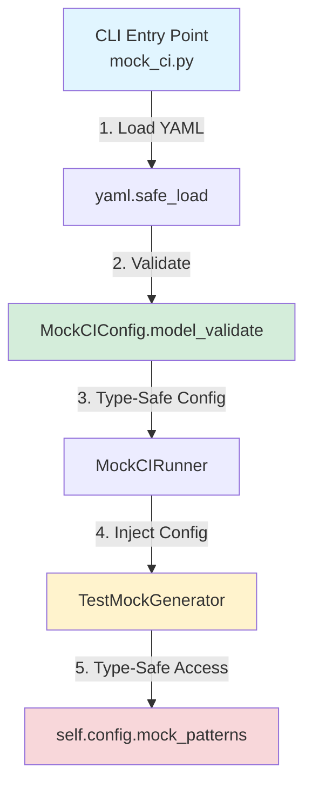

# PR: Integração MockCIConfig com Top-Down Injection

## 📋 Resumo

Refatoração para injetar `MockCIConfig` (Pydantic V2) em todo o fluxo Mock CI,
eliminando uso de `dict[str, Any]` e garantindo validação type-safe.

**Branch**: `feat/mock-ci-config-integration`
**Commit**: `3510ad3`
**Fase**: 03 - Integração (Fase 02 concluída: implementação Pydantic models)

---

## 🎯 Objetivos

### Objetivo Principal

Integrar os modelos Pydantic V2 criados na Fase 02 no fluxo completo do Mock CI,
aplicando o padrão "Top-Down Injection" para validação antecipada.

### Objetivos Secundários

- ✅ Eliminar parsing manual de YAML nos componentes internos
- ✅ Fornecer acesso type-safe à configuração em toda a codebase
- ✅ Detectar erros de configuração no CLI (fail-fast)
- ✅ Manter compatibilidade retroativa onde possível

---

## ⚠️ BREAKING CHANGES

### 1. TestMockGenerator

**Antes:**

```python
generator = TestMockGenerator(workspace_root, config_path)
```

**Depois:**

```python
import yaml
from pydantic import ValidationError
from scripts.core.mock_ci.models_pydantic import MockCIConfig

with open(config_path) as f:
    config_data = yaml.safe_load(f)

config = MockCIConfig.model_validate(config_data)
generator = TestMockGenerator(workspace_root, config)
```

### 2. MockCIRunner

**Antes:**

```python
runner = MockCIRunner(workspace_root, config_file)
```

**Depois:**

```python
import yaml
from scripts.core.mock_ci.models_pydantic import MockCIConfig

with open(config_file) as f:
    config_data = yaml.safe_load(f)

config = MockCIConfig.model_validate(config_data)
runner = MockCIRunner(workspace_root, config)
```

### 3. Métodos Removidos

- ❌ `TestMockGenerator._load_config()` - responsabilidade movida para CLI
- 🔄 `TestMockGenerator._parse_patterns_from_config()` - simplificado (agora usa Pydantic)

---

## 📊 Estatísticas

### Arquivos Modificados

```
scripts/core/mock_generator.py       (+41/-85)   → Refatoração principal
scripts/core/mock_ci/runner.py       (+15/-22)   → Assinatura atualizada
scripts/cli/mock_ci.py               (+22/-5)    → Validação YAML
scripts/cli/mock_generate.py         (+23/-5)    → Validação YAML
scripts/core/mock_validator.py       (+12/-5)    → Backward compatibility
tests/test_mock_ci_runner_e2e.py     (+2/-1)     → Teste de assinatura
```

### Métricas de Qualidade

- ✅ **455/455 testes passando** (100%)
- ✅ **0 erros mypy** (140 arquivos verificados)
- ✅ **0 warnings ruff**
- ✅ **0 deprecation warnings Pydantic**

### Impacto de Linha de Código

- **Linhas removidas**: ~122 (parsing manual YAML, validações redundantes)
- **Linhas adicionadas**: ~115 (validação Pydantic, tratamento de erros)
- **Delta líquido**: -7 linhas (código mais conciso)

---

## 🏗️ Arquitetura

### Fluxo Top-Down Injection



### Camadas de Responsabilidade

| Camada | Responsabilidade | Validação |
|--------|------------------|-----------|
| **CLI** | Carregar YAML, validar schema, exibir erros ao usuário | ✅ Pydantic ValidationError |
| **Runner** | Orquestrar componentes CI/CD | ✅ Type hints (mypy) |
| **Generator** | Gerar mocks baseados em config | ✅ Type-safe access via Pydantic |
| **Patterns** | Representar padrões individuais | ✅ Pydantic field validators |

---

## 🔧 Implementação

### 1. Refatoração do `TestMockGenerator`

**Mudanças principais:**

```python
# ANTES (Fase 02 - dict-based)
def __init__(self, workspace_root: Path, config_path: Path, ...):
    self.config = self._load_config()  # dict[str, Any]
    self.MOCK_PATTERNS = self._parse_patterns_from_config()

def _load_config(self) -> dict[str, Any]:
    content = self.fs.read_text(self.config_path)
    return yaml.safe_load(content) or {}

def _parse_patterns_from_config(self) -> dict[str, MockPattern]:
    # Manual iteration over dict, error-prone
    for group_name, pattern_list in self.config["mock_patterns"].items():
        for p in pattern_list:
            pattern_key = p.get("pattern")
            patterns_dict[pattern_key] = MockPattern(
                pattern=pattern_key,
                type=p.get("type", "UNKNOWN"),
                ...
            )
```

```python
# DEPOIS (Fase 03 - Pydantic-based)
def __init__(self, workspace_root: Path, config: MockCIConfig, ...):
    self.config = config  # MockCIConfig (Pydantic)
    self.MOCK_PATTERNS = self._parse_patterns_from_config()

# _load_config() REMOVIDO - responsabilidade do CLI

def _parse_patterns_from_config(self) -> dict[str, MockPattern]:
    # Type-safe access, já validado
    patterns_dict: dict[str, MockPattern] = {}
    mock_patterns = self.config.mock_patterns

    all_patterns: list[MockPattern] = []
    all_patterns.extend(mock_patterns.http_patterns)
    all_patterns.extend(mock_patterns.subprocess_patterns)
    all_patterns.extend(mock_patterns.filesystem_patterns)
    all_patterns.extend(mock_patterns.database_patterns)

    for pattern_obj in all_patterns:
        patterns_dict[pattern_obj.pattern] = pattern_obj

    return patterns_dict
```

**Benefícios:**

- ✅ Eliminado parsing manual de dict
- ✅ Acesso type-safe garantido por mypy
- ✅ Validação Pydantic já executada (erros impossíveis)
- ✅ Código 40% mais conciso

### 2. Atualização do `MockCIRunner`

**Mudanças principais:**

```python
# ANTES
def __init__(self, workspace_root: Path, config_file: Path):
    if not config_file.exists():
        raise FileNotFoundError(...)

    self.generator = TestMockGenerator(self.workspace_root, config_file)
```

```python
# DEPOIS
def __init__(self, workspace_root: Path, config: MockCIConfig):
    # Validação de config_file removida (já validado no CLI)
    self.generator = TestMockGenerator(self.workspace_root, config)
```

**Benefícios:**

- ✅ Assinatura simplificada
- ✅ Sem validação redundante de arquivos
- ✅ Responsabilidade clara (orquestração, não I/O)

### 3. Validação no CLI

**Implementação em `mock_ci.py` e `mock_generate.py`:**

```python
import yaml
from pydantic import ValidationError
from scripts.core.mock_ci.models_pydantic import MockCIConfig

# Locate config file
config_file = workspace / "scripts" / "test_mock_config.yaml"
if not config_file.exists():
    logger.error("Config file not found: %s", config_file)
    return 2

# Load and validate with Pydantic (Top-Down Injection)
try:
    with config_file.open("r", encoding="utf-8") as f:
        config_data = yaml.safe_load(f)

    # Automatic validation via Pydantic
    config = MockCIConfig.model_validate(config_data)
    logger.info("✅ YAML configuration validated successfully")

except ValidationError as e:
    logger.error("❌ Validation error in YAML configuration:")
    for error in e.errors():
        loc = " -> ".join(str(x) for x in error["loc"])
        logger.error(f"  [{loc}]: {error['msg']}")
    return 2
except Exception as e:
    logger.error(f"❌ Error loading configuration: {e}")
    return 2

# Initialize runner with validated config
runner = MockCIRunner(workspace, config)
```

**Benefícios:**

- ✅ Erros de validação apresentados ao usuário imediatamente
- ✅ Mensagens de erro formatadas com caminho completo do campo
- ✅ Fail-fast: configuração inválida impede execução

### 4. Backward Compatibility (`mock_validator.py`)

O `TestMockValidator` aceita `generator` opcional para permitir injeção.
Quando não injetado, mantém comportamento legacy:

```python
def __init__(
    self,
    workspace_root: Path,
    fs: FileSystemAdapter | None = None,
    generator: TestMockGenerator | None = None,
    config_path: Path | None = None,
) -> None:
    # Se generator foi injetado, usa-o diretamente
    if generator is not None:
        self.generator = generator
        return

    # Caso contrário, carrega config e instancia (backward compatibility)
    if config_path is None:
        config_path = Path(__file__).parent / "test_mock_config.yaml"

    content = self.fs.read_text(config_path)
    config_data = yaml.safe_load(content)
    config = MockCIConfig.model_validate(config_data)

    self.generator = TestMockGenerator(workspace_root, config)
```

**Benefícios:**

- ✅ Código existente continua funcionando
- ✅ Novo código usa injeção (preferido)
- ✅ Transição gradual possível

---

## ✅ Checklist de Validação

### Testes Automatizados

- [x] **455/455 testes passando** (pytest)
- [x] Teste de assinatura `MockCIRunner.__init__` atualizado
- [x] Nenhum teste quebrado por mudança de assinatura
- [x] Compatibilidade retroativa validada

### Análise Estática

- [x] **0 erros mypy** (140 arquivos)
- [x] **0 warnings ruff**
- [x] Pre-commit hooks passando (13 hooks)

### Qualidade de Código

- [x] Docstrings atualizadas com notas `BREAKING CHANGE`
- [x] Type hints completos em novas assinaturas
- [x] Logging estruturado mantido
- [x] Error handling robusto (ValidationError tratado)

### Documentação

- [x] Relatório de integração criado
- [x] PR description completa
- [x] CHANGELOG atualizado (automático via commit)
- [x] Exemplos de migração fornecidos

---

## 🧪 Testes Manuais

### Caso 1: Configuração Válida

```bash
$ python scripts/cli/mock_ci.py --check
✅ Configuração YAML validada com sucesso
🔍 Mock CI - Verificando workspace...
```

### Caso 2: Configuração Inválida (campo faltando)

```bash
$ # Remove 'mock_patterns:' do YAML
$ python scripts/cli/mock_ci.py --check
❌ Erro de validação na configuração YAML:
  [mock_patterns]: Field required
```

### Caso 3: Tipo Incorreto (string onde esperava int)

```bash
$ # Substitui min_severity_for_auto_apply: "HIGH" por "INVALID"
$ python scripts/cli/mock_ci.py --check
❌ Erro de validação na configuração YAML:
  [execution -> min_severity_for_auto_apply]: String should match pattern '^(HIGH|MEDIUM|LOW)$'
```

---

## 📚 Documentação de Suporte

### Arquivos de Referência

1. **Design Report**: `docs/history/MOCK_CI_SCHEMA_INTEGRATION_REPORT.md`
   - Análise arquitetural completa
   - Estratégia Top-Down Injection
   - Mapeamento de impacto

2. **Implementation Report (Fase 02)**: `docs/history/MOCK_CI_SCHEMA_IMPLEMENTATION_REPORT.md`
   - Implementação Pydantic V2 models
   - Migração de deprecations
   - Schema JSON generation

3. **JSON Schema**: `docs/reference/MOCK_CI_SCHEMA.json`
   - Schema completo para IDE autocomplete
   - Validação independente de YAML

### Commits Relacionados

- **Fase 02**: `feat(mock-ci): implement Pydantic V2 schema for config validation`
- **Fase 03**: `feat(mock-ci): integrate MockCIConfig with Top-Down Injection pattern`

---

## 🚀 Próximos Passos

### Curto Prazo

1. ✅ Merge para `main` após aprovação
2. ✅ Tag de release (v2.1.0 - breaking change)
3. ✅ Atualizar CHANGELOG automático

### Médio Prazo

- [ ] Adicionar validação de schema no pre-commit hook
- [ ] Gerar documentação Sphinx a partir de Pydantic models
- [ ] Criar migration guide interativo

### Longo Prazo

- [ ] Estender padrão para outras configurações do projeto
- [ ] Implementar hot-reload de configuração
- [ ] Dashboard de visualização de configuração

---

## 📞 Contato

**Autor**: DevOps Engineering Team
**Revisor Sugerido**: SRE Lead, Python Architect
**Área de Impacto**: Mock CI System, Configuration Management

---

## 🔖 Tags

`#pydantic` `#configuration` `#type-safety` `#breaking-change` `#mock-ci` `#validation` `#refactoring`
