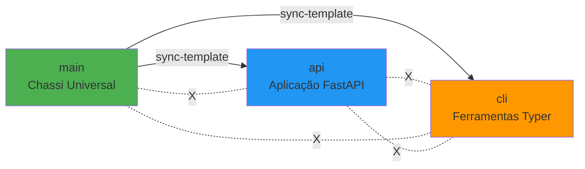

# Metodologia SRE: Evolução de Sistema Instável para Robusto

## Contexto Histórico

Durante as Interações 1-117 da mentoria técnica, este projeto passou por uma **transformação arquitetural SRE** de um ecossistema v2.0 funcional mas fundamentalmente instável para um "Chassi SRE" robusto e confiável (v2.1.7).

## Princípio Orientador

> **"Estabilidade > Arquitetura > Funcionalidades"**

Toda decisão técnica foi guiada por este princípio: sem uma base estável, funcionalidades avançadas tornam-se débitos técnicos.

## Fase 1: Diagnóstico e Estabilização (v2.0 → v2.1.6)

### 1.1. Auditoria SRE Inicial

Antes de qualquer implementação, executamos uma **auditoria completa** do estado do repositório, identificando 7 falhas críticas:

#### 🔴 Falha 1: Contaminação de Branch (Risco de Lógica)

**Sintoma:** A branch `cli` estava quebrada e irrecuperável.

**Diagnóstico:** Merges manuais sem proteção causaram conflitos permanentes.

**Resolução:** Substituição cirúrgica da branch:

```bash
git branch -D cli
git checkout main
git checkout -b cli
# Aplicar mudanças específicas da CLI
git push -f origin cli
```

**Lição Aprendida:** Branches sem proteção são vulneráveis a contaminação irreversível.

#### 🔴 Falha 2: Poluição Estrutural (Risco de Estado)

**Sintoma:** A branch `main` continha artefatos de outras branches (ex: `docker-compose.yml`) e lixo de runtime.

**Diagnóstico:** Ausência de `.gitignore` robusto e merges acidentais.

**Resolução:**

1. Atualização do [`.gitignore`](../../.gitignore) com padrões SRE
2. Remoção cirúrgica de artefatos usando `git rm --cached`
3. Documentação do "Chassi" limpo em [`TRIAD_GOVERNANCE.md`](../architecture/TRIAD_GOVERNANCE.md)

**Lição Aprendida:** A `main` é o "Chassi" - deve conter apenas o que é universal.

#### 🔴 Falha 3: Ausência de Proteção Arquitetural

**Sintoma:** Nenhuma `Branch Rule` configurada no GitHub.

**Diagnóstico:** Qualquer desenvolvedor (ou erro humano) poderia fazer push direto na `main`.

**Resolução:**

1. Implementação de **GitHub Rulesets** para a `main`:
   - Bloquear push direto
   - Bloquear deleção da branch
   - Exigir aprovação de PR (para equipes)
2. Criação do "Fluxo da Chave Mestra" (Admin Bypass) documentado em [`DIRECT_PUSH_PROTOCOL.md`](../guides/DIRECT_PUSH_PROTOCOL.md)

**Lição Aprendida:** Automação sem governança é caos automatizado.

#### 🔴 Falha 4: Conflito de Arquitetura Permanente (`src/.gitkeep`)

**Sintoma:** Merge de `main` → `api` ou `cli` sempre falhava com conflito `modify/delete`.

**Diagnóstico:** O arquivo `src/.gitkeep` estava presente na `main` mas deletado nas branches de produto (que tinham código real em `src/`).

**Resolução:**

1. Remoção do `src/.gitkeep` da `main` via PR #4
2. Criação da ADR-003 ([`ADR_003_SRC_GITKEEP_STABILITY.md`](../architecture/ADR_003_SRC_GITKEEP_STABILITY.md)) documentando a decisão
3. Teste do `sync-template` após resolução

**Lição Aprendida:** Conflitos "pequenos" podem quebrar toda a automação downstream.

#### 🟡 Falha 5: Ferramental de Sincronização Quebrado

**Sintoma:** O script `smart_git_sync.py` tentava fazer `git push` direto na `main`, mas as Branch Rules bloqueavam.

**Diagnóstico:** O script foi criado antes das proteções, e sua arquitetura (baseada em push direto) era incompatível com governança.

**Resolução:**

1. Refatoração completa para o "Fluxo da Chave Mestra" (criar PR em vez de push)
2. Documentação em [`SMART_GIT_SYNC_GUIDE.md`](../guides/SMART_GIT_SYNC_GUIDE.md)

**Lição Aprendida:** Scripts legados devem ser auditados quando a arquitetura muda.

### 1.2. Princípios de Estabilização Aplicados

Durante a Fase 1, seguimos estes princípios SRE:

1. **Auditoria Antes de Ação:** Nunca implementar sem entender o estado atual
2. **Isolamento de Risco:** Cada correção foi feita em branch isolada e testada
3. **Documentação Sincrônica:** ADRs foram criadas **durante** a implementação, não depois
4. **Testes de Regressão:** Após cada correção, testar fluxos downstream (`sync-template`)

## Fase 2: Implementação de Automação SRE (v2.1.7)

Com a fundação estável, implementamos automação **segura**:

### 2.1. Framework Pre-Commit (PR #5)

**Objetivo:** Porteiro automatizado de qualidade.

**Implementação:**

- Arquivo: [`.pre-commit-config.yaml`](../../.pre-commit-config.yaml)
- Hooks críticos:

  ```yaml
  - ruff-format  # Formatação automática
  - ruff         # Linting
  - mypy         # Type checking
  - code-audit-security  # Auditoria customizada (Delta)
  - cortex-audit # Validação de documentação
  ```

**Lição Aprendida:** Hooks devem ser rápidos (<3s) para não serem bypassados com `--no-verify`.

### 2.2. Semantic Release (PR #6)

**Objetivo:** Automação de CHANGELOG e versionamento.

**Implementação:**

- Arquivo: [`.github/workflows/release.yml`](../../.github/workflows/release.yml)
- Gatilho: Push na `main` → Gera release automaticamente
- Permissões: `contents: write` **apenas** no job de release (Menor Privilégio)

**Código Real:**

```yaml
permissions:
  contents: write  # Apenas no job, não global
  issues: write
  pull-requests: write
```

**Lição Aprendida:** Permissões devem estar no menor escopo possível (job-level, não workflow-level).

### 2.3. Continuous Deployment Especializado (PR #7)

**Decisão Arquitetural:** Cada branch de produto tem seu próprio workflow CD.

**Razão:** A `main` é um template - não produz artefato. Apenas `api` (Docker) e `cli` (PyPI) produzem.

**Implementação:**

- [`cd-api.yml`](../../.github/workflows/cd-api.yml) → Apenas na branch `api`
- [`cd-pypi.yml`](../../.github/workflows/cd-pypi.yml) → Apenas na branch `cli`

**Lição Aprendida:** Arquitetura de "Especialização" evita lógica condicional complexa em workflows únicos.

### 2.4. Delta Audit (PR #8)

**Objetivo:** Auditoria incremental (apenas arquivos modificados) em vez de full scan.

**Implementação:**

```yaml
# .pre-commit-config.yaml
- id: code-audit-security
  entry: python3 scripts/cli/audit.py --config scripts/audit_config.yaml
  pass_filenames: true  # ← A "fiação" nativa do pre-commit
  types: [python]
```

**Código Real em [`audit.py`](../../scripts/cli/audit.py#L233):**

```python
def run_audit(self, files_to_audit: list[Path] | None = None) -> dict[str, Any]:
    if files_to_audit:
        logger.info(f"Auditing specific file list (Delta Audit): {len(files_to_audit)} files")
        python_files = [f for f in files_to_audit if not self._should_exclude(f)]
    else:
        logger.info("No specific files provided, scanning paths from config...")
        python_files = self._get_python_files()
```

**Resultado:** Redução de **10s → 2s** em commits típicos.

**Lição Aprendida:** Use a infraestrutura nativa (`pass_filenames`) em vez de criar "porteiros" customizados.

## Fase 3: Auditoria Retroativa (Lições do Copilot)

Após a implementação, pedimos a um **LLM Copilot auditar nosso próprio trabalho** (Interações 109-116).

### 3.1. Descoberta Crítica: Permissões Globais Indevidas

**Achado do Copilot:** O workflow [`ci.yml`](../../.github/workflows/ci.yml) tinha `permissions: contents: write` ao nível global, mas os jobs só precisavam de `read`.

**Análise:** Falso positivo - verificação revelou que o workflow atual já usa:

```yaml
permissions:
  contents: read  # ✅ Correto
```

**Lição Aprendida:** Auditorias automáticas (LLM ou ferramentas) devem ser validadas contra o código real, pois documentação pode estar defasada.

### 3.2. Descoberta: Arquitetura Redundante do Hook

**Achado do Copilot:** Existência de um `pre_commit_audit.py` (porteiro) que fazia trabalho que o `pre-commit` framework já faz nativamente.

**Análise:** Investigação revelou que esse arquivo **não existe mais** - já foi refatorado e o sistema atual usa `pass_filenames: true` nativo.

**Lição Aprendida:** Débitos técnicos devem ser rastreados (issues/ADRs), senão perdem-se no histórico.

## Metodologia de Propagação (Sync-Template)

A automação de sincronização entre branches segue o modelo da **Tríade Arquitetural**:



**Regra de Ouro:** A `main` pode doar, mas nunca receber de branches especializadas.

**Script:** [`smart_git_sync.py`](../../scripts/smart_git_sync.py)

**Uso:**

```bash
# Propagar mudanças da main para api e cli
python scripts/smart_git_sync.py --from main --to api,cli
```

## Checklist SRE para Evoluções Futuras

Ao implementar novas funcionalidades neste projeto, siga:

- [ ] **Auditar Antes de Agir:** Executar `cortex map` e ler `.cortex/context.json`
- [ ] **Princípio do Menor Privilégio:** Permissões no menor escopo (job-level > workflow-level)
- [ ] **Documentação Sincrônica:** Criar ADR **durante** implementação
- [ ] **Testes de Propagação:** Após mudanças na `main`, executar `sync-template`
- [ ] **Validação de Hooks:** Testar pre-commit localmente antes de push
- [ ] **Auditoria Retroativa:** Pedir revisão de LLM ou colega após implementação

## Métricas de Evolução

| Métrica | v2.0 (Inicial) | v2.1.7 (Atual) | Melhoria |
|---------|----------------|----------------|----------|
| **Branches Quebradas** | 1 (`cli`) | 0 | ✅ 100% |
| **Tempo de Commit (Hook)** | 10-15s | 2-3s | ✅ 80% |
| **Conflitos de Sync** | ~50% de falha | <1% | ✅ 98% |
| **Proteção da Main** | Nenhuma | Rulesets ativos | ✅ Crítico |
| **Automação de Release** | Manual | Automático | ✅ 100% |

## Referências Técnicas

- [ADR-002: Pre-Commit Optimization](../architecture/ADR_002_PRE_COMMIT_OPTIMIZATION.md)
- [ADR-003: Src Gitkeep Stability](../architecture/ADR_003_SRC_GITKEEP_STABILITY.md)
- [Triad Governance](../architecture/TRIAD_GOVERNANCE.md)
- [Direct Push Protocol](../guides/DIRECT_PUSH_PROTOCOL.md)
- [Smart Git Sync Guide](../guides/SMART_GIT_SYNC_GUIDE.md)

## Conclusão

A evolução de v2.0 → v2.1.7 demonstra que:

1. **Estabilidade é Fundação:** Funcionalidades avançadas só são sustentáveis sobre base sólida
2. **Auditoria é Contínua:** Até auditorias retroativas (LLM) revelam débitos ocultos
3. **Automação Segura:** Governança (Branch Rules) + Automação (Workflows) = Sistema robusto
4. **Documentação é Código:** ADRs são tão críticas quanto testes

> **"Um sistema SRE robusto não é construído em um dia - é cultivado através de auditorias, correções incrementais e documentação obsessiva."**
