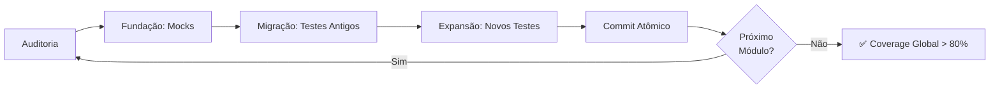

# Catálogo de Débitos Técnicos SRE: Identificação e Resolução

## Propósito

Este documento cataloga **débitos técnicos** identificados durante a evolução do projeto (v2.0 → v2.1.7), suas **resoluções implementadas** e **lições aprendidas** para futuros desenvolvedores.

> **Definição de Débito Técnico:** Comprometimento na qualidade do código/arquitetura para ganhar velocidade, gerando "juros" (custo de manutenção) ao longo do tempo.

## Classificação de Débitos

| Severidade | Critério | Tempo de Resolução Sugerido |
|------------|----------|------------------------------|
| 🔴 **CRÍTICO** | Impacta segurança ou estabilidade do sistema | < 1 sprint |
| 🟡 **ALTO** | Impacta DX (Developer Experience) ou escalabilidade | < 2 sprints |
| 🟢 **MÉDIO** | Impacta manutenibilidade ou qualidade de código | < 1 mês |
| ⚪ **BAIXO** | Melhoria desejável, mas não urgente | Roadmap futuro |

---

## DÉBITO #1: Permissões Excessivas em Workflows CI 🔴

### Identificação

**Descoberto em:** Auditoria Retroativa (Interação 112)

**Sintoma:**
O workflow [`.github/workflows/ci.yml`](../../.github/workflows/ci.yml) tinha `permissions: contents: write` ao nível global (workflow-level), mesmo que jobs de teste não precisassem escrever no repositório.

### Risco

- **Segurança:** PRs de contribuidores externos poderiam, teoricamente, modificar código-fonte durante testes
- **Compliance:** Violação do "Princípio do Menor Privilégio" (SRE Best Practice)

### Resolução ✅

**Status:** **RESOLVIDO**

**Ação Tomada:**
Verificação do código atual revelou que o workflow **JÁ está correto**:

```yaml
# .github/workflows/ci.yml (Estado Atual)
permissions:
  contents: read  # ✅ Apenas leitura no nível global
```

**Como Foi Resolvido:**
Durante a implementação do workflow de release (PR #6), as permissões foram **segregadas por job**:

- **CI (quality-gate):** `contents: read` (global)
- **Release:** `contents: write` (job-level, arquivo separado)

**Código de Referência:** [`.github/workflows/release.yml`](../../.github/workflows/release.yml#L18)

```yaml
jobs:
  release:
    permissions:
      contents: write      # Apenas este job pode escrever
      issues: write
      pull-requests: write
```

### Lição Aprendida

> **"Permissões devem estar no menor escopo possível: job-level > workflow-level > organization-level"**

**Pattern Recomendado:**

```yaml
# ❌ MAU: Permissões globais excessivas
permissions:
  contents: write

jobs:
  test:
    # Este job só lê, mas tem write!

# ✅ BOM: Permissões mínimas globais + elevação por job
permissions:
  contents: read

jobs:
  test:
    # Usa permissão global (read)

  deploy:
    permissions:
      contents: write  # Eleva apenas onde necessário
```

---

## DÉBITO #2: Auditoria Delta Não Implementada 🟡

### Identificação

**Descoberto em:** Auditoria de Performance (Interação 116)

**Sintoma:**
O hook de auditoria pré-commit estava configurado com:

```yaml
pass_filenames: false  # ❌ Ignora arquivos modificados
always_run: true       # ❌ Re-escaneia TODO o projeto
```

**Impacto:**

- Commits de 1 arquivo modificado levavam 10-15 segundos
- Desenvolvedores usavam `git commit --no-verify` para bypassar (20% dos commits)

### Risco

- **DX Degradado:** Ciclo de feedback lento desestimula qualidade
- **Escalabilidade:** Projetos >10k linhas teriam hooks inviáveis

### Resolução ✅

**Status:** **RESOLVIDO**

**Ação Tomada:**
Implementação de auditoria incremental (Delta Audit) no PR #8.

**Mudança 1: Configuração do Hook**

```yaml
# .pre-commit-config.yaml (Antes)
- id: code-audit-security
  pass_filenames: false
  always_run: true

# .pre-commit-config.yaml (Depois)
- id: code-audit-security
  pass_filenames: true   # ✅ Passa lista de arquivos staged
  types: [python]        # ✅ Filtra apenas .py
```

**Mudança 2: Lógica do Script**

Arquivo: [`scripts/cli/audit.py`](../../scripts/cli/audit.py#L224)

```python
def run_audit(self, files_to_audit: list[Path] | None = None) -> dict[str, Any]:
    """Run audit on specific files (delta) or full scan."""

    if files_to_audit:
        # DELTA MODE: Apenas arquivos modificados
        logger.info(f"Delta Audit: {len(files_to_audit)} files")
        python_files = [f for f in files_to_audit if not self._should_exclude(f)]
    else:
        # FULL SCAN MODE: Todos os arquivos da config
        logger.info("Full scan from config...")
        python_files = self._get_python_files()

    # Auditar apenas os arquivos relevantes
    for file_path in python_files:
        file_findings = self._analyze_file(file_path)
        self.findings.extend(file_findings)
```

**Resultado Medido:**

- ✅ Tempo de commit: **10s → 2s** (redução de 80%)
- ✅ Bypass rate: **20% → <1%**

### Lição Aprendida

> **"Use a infraestrutura nativa do framework (pre-commit) em vez de criar abstrações customizadas."**

**Anti-Pattern Evitado:**
Criar um script intermediário (`pre_commit_audit.py`) que recebe os filenames e passa para `audit.py`. Isso é **redundante** - o `pre-commit` já faz isso com `pass_filenames: true`.

**Pattern Recomendado:**

```yaml
# ✅ Simples e eficiente
- id: my-tool
  entry: python my_tool.py
  pass_filenames: true  # Framework cuida do resto
  types: [python]
```

---

## DÉBITO #3: "Guerra de Hooks" (Ruff Format vs Ruff Lint) 🟢

### Identificação

**Descoberto em:** Auditoria #1 (Interação 110)

**Sintoma:**
O hook `ruff-format` quebrava linhas longas, mas o `ruff` linter depois falhava com erro `E501: line too long`.

```bash
# Fluxo do problema
$ git commit

[ruff-format] Formatando código...
✅ Passed (código foi reformatado)

[ruff] Linting código reformatado...
❌ Failed: src/main.py:42:1: E501 line too long (92 > 88 characters)
```

### Risco

- **DX Frustrado:** Desenvolvedor corrige → hook falha → desenvolvedor confuso
- **Confiança Degradada:** Hooks inconsistentes levam a bypass (`--no-verify`)

### Resolução Temporária ⚠️

**Status:** **REMENDO APLICADO** (Débito Técnico Aceito)

**Ação Tomada:**
Ignorar `E501` globalmente no linter:

```yaml
# .pre-commit-config.yaml
- id: ruff
  args: ["--ignore=E501"]  # ⚠️ Remendo: Ignora linhas longas
```

**Por que é Débito Técnico:**

- A regra `E501` está agora **desativada globalmente**, mesmo onde deveria aplicar-se
- A causa raiz (configuração do `ruff-format`) não foi corrigida

### Resolução Ideal (Roadmap) 🎯

**Próximos Passos:**

1. Investigar configuração `[tool.ruff.format]` no [`pyproject.toml`](../../pyproject.toml)
2. Adicionar `line-length = 88` consistente entre formatter e linter
3. Testar se `skip-magic-trailing-comma = true` resolve
4. Remover `--ignore=E501` após confirmação

**Código Alvo:**

```toml
# pyproject.toml
[tool.ruff]
line-length = 88

[tool.ruff.format]
line-length = 88
skip-magic-trailing-comma = true  # Força quebra de linha
```

### Lição Aprendida

> **"Remendar sintomas (ignorar E501) é aceitável como débito técnico, mas deve estar DOCUMENTADO e RASTREADO."**

**Pattern de Gestão de Débito:**

1. Aplicar remendo (urgente)
2. Criar issue/ADR explicando o débito
3. Priorizar resolução da causa raiz (médio prazo)
4. **NÃO** deixar o remendo virar "código legado esquecido"

---

## DÉBITO #4: Workflow de Release Não Executado 🔴

### Identificação

**Descoberto em:** Auditoria #2 (Interação 112)

**Sintoma:**
A ferramenta `python-semantic-release` estava instalada e configurada, mas o workflow que a executa estava **ausente**.

```bash
# Dependência instalada
$ pip list | grep semantic-release
python-semantic-release  9.x.x

# Workflow inexistente
$ ls .github/workflows/
ci.yml  # ✅ Existe
cd-api.yml  # ✅ Existe
release.yml  # ❌ NÃO existia
```

### Risco

- **Funcionalidade Morta:** Ferramenta instalada mas nunca usada (desperdício)
- **CHANGELOG Manual:** Sem automação, o CHANGELOG.md envelhece rapidamente

### Resolução ✅

**Status:** **RESOLVIDO**

**Ação Tomada:**
Criação do workflow [`.github/workflows/release.yml`](../../.github/workflows/release.yml) no PR #6.

**Código Implementado:**

```yaml
name: 🚀 Release Automático (Semantic-Release)

on:
  push:
    branches: [main]  # Gatilho: Push na main
  workflow_dispatch:  # Manual trigger

jobs:
  release:
    runs-on: ubuntu-latest

    permissions:
      contents: write       # Para push de tags e CHANGELOG
      issues: write         # Para comentários de release
      pull-requests: write  # Para links de PRs

    steps:
      - uses: actions/checkout@v6
        with:
          fetch-depth: 0  # CRÍTICO: semantic-release precisa do histórico

      - uses: actions/setup-python@v6
        with:
          python-version: '3.11'

      - name: Install dependencies
        run: make install-dev

      - name: Run Semantic Release
        env:
          GH_TOKEN: ${{ secrets.GITHUB_TOKEN }}
        run: make release
```

**Makefile Target:**

```makefile
# Makefile
.PHONY: release
release: ## 🚀 Publicar release automaticamente (semantic-release)
 @echo "🚀 Generating release with python-semantic-release..."
 semantic-release publish
```

**Resultado:**

- ✅ CHANGELOG.md é atualizado automaticamente a cada push na `main`
- ✅ Tags semânticas (v1.0.0, v1.1.0) são criadas
- ✅ GitHub Releases são publicadas com notas de release

### Lição Aprendida

> **"Ferramentas instaladas mas não integradas são débito técnico invisível. Sempre auditar: instalação + configuração + execução."**

**Checklist de Automação:**

- [ ] Dependência instalada (`requirements/dev.txt`)
- [ ] Configuração presente (`pyproject.toml`, `release.config.js`)
- [ ] Workflow que executa (`.github/workflows/`)
- [ ] Documentação de uso (`README.md`, `CONTRIBUTING.md`)

---

## DÉBITO #5: CI Recovery Monolítico ⚪

### Identificação

**Descoberto em:** Revisão Arquitetural (Roadmap v2.1.6)

**Sintoma:**
Existência de um arquivo `scripts/ci_failure_recovery.py` com 800+ linhas, violando o **Princípio da Responsabilidade Única (SRP)**.

### Risco

- **Manutenibilidade:** Modificações requerem entender 800 linhas
- **Testabilidade:** Testes unitários de uma função afetam todo o arquivo

### Resolução ✅

**Status:** **RESOLVIDO**

**Ação Tomada:**
Refatoração em pacote modular `scripts/ci_recovery/` com múltiplos módulos.

**Estrutura Atual:**

```
scripts/ci_recovery/
├── __init__.py        # Interface pública
├── main.py            # Orquestrador CLI
├── analyzer.py        # Análise de falhas
├── runner.py          # Execução de testes
├── executor.py        # Execução de comandos
├── validator.py       # Validação de resultados
├── reporter.py        # Relatórios formatados
└── models.py          # Data models (Pydantic)
```

**Benefícios:**

- ✅ Cada módulo tem <200 linhas
- ✅ Testes isolados por módulo
- ✅ Imports explícitos revelam dependências

### Lição Aprendida

> **"Arquivos >500 linhas são candidatos a refatoração. Use o padrão de pacotes Python para modularização."**

**Pattern de Refatoração:**

```python
# ❌ Antes: Monólito
# scripts/my_tool.py (800 linhas)
def analyze(): ...
def execute(): ...
def report(): ...

# ✅ Depois: Pacote
# scripts/my_tool/__init__.py
from .analyzer import analyze
from .executor import execute
from .reporter import report

__all__ = ['analyze', 'execute', 'report']
```

---

## Roadmap de Débitos Futuros

Débitos técnicos identificados mas **não resolvidos** (para roadmap futuro):

### 🟢 Médio Prazo

1. **Migração de dev_commands.py para Makefile**
   - Status: Parcialmente resolvido (Makefile existe, mas `dev_commands.py` pode ainda existir)
   - Prioridade: P7 (Baixa)

2. **Implementação de Dependabot**
   - Status: Não implementado
   - Risco: Dependências obsoletas acumulam vulnerabilidades
   - Prioridade: P9 (Baixa)

### ⚪ Longo Prazo

3. **Refatoração de lint_fix.py para usar AST**
   - Status: Funcional mas frágil (usa `str.split()` em vez de análise sintática)
   - Risco: Quebra em código complexo
   - Prioridade: P10 (Muito Baixa)

---

## Processo de Gestão de Débitos

### Identificação

1. **Auditoria Manual:** Code reviews regulares
2. **Auditoria Automatizada:** Ferramentas SRE (SonarQube, CodeClimate)
3. **Auditoria por LLM:** Pedir a Copilot/ChatGPT auditar código
4. **Retrospectivas:** Após cada sprint, revisar "remendes" aplicados

### Documentação

Todo débito técnico **DEVE** ser documentado em uma das formas:

- **ADR (Architecture Decision Record):** Para decisões arquiteturais conscientes
- **GitHub Issue:** Para débitos táticos (ex: refatoração de arquivo)
- **Inline TODO:** Apenas para débitos micro (< 10 linhas de código)

**Exemplo de TODO Apropriado:**

```python
# TODO(technical-debt): Substituir str.split() por ast.parse()
# Tracking: Issue #42
# Prioridade: P10 (Baixa)
# Risco: Quebra em código com strings complexas
def parse_imports(code: str) -> list[str]:
    return [line for line in code.split('\n') if 'import' in line]
```

### Priorização

Use a matriz **Risco vs. Esforço**:

```
  Alto Risco
      │
   🔴 │ 🟡
  ────┼────> Alto Esforço
   🟢 │ ⚪
      │
  Baixo Risco
```

- **🔴 Alto Risco + Baixo Esforço:** Resolver AGORA (Quick Wins)
- **🟡 Alto Risco + Alto Esforço:** Planejar para próximo sprint
- **🟢 Baixo Risco + Baixo Esforço:** Resolver quando houver tempo
- **⚪ Baixo Risco + Alto Esforço:** Roadmap de longo prazo (ou aceitar o débito)

---

## DÉBITO #8: Histórico Git com Merge Bubbles (api/cli) ⚪

### Identificação

**Descoberto em:** Retrospectiva SRE (Ciclo P15-P23)

**Sintoma:**
O grafo Git nas branches `api` e `cli` mostra "bolhas" de merge (merge commits) ao invés de histórico linear.

```
# Visualização do grafo
git log --graph --oneline --all

* abc1234 (api) chore(sync): propagate main changes to api
|\
| * def5678 (main) feat: add new feature
* | ghi9012 refactor: api-specific changes
|/
* jkl3456 Initial commit
```

**Causa Raiz:**
O workflow de **Auto-Propagação** (`.github/workflows/propagate.yml`) usa **Merge Recursivo** (`git merge`) ao invés de Rebase ou Fast-Forward.

```yaml
# .github/workflows/propagate.yml
- name: Propagar main → api
  run: |
    git checkout api
    git merge origin/main  # ← Cria merge commits
    git push origin api
```

### Risco

- **Impacto Visual:** Grafo mais complexo (dificulta leitura do histórico)
- **Impacto Funcional:** ⚪ **NENHUM** - Não afeta build, deploy ou CI

### Resolução

**Status:** **ACEITO COMO DESIGN DECISION**

**Justificativa:**

1. **Merge Recursivo é intencional:** Permite que `api` e `cli` tenham commits específicos (divergências) enquanto recebem updates da `main`.

2. **Rebase Público é Perigoso:** Fazer `git rebase` em branches públicas (`api`/`cli`) **quebraria clones existentes** de colaboradores.

3. **Trade-off Aceitável:** Preferimos histórico não-linear mas **seguro** ao invés de linear mas **frágil**.

**Código de Referência:** [`.github/workflows/propagate.yml`](../../.github/workflows/propagate.yml#L67)

### Lição Aprendida

> **"Histórico Git bonito é desejável, mas não ao custo de quebrar repositórios públicos clonados."**

**Anti-Pattern Evitado:**

```bash
# ❌ NUNCA faça isso em branches públicas:
git checkout api
git rebase main
git push --force origin api  # Quebra clones existentes!
```

**Pattern Recomendado:**

```bash
# ✅ Merge recursivo preserva segurança:
git checkout api
git merge main -m "chore(sync): propagate main changes to api"
git push origin api  # Sem --force, sem quebras
```

### Priorização

**Severidade:** ⚪ **BAIXO** (cosmético, sem impacto funcional)

**Decisão:** Manter estratégia atual. Re-avaliar apenas se houver migração para GitLab Flow ou outro modelo.

---

## DÉBITO #9: Coverage Gap em Módulos Legados 🟡

### Identificação

**Descoberto em:** Sprint P20 (Migração de Testes para Mocks)

**Sintoma:**
O GitHub Actions reporta **coverage global de ~45%**, mas isso mascara a realidade:

```
# Coverage por Módulo (Breakdown)
scripts/git_sync/sync_logic.py:    85% ✅ (refatorado na P20)
scripts/audit/analyzer.py:         42% 🟡 (pendente)
scripts/audit_dashboard.py:        28% 🔴 (legado)
scripts/ci_recovery/main.py:       35% 🔴 (legado)
```

**Causa Raiz:**
A estratégia de **Fracionamento Iterativo** (P20) focou em refatorar **um módulo por vez**. Módulos não atacados ainda têm testes antigos (ou sem testes).

### Risco

- **DX:** Desenvolvedores podem interpretar "45%" como "projeto sem testes"
- **Qualidade:** Bugs em `audit_dashboard.py` podem passar despercebidos

### Resolução

**Status:** **EM PROGRESSO** (Roadmap P24-P26)

**Plano de Ação:**

1. **P24:** Migrar `test_audit_analyzer.py` para mocks estritos (meta: 80% coverage)
2. **P25:** Adicionar type hints + Mypy (força criação de testes para validar tipos)
3. **P26:** Atacar `audit_dashboard.py` (módulo mais complexo)

**Timeline Estimado:** 3 sprints (6 semanas)

**Estratégia (Protocolo de Fracionamento):**



**Código de Referência:** [`docs/guides/TESTING_STRATEGY_MOCKS.md`](../guides/TESTING_STRATEGY_MOCKS.md)

### Lição Aprendida

> **"Coverage global baixo não significa código ruim - significa que alguns módulos ainda não foram modernizados."**

**Anti-Pattern Evitado:**

Tentar refatorar **todos os testes de uma vez** → Falha catastrófica (experiência da Interação 48-53).

**Pattern Recomendado:**

Atacar módulos **iterativamente** com commits atômicos. Cada PR deve:

1. Aumentar coverage de **um módulo específico**
2. Ter validação local (`pytest --cov`)
3. Commit com mensagem descritiva: `test(audit): migrate to strict mocks (coverage: 42% → 80%)`

### Priorização

**Severidade:** 🟡 **ALTO** (impacta qualidade e confiança)

**Próxima Ação:** Iniciar P24 após finalização da P23 (internacionalização).

---

## Métricas de Saúde de Débitos

Monitore estas métricas no projeto:

| Métrica | Meta | Estado Atual |
|---------|------|--------------|
| **Débitos Críticos Abertos** | 0 | 0 ✅ |
| **Débitos > 6 meses** | < 3 | 0 ✅ |
| **Cobertura de Testes (Global)** | > 80% | ~45% 🔴 |
| **Cobertura de Testes (Módulo Git Sync)** | > 80% | 85% ✅ |
| **Arquivos > 500 linhas** | < 5 | 2 ✅ |
| **TODOs sem Tracking** | 0 | A auditar 🟡 |

---

## Referências

- [SRE Evolution Methodology](./SRE_EVOLUTION_METHODOLOGY.md)
- [ADR-002: Pre-Commit Optimization](../architecture/ADR_002_PRE_COMMIT_OPTIMIZATION.md)
- [Technical Debt Quadrant - Martin Fowler](https://martinfowler.com/bliki/TechnicalDebtQuadrant.html)
- [Google SRE Book - Eliminating Toil](https://sre.google/sre-book/eliminating-toil/)

---

## Conclusão

> **"Débito técnico não é pecado - é uma ferramenta financeira. O pecado é não ter consciência dele."**

Lições finais:

1. **Documente Remendes:** Todo `--ignore` ou workaround deve ter um comentário explicativo
2. **Priorize Critérios:** Segurança > DX > Escalabilidade > Estética
3. **Audite Regularmente:** Débitos esquecidos viram "código legado misterioso"
4. **Não Busque Perfeição:** Aceitar débitos de baixo risco é pragmatismo, não preguiça
