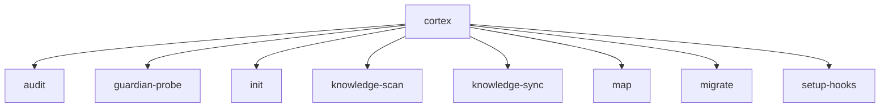

# 📚 Referência de Comandos CLI (Auto-Generated)

**⚠️ ESTE ARQUIVO É GERADO AUTOMATICAMENTE**

Não edite manualmente. Toda alteração será sobrescrita.
Gerado em: **2025-12-14 16:57 UTC**
Fonte: `scripts/core/doc_gen.py`

Este documento contém a referência completa de todos os comandos CLI disponíveis
no projeto. A documentação é extraída automaticamente dos códigos-fonte usando
introspecção do Typer.

## 📑 Índice

- **[cortex](#cortex)**
  - [cortex - audit](#cortexaudit)
  - [cortex - guardian-probe](#cortexguardianprobe)
  - [cortex - init](#cortexinit)
  - [cortex - knowledge-scan](#cortexknowledgescan)
  - [cortex - knowledge-sync](#cortexknowledgesync)
  - [cortex - map](#cortexmap)
  - [cortex - migrate](#cortexmigrate)
  - [cortex - setup-hooks](#cortexsetuphooks)
- **[audit](#audit)**
- **[doctor](#doctor)**
- **[git-sync](#gitsync)**
- **[mock-gen](#mockgen)**
- **[mock-check](#mockcheck)**
- **[mock-ci](#mockci)**
- **[install-dev](#installdev)**
- **[upgrade-python](#upgradepython)**

## `cortex` - CORTEX - Documentation as Code CLI.

**Descrição:** CORTEX - Documentation as Code CLI.

Command-line interface for managing documentation metadata and frontmatter
using the CORTEX system.

### `cortex audit`


Audit documentation files for metadata and link integrity.

Scans Markdown files to verify:
- Valid YAML frontmatter
- Required metadata fields
- Links to code files exist
- Links to other docs exist

Examples:
    cortex audit                    # Audit all docs in docs/
    cortex audit docs/guides/       # Audit specific directory
    cortex audit docs/guide.md      # Audit single file
    cortex audit --fail-on-error    # Exit 1 if errors found (CI mode)


**Parâmetros:**


| Nome | Tipo | Obrigatório | Default | Descrição |

|:-----|:-----|:------------|:--------|:----------|

| `path` | `Annotated[Path | None, typer.Argument(help='Path to directory or file to audit (default: docs/)', exists=False, resolve_path=True)]` | ❌ Não | `None` | Path to directory or file to audit (default: docs/) |

| `fail_on_error` | `Annotated[bool, typer.Option('--fail-on-error', help='Exit with error code if validation fails (useful for CI)')]` | ❌ Não | `False` | Exit with error code if validation fails (useful for CI) |


**Exemplo:**
```bash
cortex audit
```

### `cortex guardian-probe`


Run the Hallucination Probe to verify Knowledge Node integrity.

The Hallucination Probe implements the "Needle Test" pattern to detect
hallucination in the knowledge system. It searches for a specific canary
knowledge entry and validates its properties to ensure the system is not
fabricating or losing knowledge.

This serves as a sanity check for the Knowledge Scanner and ensures the
integrity of the knowledge base.

Examples:
    cortex guardian-probe                      # Run probe with default canary
    cortex guardian-probe --canary-id kno-002  # Test specific entry
    cortex guardian-probe --verbose            # Show detailed validation


**Parâmetros:**


| Nome | Tipo | Obrigatório | Default | Descrição |

|:-----|:-----|:------------|:--------|:----------|

| `canary_id` | `Annotated[str, typer.Option('--canary-id', help='ID of the canary knowledge entry to search for (default: kno-001)')]` | ❌ Não | `"kno-001"` | ID of the canary knowledge entry to search for (default: kno-001) |

| `verbose` | `Annotated[bool, typer.Option('--verbose', '-v', help='Show detailed validation information')]` | ❌ Não | `False` | Show detailed validation information |


**Exemplo:**
```bash
cortex guardian-probe
```

### `cortex init`


Add YAML frontmatter to a Markdown file.

Generates and inserts standard CORTEX frontmatter at the beginning
of a Markdown file. If frontmatter already exists, will prompt for
confirmation unless --force is used.

Examples:
    cortex init docs/new-guide.md
    cortex init docs/existing.md --force


**Parâmetros:**


| Nome | Tipo | Obrigatório | Default | Descrição |

|:-----|:-----|:------------|:--------|:----------|

| `path` | `Annotated[Path, typer.Argument(help='Path to the Markdown file to initialize with frontmatter', exists=True, file_okay=True, dir_okay=False, readable=True, resolve_path=True)]` | ✅ Sim | `-` | Path to the Markdown file to initialize with frontmatter |

| `force` | `Annotated[bool, typer.Option('--force', '-f', help='Overwrite existing frontmatter if present')]` | ❌ Não | `False` | Overwrite existing frontmatter if present |


**Exemplo:**
```bash
cortex init <path>
```

### `cortex knowledge-scan`


Scan and validate the Knowledge Base (docs/knowledge).

Scans the docs/knowledge directory for markdown files with valid
frontmatter representing knowledge entries. Validates the structure
and displays a summary of found entries.

Knowledge entries should have:
- id: Unique identifier
- status: Entry status (active, deprecated, draft)
- golden_paths: Related code paths
- tags: (optional) Classification tags
- sources: (optional) External reference URLs

Examples:
    cortex knowledge-scan              # Scan knowledge base
    cortex knowledge-scan --verbose    # Show detailed info


**Parâmetros:**


| Nome | Tipo | Obrigatório | Default | Descrição |

|:-----|:-----|:------------|:--------|:----------|

| `verbose` | `Annotated[bool, typer.Option('--verbose', '-v', help='Show detailed information about each entry')]` | ❌ Não | `False` | Show detailed information about each entry |


**Exemplo:**
```bash
cortex knowledge-scan
```

### `cortex knowledge-sync`


Synchronize knowledge entries with external sources.

Downloads content from external sources defined in knowledge entry
frontmatter, merges with local content while preserving Golden Paths,
and updates cache metadata (last_synced, etag).

If --entry-id is provided, only that specific entry will be synchronized.
Otherwise, all entries with external sources will be processed.

Use --dry-run to preview what would be synced without making changes.

Examples:
    cortex knowledge-sync                    # Sync all entries
    cortex knowledge-sync --entry-id kno-001 # Sync specific entry
    cortex knowledge-sync --dry-run          # Preview sync operations


**Parâmetros:**


| Nome | Tipo | Obrigatório | Default | Descrição |

|:-----|:-----|:------------|:--------|:----------|

| `entry_id` | `Annotated[str | None, typer.Option('--entry-id', help="Specific entry ID to synchronize (e.g., 'kno-001'). If omitted, syncs all entries.")]` | ❌ Não | `None` | Specific entry ID to synchronize (e.g., 'kno-001'). If omitted, syncs all entries. |

| `dry_run` | `Annotated[bool, typer.Option('--dry-run', help='Preview sync operations without writing to disk')]` | ❌ Não | `False` | Preview sync operations without writing to disk |


**Exemplo:**
```bash
cortex knowledge-sync
```

### `cortex map`


Generate project context map for introspection.

Scans the project structure and generates a comprehensive context map
containing information about CLI commands, documentation, dependencies,
and architecture. This map can be used by LLMs or automation tools.

The output is saved to .cortex/context.json by default.

Example:
    cortex map                          # Generate context map
    cortex map --verbose               # Show detailed information
    cortex map -o custom/path.json     # Custom output location


**Parâmetros:**


| Nome | Tipo | Obrigatório | Default | Descrição |

|:-----|:-----|:------------|:--------|:----------|

| `output` | `Annotated[Path, typer.Option('--output', '-o', help='Output path for context JSON file')]` | ❌ Não | `.cortex/context.json` | Output path for context JSON file |

| `verbose` | `Annotated[bool, typer.Option('--verbose', '-v', help='Show detailed output')]` | ❌ Não | `False` | Show detailed output |


**Exemplo:**
```bash
cortex map
```

### `cortex migrate`


Migrate documentation files to CORTEX format.

Intelligently adds YAML frontmatter to Markdown files by:
- Generating kebab-case IDs from filenames
- Inferring document type from directory structure
- Extracting title from first heading
- Detecting code references automatically

By default runs in dry-run mode (shows what would be changed).
Use --apply to actually modify files.

Examples:
    cortex migrate docs/ --dry-run      # Preview changes (default)
    cortex migrate docs/ --apply         # Apply changes to files
    cortex migrate docs/ --apply --force # Overwrite existing frontmatter
    cortex migrate docs/guides/ --apply  # Migrate specific directory


**Parâmetros:**


| Nome | Tipo | Obrigatório | Default | Descrição |

|:-----|:-----|:------------|:--------|:----------|

| `path` | `Annotated[Path, typer.Argument(help='Directory containing Markdown files to migrate (e.g., docs/)', exists=True, file_okay=False, dir_okay=True, readable=True, resolve_path=True)]` | ✅ Sim | `-` | Directory containing Markdown files to migrate (e.g., docs/) |

| `apply` | `Annotated[bool, typer.Option('--apply', help='Apply changes to files (default is dry-run mode)')]` | ❌ Não | `False` | Apply changes to files (default is dry-run mode) |

| `force` | `Annotated[bool, typer.Option('--force', '-f', help='Overwrite existing frontmatter if present')]` | ❌ Não | `False` | Overwrite existing frontmatter if present |

| `recursive` | `Annotated[bool, typer.Option('--recursive/--no-recursive', '-r', help='Process subdirectories recursively')]` | ❌ Não | `True` | Process subdirectories recursively |


**Exemplo:**
```bash
cortex migrate <path>
```

### `cortex setup-hooks`


Install Git hooks to auto-regenerate context map.

Creates Git hooks that automatically run 'cortex map' after:
- git pull / git merge (post-merge hook)
- git checkout (post-checkout hook)
- git rebase / git commit --amend (post-rewrite hook)

This ensures the AI context stays fresh after repository changes.

Example:
    cortex setup-hooks


**Exemplo:**
```bash
cortex setup-hooks
```

## `audit` - Pre-commit Code Security and Quality Auditor.

**Descrição:** Pre-commit Code Security and Quality Auditor.

A DevOps-grade auditing tool that performs static analysis to detect
security vulnerabilities, external dependencies, and CI/CD risks before commits.

### Função Principal

```python
() -> 'None'
```

**Documentação:**

Main entry point.

## `doctor` - Dev Doctor - Diagnóstico Preventivo de Ambiente de Desenvolvimento.

**Descrição:** Dev Doctor - Diagnóstico Preventivo de Ambiente de Desenvolvimento.

===================================================================
Script para detectar problemas de ambiente (Drift) antes de executar
comandos críticos. Usa APENAS a Standard Library para rodar em ambientes
quebrados.

Exit Codes:
    0 - Ambiente saudável
    1 - Problemas detectados

### Função Principal

```python
() -> 'int'
```

**Documentação:**

Função principal.

## `git-sync` - Smart Git Synchronization CLI Wrapper.

**Descrição:** Smart Git Synchronization CLI Wrapper.

A lightweight command-line interface for the Smart Git Sync orchestrator.
This script delegates all synchronization logic to the git_sync module.

### Função Principal

```python
() -> 'None'
```

**Documentação:**

Main entry point for the Smart Git Sync CLI.

## `mock-gen` - Mock Generator CLI - Test mock generation tool.

**Descrição:** Mock Generator CLI - Test mock generation tool.

Command-line interface for the TestMockGenerator core engine.

### Função Principal

```python
() -> 'int'
```

**Documentação:**

Main CLI entry point with banner injection.

## `mock-check` - Mock Validator CLI - Test mock validation tool.

**Descrição:** Mock Validator CLI - Test mock validation tool.

Command-line interface for the TestMockValidator core engine.

### Função Principal

```python
() -> 'int'
```

**Documentação:**

Main CLI entry point with banner injection.

## `mock-ci` - CI/CD Test Mock Integration - Integração com Pipelines CI/CD.

**Descrição:** CI/CD Test Mock Integration - Integração com Pipelines CI/CD.

============================================================

Script para integrar o Test Mock Generator em pipelines de CI/CD,
garantindo que todos os testes tenham mocks adequados antes do deploy.

Este script é idempotente e pode ser executado em qualquer ambiente CI/CD.

Uso em CI/CD:
    # No pipeline (GitHub Actions, GitLab CI, etc.)
    python scripts/cli/mock_ci.py --check --fail-on-issues

    # Para aplicar correções automaticamente
    python scripts/cli/mock_ci.py --auto-fix --commit

Autor: DevOps Template Generator
Versão: 2.0.0 (Refatorado)

### Função Principal

```python
() -> 'int'
```

**Documentação:**

Função principal CLI para integração CI/CD.

    Returns:
        Código de saída (0 = sucesso, 1 = warning, 2 = failure)

    

## `install-dev` - Development Environment Installation Script.

**Descrição:** Development Environment Installation Script.

Performs complete installation of the development environment with dependency
pinning using pip-tools.

Operation Sequence:
1. Install project in editable mode with dev dependencies
2. Compile dependencies with pip-compile (with fallback) - ATOMIC WRITES
3. Install pinned dependencies from requirements/dev.txt

### Função Principal

```python
() -> 'int'
```

**Documentação:**

Main script entrypoint.

## `upgrade-python` - 🔧 Version Governor - Automação de Manutenção de Versões Python.

**Descrição:** 🔧 Version Governor - Automação de Manutenção de Versões Python.

Este script automatiza a atualização do `.python-version` para os patches
mais recentes disponíveis no pyenv, garantindo paridade com o GitHub Actions.

Arquitetura:
    1. Consulta pyenv install --list
    2. Extrai o patch mais recente de cada minor version (3.10, 3.11, 3.12)
    3. Atualiza .python-version se necessário
    4. Instala as novas versões via pyenv

Uso:
    python scripts/maintain_versions.py
    make upgrade-python

### Função Principal

```python
() -> 'int'
```

**Documentação:**

Fluxo principal de execução.

    Returns:
        0 se sucesso, 1 se erro
    

## 🗺️ Diagrama de Comandos



---

## 🔄 Atualização Automática

Esta documentação é regenerada automaticamente:

1. **Trigger:** Commit que modifica arquivos em `scripts/cli/` ou `scripts/core/`
2. **Hook:** `.pre-commit-config.yaml` → `auto-doc-gen`
3. **Script:** `scripts/core/doc_gen.py`

**Para forçar regeneração manual:**
```bash
python scripts/core/doc_gen.py
```

---

**Última Atualização:** 2025-12-14 16:57 UTC
**Gerado por:** `scripts/core/doc_gen.py` v1.1.0