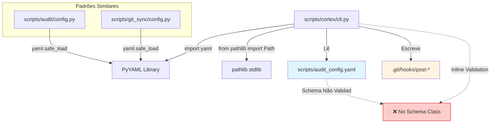
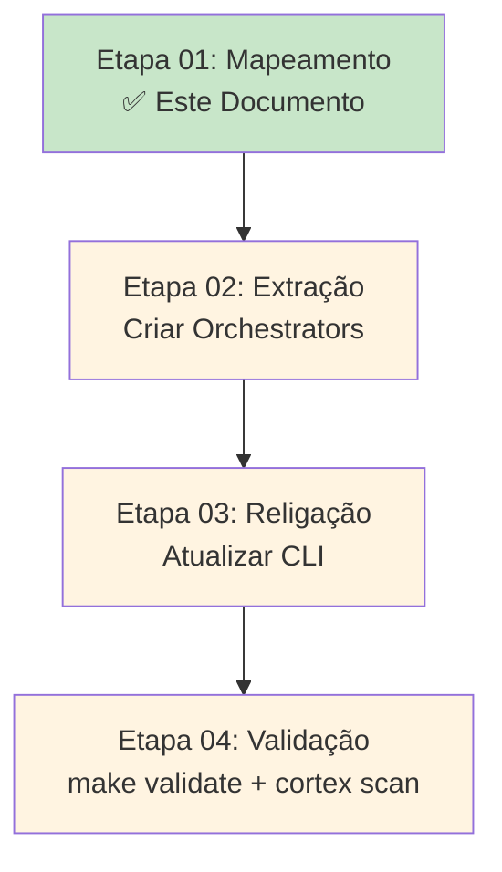

# Mapeamento Técnico - Configuração e Hooks do CORTEX CLI

## Status da Validação Inicial

✅ **Estado GREEN Confirmado** (2025-12-22 20:05:44)

```
✓ Ruff: All checks passed
✓ MyPy: Success (164 source files)
✓ Dev Doctor: Ambiente SAUDÁVEL
✓ Pytest: 576 passed, 2 skipped in 7.50s
```

---

## 1. Escaneamento do CLI (scripts/cortex/cli.py)

### 1.1. Comando `config` (Linhas 1016-1150)

**Localização:** `@app.command(name="config")` → função `config_manager()`

**Assinatura:**

```python
def config_manager(
    show: bool = False,          # --show flag
    validate: bool = False,       # --validate flag
    path: Path = Path("scripts/audit_config.yaml"),  # --path/-p option
) -> None
```

**Responsabilidades Identificadas:**

1. **Resolução de Caminho de Configuração**
   - Linha 1057: `config_path = _project_root / path if not path.is_absolute() else path`
   - Lógica: Resolve caminhos relativos contra a raiz do projeto

2. **Validação de Existência de Arquivo**
   - Linhas 1059-1063: Verifica se `config_path.exists()` antes de prosseguir
   - Retorna `Exit(code=1)` se não encontrado

3. **Leitura de YAML**
   - Linha 1067-1068:

     ```python
     with config_path.open("r", encoding="utf-8") as f:
         config_data = yaml.safe_load(f)
     ```

   - **Dependência:** `import yaml` (inline, linha 1051)

4. **Validação de Schema YAML**
   - Linhas 1071-1090: Valida presença de chaves obrigatórias
   - Chaves requeridas: `scan_paths`, `file_patterns`, `exclude_paths`
   - Gera warning se arquivo vazio (`config_data is None`)

5. **Exibição Formatada de YAML**
   - Linhas 1102-1108:

     ```python
     formatted_yaml = yaml.dump(
         config_data,
         default_flow_style=False,
         sort_keys=False,
         allow_unicode=True,
     )
     typer.echo(formatted_yaml)
     ```

6. **Estatísticas de Configuração**
   - Linhas 1113-1125: Gera sumário com contadores:
     - Número de `scan_paths`
     - Número de `file_patterns`
     - Número de `exclude_paths`
     - Número de `custom_patterns`

**Tratamento de Erros:**

- `yaml.YAMLError` (linha 1133): Sintaxe YAML inválida
- `OSError` (linha 1139): Erros de I/O
- `Exception` (linha 1145): Catch-all genérico

---

### 1.2. Comando `setup-hooks` (Linhas 572-665)

**Localização:** `@app.command(name="setup-hooks")` → função `setup_hooks()`

**Assinatura:**

```python
def setup_hooks() -> None  # Sem parâmetros
```

**Responsabilidades Identificadas:**

1. **Detecção do Diretório .git**
   - Linhas 589-596:

     ```python
     git_dir = _project_root / ".git"
     if not git_dir.exists():
         typer.secho(
             "❌ Error: .git directory not found...",
             fg=typer.colors.RED, err=True,
         )
         raise typer.Exit(code=1)
     ```

2. **Criação do Diretório de Hooks**
   - Linha 598: `hooks_dir.mkdir(exist_ok=True)`
   - **Operação pathlib:** `Path.mkdir(exist_ok=True)`

3. **Geração de Script Shell**
   - Linhas 601-619: Define template de hook bash (multi-line string)
   - Conteúdo:

     ```bash
     #!/bin/bash
     # Auto-generated by CORTEX - Do not edit manually
     # Check if cortex command exists
     if ! command -v cortex &> /dev/null; then
         echo "⚠️  Warning: 'cortex' command not found..."
         exit 0
     fi
     echo "🔄 Regenerating CORTEX context map..."
     cortex map --output .cortex/context.json
     ```

4. **Backup de Hooks Existentes**
   - Linhas 634-638:

     ```python
     if hook_path.exists():
         backup_path = hook_path.with_suffix(".backup")
         typer.echo(f"📦 Backing up existing {hook_name}...")
         hook_path.rename(backup_path)
     ```

   - **Operação pathlib:** `Path.rename()`, `Path.with_suffix()`

5. **Escrita de Arquivo de Hook**
   - Linhas 641-643:

     ```python
     with hook_path.open("w", encoding="utf-8") as f:
         f.write(hook_script)
     ```

   - **Operação pathlib:** `Path.open(mode="w", encoding="utf-8")`

6. **Modificação de Permissões (chmod)**
   - Linha 646: `hook_path.chmod(0o755)`
   - **Operação pathlib:** `Path.chmod()` para tornar executável
   - Equivale ao comando Unix: `chmod 755 <hook_file>`

**Hooks Instalados:**

- `post-merge`: Executa após `git pull` / `git merge`
- `post-checkout`: Executa após `git checkout` (mudança de branch)
- `post-rewrite`: Executa após `git rebase` / `git commit --amend`

**Validação em Ambiente Real:**

```bash
$ ls -la .git/hooks/post-*
-rwxr-xr-x 1 user user 350 Dec 22 20:05 .git/hooks/post-checkout
-rwxr-xr-x 1 user user 350 Dec 22 20:05 .git/hooks/post-merge
-rwxr-xr-x 1 user user 350 Dec 22 20:05 .git/hooks/post-rewrite
```

---

## 2. Verificação de Dependências Core

### 2.1. Arquivo `scripts/core/cortex/config.py` (Existente)

**Status:** ✅ JÁ EXISTE (151 linhas)

**Conteúdo Atual:**

1. **Padrões de Validação (Linhas 17-39)**
   - `ID_PATTERN`: Regex para kebab-case
   - `VERSION_PATTERN`: Regex para semver (x.y.z)
   - `DATE_PATTERN`: Regex para ISO 8601 (YYYY-MM-DD)
   - `TAG_PATTERN`: Regex para tags em kebab-case

2. **Valores Permitidos (Linhas 41-49)**
   - `ALLOWED_TYPES`: `["guide", "arch", "reference", "history", "knowledge"]`
   - `ALLOWED_STATUSES`: `["draft", "active", "deprecated", "archived"]`

3. **Campos Obrigatórios (Linhas 51-77)**
   - `REQUIRED_FIELDS`: `["id", "type", "status", "version", "author", "date"]`
   - `RECOMMENDED_FIELDS`: `["context_tags", "linked_code"]`
   - `OPTIONAL_FIELDS`: `["dependencies", "related_docs"]`

4. **Constantes de Validação (Linhas 79-88)**
   - `MIN_AUTHOR_LENGTH`: 3
   - `MAX_CONTEXT_TAGS`: 10
   - `MAX_LINKED_CODE`: 20
   - `MAX_RELATED_DOCS`: 10

5. **Configuração Padrão (Linhas 90-114)**

   ```python
   DEFAULT_CONFIG: dict[str, Any] = {
       "scan_paths": ["docs/"],
       "file_patterns": ["*.md"],
       "exclude_paths": [".git/", "__pycache__/", ".venv/", ...],
       "validate_code_links": True,
       "validate_doc_links": True,
       "strict_mode": False,
       "max_errors_per_file": 50,
   }
   ```

6. **Mensagens de Erro/Warnings (Linhas 116-151)**
   - `ERROR_MESSAGES`: Dicionário de templates de erro
   - `WARNING_MESSAGES`: Dicionário de templates de warning

**Conclusão:** Este arquivo já fornece CONSTANTES, mas não fornece uma **classe de orquestração** para I/O de configuração.

---

### 2.2. Ausência de Schema Centralizado

**Achado:** ❌ NÃO existe uma classe `CortexConfig` ou `ConfigSchema`

**Evidências:**

- Busca por `class Config` em `scripts/core/cortex/**`: 0 resultados
- Não há modelo Pydantic ou dataclass para configuração do CORTEX

**Padrões Existentes em Outros Módulos:**

1. **scripts/audit/config.py** (72 linhas)
   - Função: `load_config(config_path: Path | None = None) -> dict[str, Any]`
   - Merge de configuração com defaults
   - Uso de `yaml.safe_load()`

2. **scripts/git_sync/config.py** (49 linhas)
   - Função: `load_config(config_path: Path | None = None) -> dict[str, Any]`
   - Padrão idêntico ao audit/config.py

**Oportunidade de Reutilização:**

- Ambos os módulos (audit, git_sync) implementam `load_config()` de forma similar
- Há potencial para **consolidação de padrões** no ConfigOrchestrator

---

## 3. Auditoria de Git Hooks

### 3.1. Scripts em `scripts/git/`

**Listagem:**

1. `direct-push-main.sh` (138 linhas)
   - Protocolo automatizado para push direto na `main`
   - Baseado em: `docs/guides/DIRECT_PUSH_PROTOCOL.md`
   - **NÃO é instalado como Git Hook** (script manual via task)

2. `post-pr-cleanup.sh` (137 linhas)
   - Limpeza após merge de Pull Request
   - Baseado em: `docs/guides/POST_PR_MERGE_PROTOCOL.md`
   - **NÃO é instalado como Git Hook** (script manual via task)

3. `sync-all-branches.sh`
4. `update-branches.sh`
5. `update-local.sh`
6. `update-main.sh`
   - Scripts auxiliares de sincronização Git
   - **NÃO são instalados como Git Hooks**

**Conclusão:** Os scripts em `scripts/git/` são ferramentas CLI independentes, não hooks.

---

### 3.2. Hooks Gerenciados pelo `setup-hooks`

**Hooks Instalados Atualmente:**

| Hook           | Arquivo Gerado        | Trigger                          | Ação                           |
|----------------|-----------------------|----------------------------------|--------------------------------|
| `post-merge`   | `.git/hooks/post-merge` | Após `git pull` / `git merge`    | `cortex map --output .cortex/context.json` |
| `post-checkout`| `.git/hooks/post-checkout` | Após `git checkout`              | `cortex map --output .cortex/context.json` |
| `post-rewrite` | `.git/hooks/post-rewrite` | Após `git rebase` / `commit --amend` | `cortex map --output .cortex/context.json` |

**Características:**

- Todos os hooks executam a **mesma ação**: regenerar o mapa de contexto
- Script gerado é **idêntico** para os 3 hooks
- Hooks são **auto-gerados** (comentário: "Auto-generated by CORTEX - Do not edit manually")
- Permissões: `0o755` (rwxr-xr-x)

**Validação em `.git/hooks/`:**

```bash
$ find .git/hooks -type f -name "post-*"
.git/hooks/post-rewrite
.git/hooks/post-merge
.git/hooks/post-checkout
```

**Conteúdo Real (post-merge):**

```bash
#!/bin/bash
# Auto-generated by CORTEX - Do not edit manually
# This hook regenerates the project context map after Git operations

# Check if cortex command exists
if ! command -v cortex &> /dev/null; then
    echo "⚠️  Warning: 'cortex' command not found. Skipping..."
    exit 0
fi

echo "🔄 Regenerating CORTEX context map..."
cortex map --output .cortex/context.json

if [ $? -eq 0 ]; then
    echo "✅ Context map updated successfully!"
else
    echo "⚠️  Warning: Failed to update context map"
fi
```

---

## 4. Análise de Dependências Externas

### 4.1. Biblioteca YAML

**Importação:**

- **Localização:** Inline, dentro dos comandos (não no topo do arquivo)
  - Linha 162: `import yaml` (dentro de `init()`)
  - Linha 1051: `import yaml` (dentro de `config_manager()`)

**Funções Utilizadas:**

1. **yaml.safe_load()** (Leitura)
   - Linha 1068: `config_data = yaml.safe_load(f)`
   - Conversão de YAML string → dict Python
   - **Safe:** Protegido contra execução arbitrária de código

2. **yaml.dump()** (Escrita)
   - Linha 164: Serialização de frontmatter
   - Linha 1102: Serialização de configuração
   - Parâmetros comuns:
     - `default_flow_style=False`: Usa estilo block (mais legível)
     - `sort_keys=False`: Preserva ordem das chaves
     - `allow_unicode=True`: Suporta caracteres UTF-8

3. **yaml.YAMLError** (Exceção)
   - Linha 1133: `except yaml.YAMLError as e:`
   - Captura erros de sintaxe YAML

**Conclusão:** O comando `config` é o único que realiza operações YAML no CLI.

---

### 4.2. Biblioteca pathlib

**Importação:**

- **Localização:** Topo do arquivo (linha 19)
  - `from pathlib import Path`

**Operações Utilizadas:**

#### No Comando `config`

1. **Resolução de Caminho**
   - `_project_root / path` (operador `/`)
   - `path.is_absolute()`

2. **Verificação de Existência**
   - `config_path.exists()`

3. **Leitura de Arquivo**
   - `config_path.open("r", encoding="utf-8")`

#### No Comando `setup-hooks`

1. **Construção de Caminhos**
   - `_project_root / ".git"`
   - `git_dir / "hooks"`

2. **Criação de Diretório**
   - `hooks_dir.mkdir(exist_ok=True)`

3. **Manipulação de Sufixos**
   - `hook_path.with_suffix(".backup")`

4. **Renomeação de Arquivos**
   - `hook_path.rename(backup_path)`

5. **Escrita de Arquivo**
   - `hook_path.open("w", encoding="utf-8")`

6. **Modificação de Permissões**
   - `hook_path.chmod(0o755)` ⚠️ **Unix-specific**

**Nota de Portabilidade:**

- `chmod()` funciona em Unix/Linux/macOS
- No Windows, pode não ter efeito ou levantar exceção
- Não há tratamento específico para cross-platform

---

## 5. Mapeamento de I/O para ConfigOrchestrator

### 5.1. Operações a Serem Extraídas

Com base na análise, as seguintes operações devem ser movidas para um **ConfigOrchestrator**:

#### **Categoria 1: Gerenciamento de Arquivos YAML**

```python
class ConfigOrchestrator:
    def load_yaml(self, path: Path) -> dict[str, Any]:
        """Carrega e valida arquivo YAML."""
        # Extração: Linhas 1057-1068 (config_manager)
        # Responsabilidades:
        # - Resolução de caminho relativo/absoluto
        # - Verificação de existência
        # - yaml.safe_load()
        # - Tratamento de yaml.YAMLError

    def save_yaml(
        self, data: dict[str, Any], path: Path, **kwargs
    ) -> None:
        """Salva dados em arquivo YAML formatado."""
        # Extração: Linhas 1102-1108 (config_manager)
        # Responsabilidades:
        # - yaml.dump() com opções padrão
        # - Criação de diretórios pai se necessário
        # - Tratamento de OSError
```

#### **Categoria 2: Validação de Schema**

```python
    def validate_config_schema(
        self, config_data: dict[str, Any],
        required_keys: list[str],
    ) -> tuple[bool, list[str]]:
        """Valida presença de chaves obrigatórias."""
        # Extração: Linhas 1071-1090 (config_manager)
        # Retorna: (is_valid, missing_keys)
```

#### **Categoria 3: Merge de Configuração com Defaults**

```python
    def merge_with_defaults(
        self, user_config: dict[str, Any],
        defaults: dict[str, Any],
    ) -> dict[str, Any]:
        """Mescla configuração do usuário com defaults."""
        # Padrão de: scripts/audit/config.py (load_config)
        # Padrão de: scripts/git_sync/config.py (load_config)
        # Oportunidade de consolidação
```

---

### 5.2. Operações de Git Hooks a Serem Extraídas

```python
class HooksOrchestrator:
    def detect_git_directory(
        self, project_root: Path
    ) -> Path:
        """Detecta e valida diretório .git."""
        # Extração: Linhas 589-596 (setup_hooks)

    def generate_hook_script(
        self, hook_type: str, command: str
    ) -> str:
        """Gera script bash para hook Git."""
        # Extração: Linhas 601-619 (setup_hooks)
        # Parâmetro hook_type: "post-merge", "post-checkout", etc.
        # Parâmetro command: "cortex map --output .cortex/context.json"

    def install_hook(
        self, hook_name: str, script_content: str,
        hooks_dir: Path, backup: bool = True,
    ) -> None:
        """Instala hook Git com backup opcional."""
        # Extração: Linhas 634-648 (setup_hooks)
        # Responsabilidades:
        # - Backup de hook existente
        # - Escrita do arquivo
        # - chmod 0o755 (tornar executável)

    def install_cortex_hooks(
        self, project_root: Path
    ) -> list[str]:
        """Instala todos os hooks do CORTEX."""
        # Extração: Loop completo (linhas 621-648)
        # Retorna: Lista de hooks instalados
```

---

### 5.3. Operações Compartilhadas (Utilitários)

```python
class FileSystemOrchestrator:
    def ensure_directory(self, path: Path) -> None:
        """Garante que diretório existe."""
        # path.mkdir(exist_ok=True, parents=True)

    def backup_file(
        self, file_path: Path, suffix: str = ".backup"
    ) -> Path:
        """Cria backup de arquivo existente."""
        # Extração: Linhas 634-638 (setup_hooks)

    def make_executable(self, file_path: Path) -> None:
        """Torna arquivo executável (Unix)."""
        # file_path.chmod(0o755)
        # TODO: Verificar plataforma (os.name) antes
```

---

## 6. Diagrama de Dependências Atuais



---

## 7. Riscos e Considerações para Extração

### 7.1. Riscos de Quebra

1. **Imports Inline de YAML**
   - Risco: Mover `import yaml` para o topo pode causar ImportError se PyYAML não estiver instalado
   - Mitigação: Manter lazy import ou documentar dependência

2. **Acoplamento com _project_root**
   - Risco: `_project_root` é variável global do módulo CLI
   - Mitigação: Passar `project_root` como parâmetro para Orchestrator

3. **Tratamento de Erros Específicos**
   - Risco: CLI usa `typer.secho()` e `typer.Exit(code=1)` para erros
   - Mitigação: Orchestrator deve levantar exceções, CLI trata apresentação

4. **Operação chmod() no Windows**
   - Risco: `chmod(0o755)` pode falhar no Windows
   - Mitigação: Adicionar verificação de plataforma (`os.name == 'posix'`)

---

### 7.2. Dependências Externas

**PyYAML:**

- Verificação em `pyproject.toml`: ✅ Presente
- Versão: Gerenciada por UV (lock file)

**pathlib:**

- Biblioteca padrão do Python 3.4+
- ✅ Sem riscos de dependência

---

## 8. Proposta de Arquitetura Pós-Extração

### 8.1. Estrutura de Arquivos

```
scripts/core/cortex/
├── config.py                    # Existente - Constantes
├── config_orchestrator.py       # NOVO - Gerenciamento de YAML
├── hooks_orchestrator.py        # NOVO - Gerenciamento de Git Hooks
└── filesystem_utils.py          # NOVO - Utilitários de I/O
```

### 8.2. Fluxo de Refatoração



---

## 9. Estatísticas de Código

### 9.1. Linhas a Serem Movidas

| Comando        | Linhas Totais | Linhas de I/O | % I/O |
|----------------|---------------|---------------|-------|
| `config`       | 135           | ~80           | 59%   |
| `setup-hooks`  | 94            | ~70           | 74%   |
| **Total**      | **229**       | **~150**      | **65%** |

### 9.2. Redução Esperada no cli.py

- **Antes:** 1742 linhas
- **Após:** ~1592 linhas (estimativa)
- **Redução:** ~150 linhas (8.6%)

---

## 10. Próximos Passos (Etapa 02)

### 10.1. Checklist de Implementação

- [ ] Criar `scripts/core/cortex/config_orchestrator.py`
  - [ ] Implementar `load_yaml()`
  - [ ] Implementar `save_yaml()`
  - [ ] Implementar `validate_config_schema()`
  - [ ] Implementar `merge_with_defaults()`

- [ ] Criar `scripts/core/cortex/hooks_orchestrator.py`
  - [ ] Implementar `detect_git_directory()`
  - [ ] Implementar `generate_hook_script()`
  - [ ] Implementar `install_hook()`
  - [ ] Implementar `install_cortex_hooks()`

- [ ] Criar testes unitários
  - [ ] `tests/test_config_orchestrator.py`
  - [ ] `tests/test_hooks_orchestrator.py`

- [ ] Atualizar `scripts/cortex/cli.py`
  - [ ] Substituir lógica inline por chamadas aos Orchestrators
  - [ ] Manter tratamento de erros e UI (typer)

- [ ] Validação completa
  - [ ] `make validate`
  - [ ] `cortex scan`
  - [ ] `pytest tests/`

---

## 11. Referências

### 11.1. Documentos Consultados

- [REFACTORING_PROTOCOL_ITERATIVE_FRACTIONATION.md](../guides/REFACTORING_PROTOCOL_ITERATIVE_FRACTIONATION.md)
  - Seção: "Fases Obrigatórias (Iterativas)"
  - Fase 0: Mapeamento (Este documento)

### 11.2. Código Analisado

- [scripts/cortex/cli.py](../../scripts/cortex/cli.py) (1742 linhas)
  - Comando `config`: Linhas 1016-1150
  - Comando `setup-hooks`: Linhas 572-665

- [scripts/core/cortex/config.py](../../scripts/core/cortex/config.py) (151 linhas)
  - Constantes e defaults existentes

- [scripts/audit/config.py](../../scripts/audit/config.py) (72 linhas)
  - Padrão de `load_config()`

- [scripts/git_sync/config.py](../../scripts/git_sync/config.py) (49 linhas)
  - Padrão de `load_config()`

---

## Conclusão

Este mapeamento técnico identificou **150 linhas de lógica de I/O** que podem ser extraídas do CLI monolítico para Orchestrators dedicados, seguindo o **Protocolo de Fracionamento Iterativo**.

**Estado Atual:** ✅ GREEN (todos os testes passando)
**Próxima Etapa:** Extração dos módulos (Fase 1 do protocolo)

---

**Revisado por:** GitHub Copilot (Claude Sonnet 4.5)
**Data:** 2025-12-22
**Validação CI:** ✅ 576 testes passando
