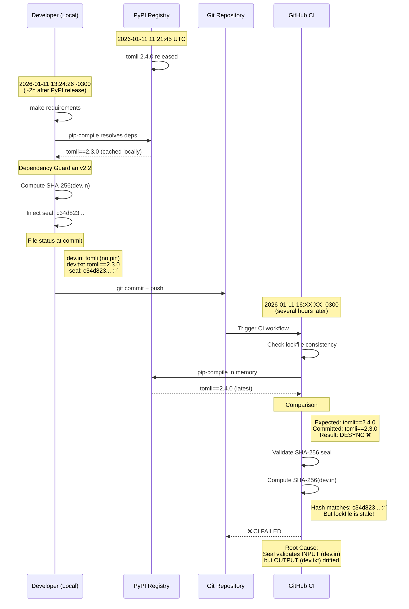
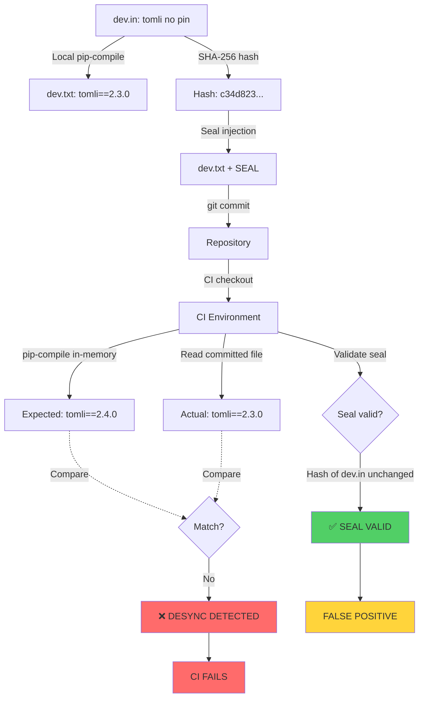
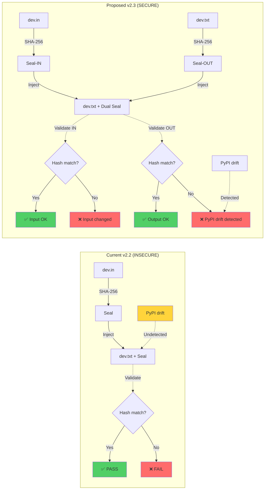
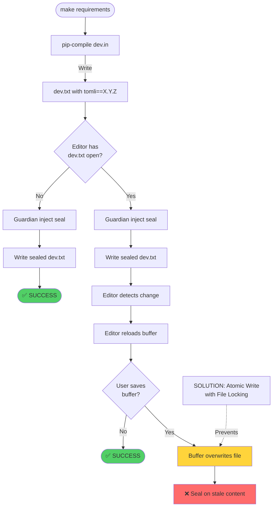

**Diagrama 1: Race Condition Temporal entre Ambiente Local e CI**

---

**Diagrama 2: Falha de Design - Selo Valida INPUT mas Ignora OUTPUT**

---

**Diagrama 3: Comparação de Segurança - v2.2 vs v2.3 Proposta**

---

**Diagrama 4: Race Condition de Buffer (VS Code/Editor)**
